# LƯU ĐỒ GIẢI THUẬT SOURCE CODE `main.c`

**Project:** Nabertherm Furnace Control Panel Firmware  
**File:** `main.c`  

---

## 1. Tổng quan thuật toán

Source code `main.c` được tổ chức theo mô hình **state machine** kết hợp các task chạy không chặn trong vòng lặp `while(1)`.

Các khối thuật toán chính:

1. Khởi tạo hệ thống.
2. Đọc cấu hình từ Flash.
3. Đọc và kiểm tra cảm biến nhiệt MAX31856.
4. Xử lý nút nhấn bằng ngắt EXTI và debounce phần mềm.
5. Quản lý giao diện LCD I2C 16x2.
6. Quản lý profile nung nhiều chu kỳ P1 đến P9.
7. Tính setpoint theo 2 chế độ:
   - `MT`: giữ nhiệt độ cố định.
   - `TIOT`: thay đổi nhiệt độ theo thời gian.
8. Điều khiển SSR bằng PID kết hợp Slow PWM 1000 ms.
9. Bảo vệ lỗi cảm biến, dữ liệu nhiệt và quá nhiệt.
10. Lưu cấu hình vào Flash có kiểm tra MagicWord, Version và Checksum.

---

## 2. Các trạng thái trong chương trình

### 2.1. Trạng thái vận hành hệ thống

| Trạng thái | Ý nghĩa |
|---|---|
| `SYS_IDLE` | Hệ thống đang dừng, chưa chạy hoặc bị lỗi |
| `SYS_RUNNING` | Hệ thống đang chạy profile nung |
| `SYS_COMPLETED` | Hệ thống đã chạy xong toàn bộ profile |

### 2.2. Trạng thái giao diện

| Trạng thái | Ý nghĩa |
|---|---|
| `UI_STATE_MAIN` | Màn hình chính |
| `UI_STATE_SET_INTERVAL` | Cài tổng số chu kỳ |
| `UI_STATE_SET_P` | Menu cấu hình từng chu kỳ |
| `UI_STATE_SET_TEMP` | Cài nhiệt độ |
| `UI_STATE_SET_TIME` | Cài thời gian |

### 2.3. Chế độ nung

| Chế độ | Ý nghĩa |
|---|---|
| `MODE_MT` | Maintain Temperature - giữ nhiệt |
| `MODE_TIOT` | Temperature Increases Over Time - thay đổi nhiệt độ theo thời gian |

### 2.4. Trạng thái lỗi

| Lỗi | Ý nghĩa |
|---|---|
| `CONTROL_FAULT_NONE` | Không có lỗi |
| `CONTROL_FAULT_MAX31856` | MAX31856 báo lỗi |
| `CONTROL_FAULT_SENSOR_DATA` | Dữ liệu nhiệt không hợp lệ |
| `CONTROL_FAULT_OVERTEMP` | Quá nhiệt |

---

## 3. Lưu đồ tổng quát chương trình

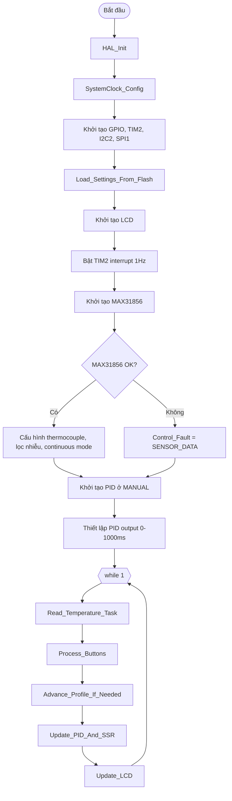

---

## 4. Lưu đồ khởi tạo hệ thống

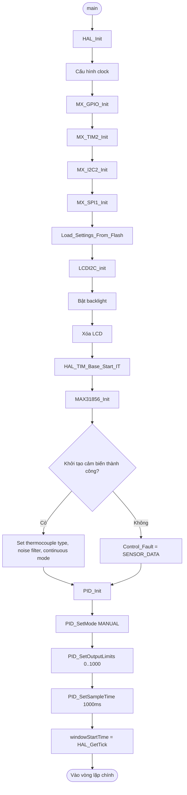

---

## 5. Lưu đồ vòng lặp chính `while(1)`

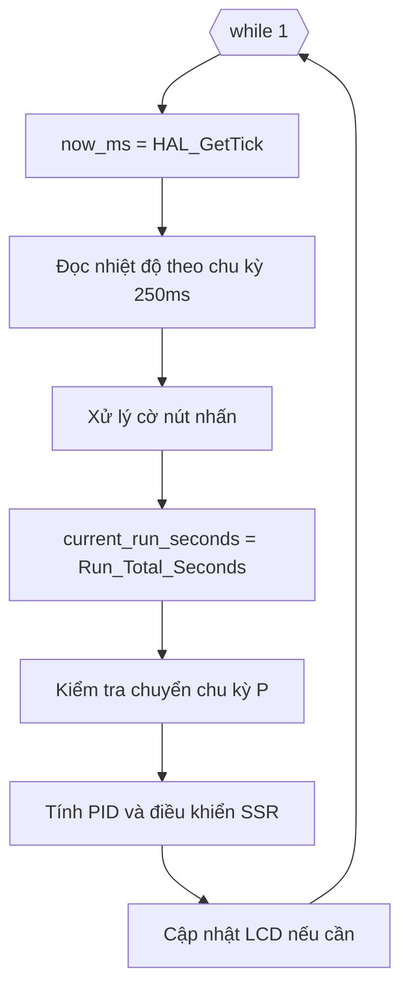

### Ý nghĩa từng task

| Task | Chức năng |
|---|---|
| `Read_Temperature_Task()` | Đọc cảm biến, lọc nhiệt, phát hiện lỗi |
| `Process_Buttons()` | Xử lý nút và menu |
| `Advance_Profile_If_Needed()` | Tự động chuyển P theo thời gian |
| `Update_PID_And_SSR()` | Tính setpoint, PID và Slow PWM |
| `Update_LCD()` | Cập nhật LCD bằng double-buffer |

---

## 6. Lưu đồ ngắt Timer TIM2 1Hz

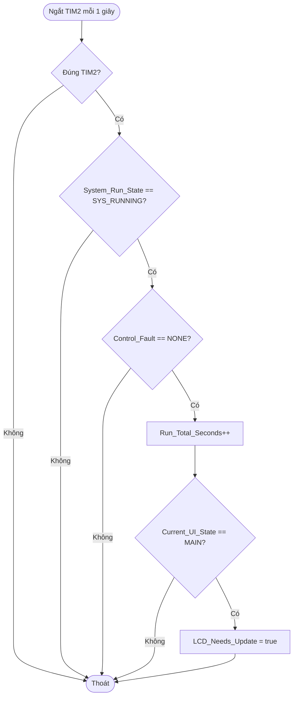

**Ghi chú:**  
Chương trình dùng `Run_Total_Seconds` làm thời gian chạy tổng. Khi chuyển từ P1 sang P2, thời gian không bị reset.

---

## 7. Lưu đồ ngắt nút nhấn EXTI

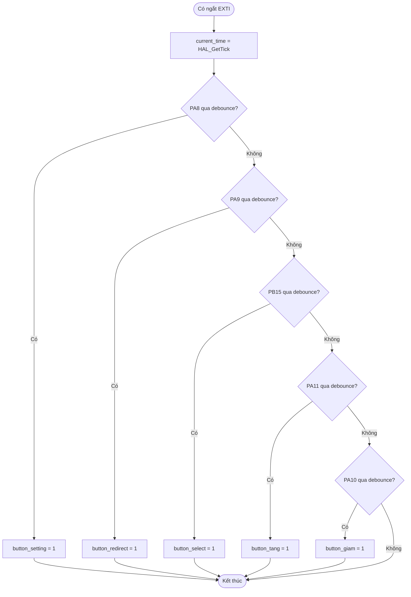

**Nguyên tắc:**  
Trong interrupt chỉ đặt cờ. Logic chính được xử lý ở `Process_Buttons()` để tránh ISR quá dài.

---

## 8. Lưu đồ xử lý nút `Process_Buttons()`

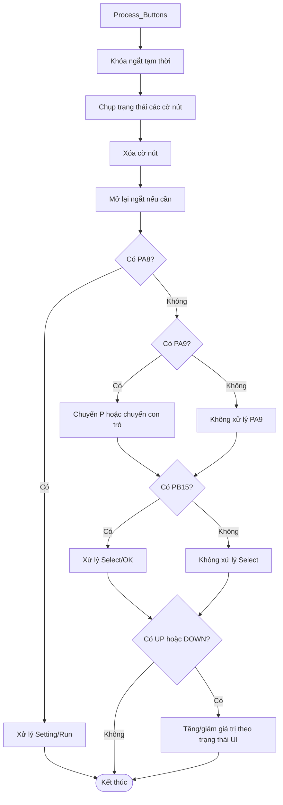

---

## 9. Lưu đồ nút PA8 - vào cài đặt hoặc lưu và chạy

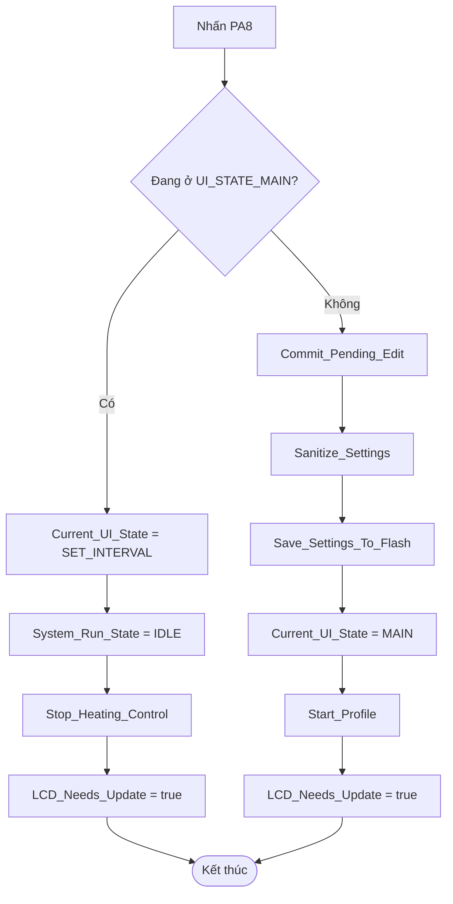

**Ý nghĩa:**

- Đang ở màn hình chính: PA8 đưa hệ thống vào cài đặt và tắt gia nhiệt.
- Đang ở menu cài đặt: PA8 lưu dữ liệu, quay về màn hình chính và chạy lại từ P1.

---

## 10. Lưu đồ state machine giao diện

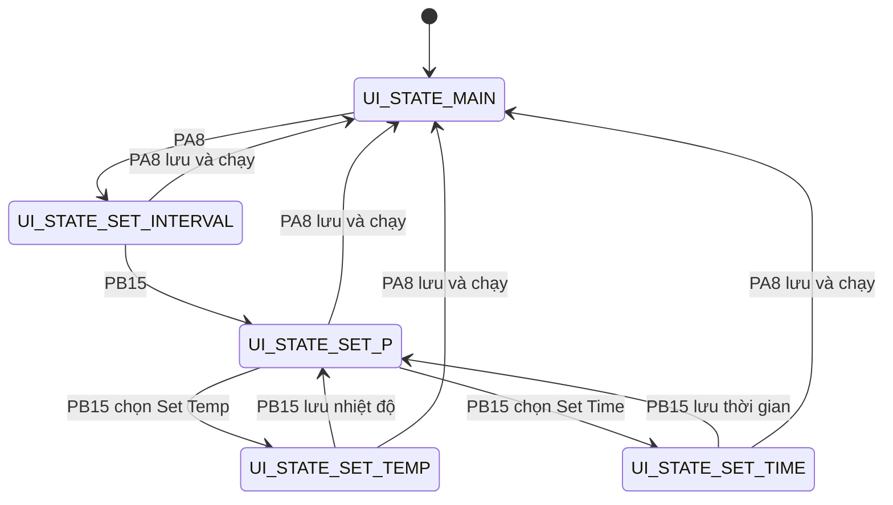

---

## 11. Lưu đồ màn hình `SET_INTERVAL`

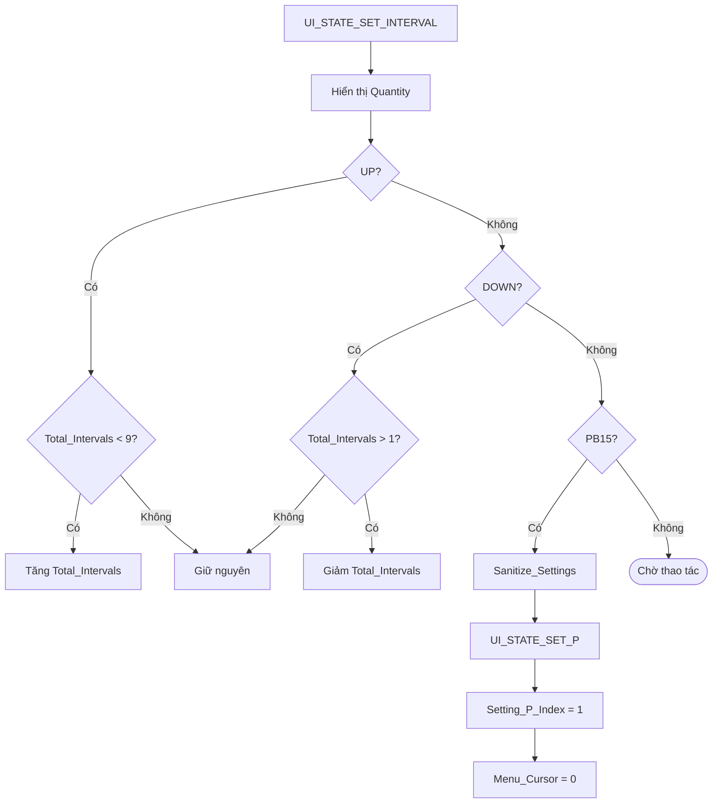

---

## 12. Lưu đồ màn hình `SET_P`

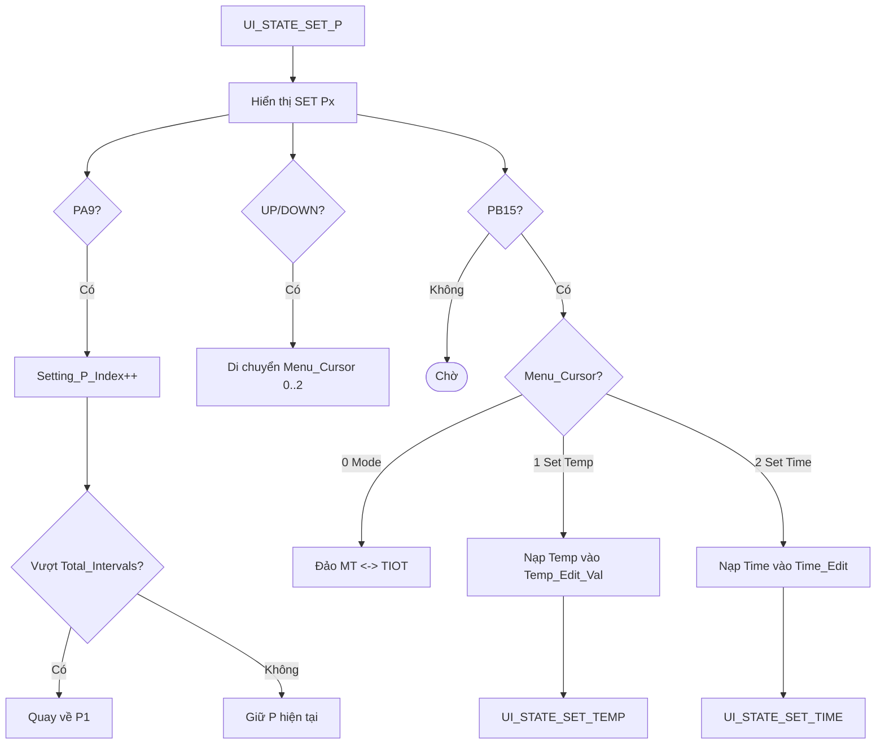

---

## 13. Lưu đồ màn hình `SET_TEMP`

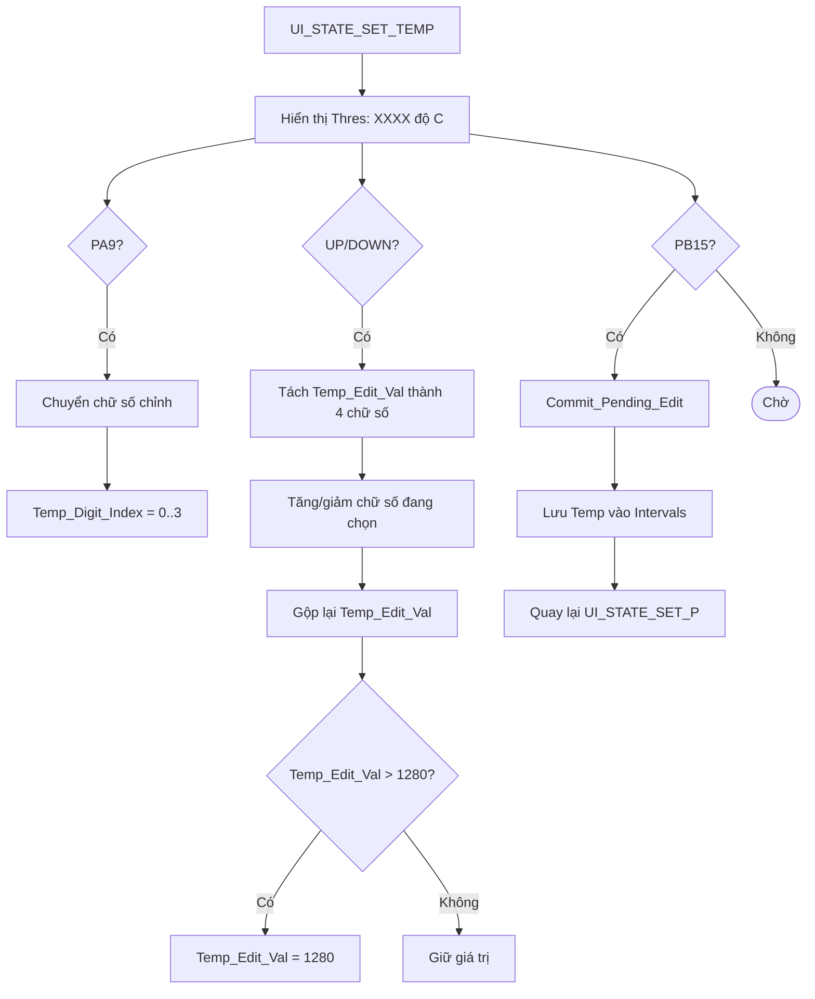

---

## 14. Lưu đồ màn hình `SET_TIME`

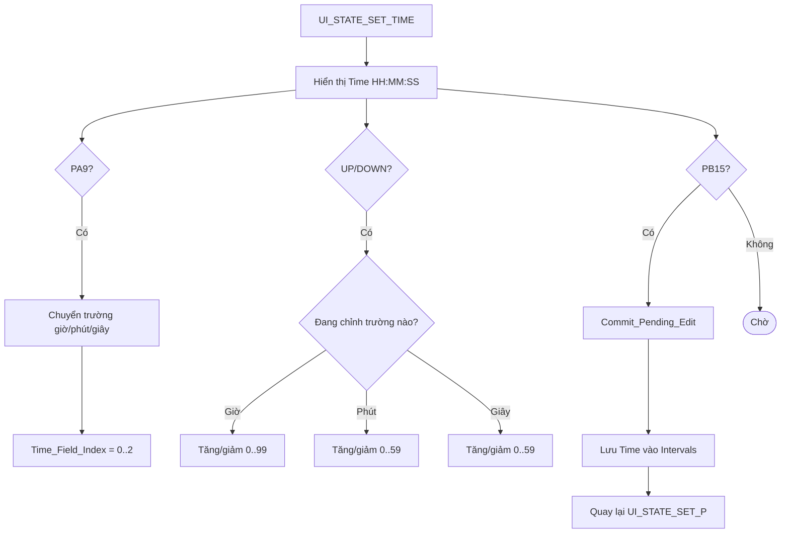

---

## 15. Lưu đồ bắt đầu profile `Start_Profile()`

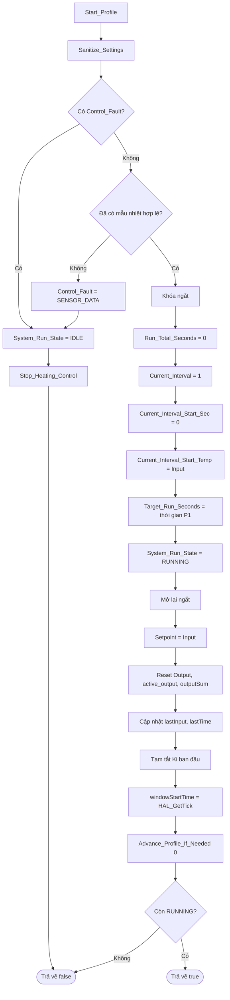

---

## 16. Lưu đồ chuyển chu kỳ `Advance_Profile_If_Needed()`

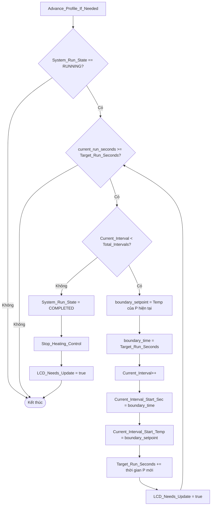

**Điểm quan trọng:**  
Hàm này dùng vòng lặp để nếu có chu kỳ thời gian bằng 0 hoặc main loop xử lý trễ, chương trình vẫn chuyển đúng đến chu kỳ cần chạy.

---

## 17. Lưu đồ tính setpoint `Calculate_Profile_Setpoint()`

```mermaid
flowchart TD
    A[Calculate_Profile_Setpoint] --> B[index = Current_Interval - 1]
    B --> C[target_temp = Intervals[index].Temp]
    C --> D{Mode == MT?}
    D -- Có --> E[Trả về target_temp]

    D -- Không --> F[duration = thời gian P hiện tại]
    F --> G{duration == 0?}
    G -- Có --> E
    G -- Không --> H[elapsed = current_run_seconds - Current_Interval_Start_Sec]
    H --> I{elapsed > duration?}
    I -- Có --> J[elapsed = duration]
    I -- Không --> K[Giữ elapsed]
    J --> L[fraction = elapsed / duration]
    K --> L
    L --> M[ramp_setpoint = Start_Temp + delta * fraction]
    M --> N[Giới hạn ramp_setpoint trong 0..1280]
    N --> O[Trả về ramp_setpoint]
```

---

## 18. Thuật toán chế độ MT

```text
Nếu Mode = MODE_MT:
    Setpoint = nhiệt độ cài đặt của chu kỳ hiện tại
```

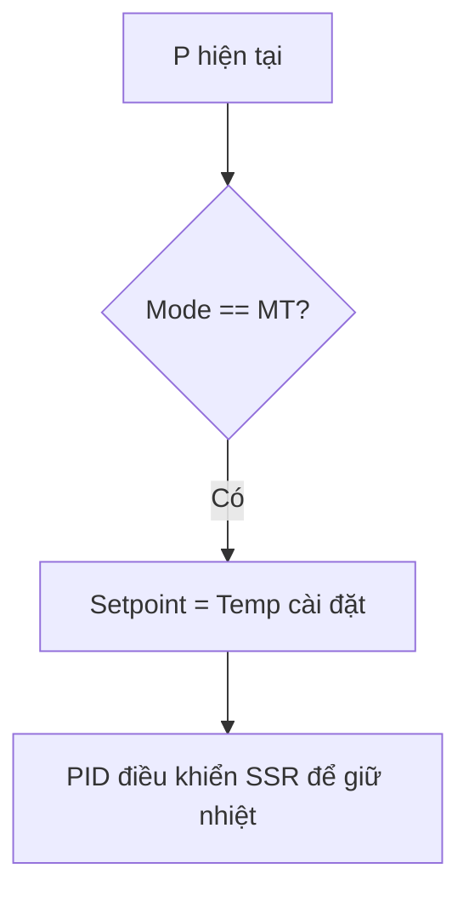

Ví dụ:

```text
P1: MT, Temp = 800°C, Time = 01:00:00
Trong toàn bộ 1 giờ, Setpoint = 800°C.
```

---

## 19. Thuật toán chế độ TIOT

```text
fraction = thời_gian_đã_chạy_trong_P / tổng_thời_gian_P

Setpoint = nhiệt_độ_đầu_P + (nhiệt_độ_đích_P - nhiệt_độ_đầu_P) × fraction
```

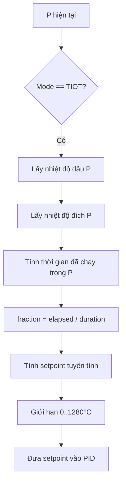

Ví dụ:

```text
Nhiệt độ đầu P = 200°C
Nhiệt độ đích P = 800°C
Thời gian P = 60 phút

Sau 30 phút:
fraction = 30 / 60 = 0.5
Setpoint = 200 + (800 - 200) × 0.5 = 500°C
```

---

## 20. Lưu đồ đọc nhiệt độ `Read_Temperature_Task()`

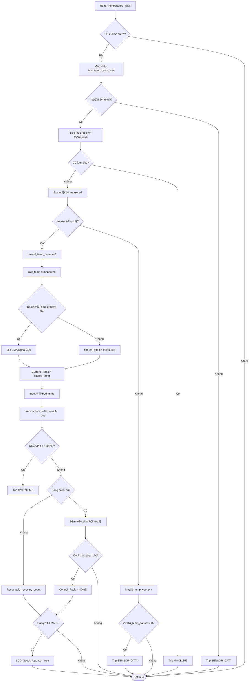

---

## 21. Lưu đồ bảo vệ lỗi `Trip_Control_Fault()`

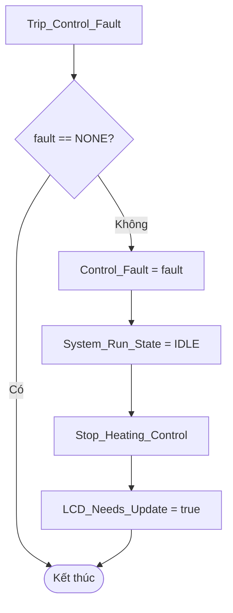

---

## 22. Lưu đồ dừng gia nhiệt `Stop_Heating_Control()`

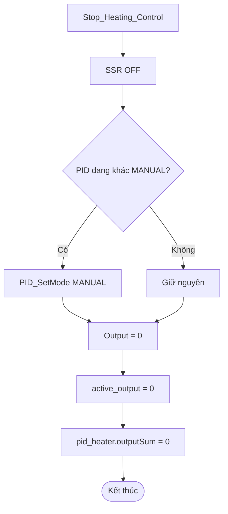

---

## 23. Lưu đồ PID và SSR `Update_PID_And_SSR()`

```mermaid
flowchart TD
    A[Update_PID_And_SSR] --> B{System_Run_State == RUNNING?}
    B -- Không --> C[Stop_Heating_Control]
    C --> Z([Kết thúc])

    B -- Có --> D{Control_Fault == NONE?}
    D -- Không --> C

    D -- Có --> E{Có mẫu nhiệt hợp lệ?}
    E -- Không --> C

    E -- Có --> F[Setpoint = Calculate_Profile_Setpoint]
    F --> G{PID đang MANUAL?}
    G -- Có --> H[PID_SetMode AUTOMATIC]
    G -- Không --> I[Tiếp tục]
    H --> I

    I --> J[error = Setpoint - Input]
    J --> K[abs_error = |error|]

    K --> L{Setpoint giảm hoặc nhiệt vượt Setpoint?}
    L -- Có --> M[Xóa outputSum chống tích phân dư]
    L -- Không --> N[Giữ outputSum]

    M --> O{abs_error > 10°C và Ki đang bật?}
    N --> O
    O -- Có --> P[Tắt Ki]
    O -- Không --> Q{abs_error < 4°C và Ki đang tắt?}
    Q -- Có --> R[Bật lại Ki]
    Q -- Không --> S[Giữ trạng thái Ki]

    P --> T[PID_Compute]
    R --> T
    S --> T

    T --> U{PID tính xong?}
    U -- Có --> V[active_output = Output]
    U -- Không --> W[Giữ active_output cũ]

    V --> X{Input hoặc raw_temp > Setpoint + 1.5°C?}
    W --> X
    X -- Có --> Y[active_output = 0, Output = 0, xóa outputSum]
    X -- Không --> AA[Giới hạn active_output 0..1000]

    Y --> AB[Tính ms_in_window]
    AA --> AB
    AB --> AC{active_output <= 20ms?}
    AC -- Có --> AD[SSR OFF]

    AC -- Không --> AE{active_output >= 980ms?}
    AE -- Có --> AF[SSR ON]

    AE -- Không --> AG{ms_in_window < active_output?}
    AG -- Có --> AH[SSR ON]
    AG -- Không --> AI[SSR OFF]

    AD --> Z
    AF --> Z
    AH --> Z
    AI --> Z
```

---

## 24. Thuật toán Slow PWM

PID không xuất tín hiệu analog mà xuất thời gian bật SSR trong cửa sổ 1000 ms.

```mermaid
flowchart TD
    A[Bắt đầu cửa sổ 1000ms] --> B[Lấy active_output]
    B --> C{active_output <= 20ms?}
    C -- Có --> D[SSR OFF toàn chu kỳ]
    C -- Không --> E{active_output >= 980ms?}
    E -- Có --> F[SSR ON toàn chu kỳ]
    E -- Không --> G[ms_in_window = thời điểm trong cửa sổ]
    G --> H{ms_in_window < active_output?}
    H -- Có --> I[SSR ON]
    H -- Không --> J[SSR OFF]
```

| `active_output` | Hoạt động SSR |
|---|---|
| 0 ms | Tắt hoàn toàn |
| 250 ms | Bật 250 ms, tắt 750 ms |
| 500 ms | Bật 500 ms, tắt 500 ms |
| 1000 ms | Bật hoàn toàn |

---

## 25. Lưu đồ cập nhật LCD `Update_LCD()`

```mermaid
flowchart TD
    A[Update_LCD] --> B{LCD_Needs_Update?}
    B -- Không --> Z([Kết thúc])
    B -- Có --> C[LCD_Needs_Update = false]
    C --> D[Tạo row1 và row2 16 ký tự]

    D --> E{Current_UI_State?}
    E -- MAIN --> F[Hiển thị nhiệt độ, P, thời gian hoặc lỗi]
    E -- SET_INTERVAL --> G[Hiển thị Quantity]
    E -- SET_P --> H[Hiển thị menu Mode/Temp/Time]
    E -- SET_TEMP --> I[Hiển thị Thres XXXX độ C]
    E -- SET_TIME --> J[Hiển thị Time HH:MM:SS]

    F --> K{row1 khác dòng cũ?}
    G --> K
    H --> K
    I --> K
    J --> K

    K -- Có --> L[Ghi row1 lên LCD]
    K -- Không --> M[Bỏ qua row1]
    L --> N{row2 khác dòng cũ?}
    M --> N

    N -- Có --> O[Ghi row2 lên LCD]
    N -- Không --> P[Bỏ qua row2]

    O --> Q{Đang chỉnh TEMP?}
    P --> Q
    Q -- Có --> R[Bật blink ở chữ số nhiệt độ]
    Q -- Không --> S{Đang chỉnh TIME?}
    S -- Có --> T[Bật blink ở trường giờ/phút/giây]
    S -- Không --> U[Tắt blink]
```

---

## 26. Lưu đồ đọc Flash `Load_Settings_From_Flash()`

```mermaid
flowchart TD
    A[Load_Settings_From_Flash] --> B[Đọc Flash_Data_t tại FLASH_STORAGE_ADDR]
    B --> C{MagicWord đúng?}
    C -- Không --> I[Init_Default_Intervals]
    C -- Có --> D{Version đúng?}
    D -- Không --> I
    D -- Có --> E{TotalIntervals hợp lệ 1..9?}
    E -- Không --> I
    E -- Có --> F{Checksum đúng?}
    F -- Không --> I
    F -- Có --> G[Copy dữ liệu từ Flash vào RAM]
    G --> H[Sanitize_Settings]
    H --> Z([Kết thúc])
    I --> J[Cài mặc định: 1 chu kỳ, MT, Temp 0, Time 0]
    J --> Z
```

---

## 27. Lưu đồ lưu Flash `Save_Settings_To_Flash()`

```mermaid
flowchart TD
    A[Save_Settings_To_Flash] --> B[Sanitize_Settings]
    B --> C[Tạo flash_data]
    C --> D[Ghi MagicWord, Version, TotalIntervals]
    D --> E[Copy Intervals]
    E --> F[Tính Checksum]
    F --> G[flash_write_ok = false]
    G --> H[Tắt ngắt]
    H --> I[HAL_FLASH_Unlock]
    I --> J{Unlock OK?}
    J -- Không --> Q[Mở lại ngắt]

    J -- Có --> K[Xóa page Flash]
    K --> L{Erase OK?}
    L -- Không --> M[HAL_FLASH_Lock]
    L -- Có --> N[Ghi từng word 32-bit]
    N --> O{Ghi lỗi?}
    O -- Có --> M
    O -- Không --> P{Ghi hết chưa?}
    P -- Chưa --> N
    P -- Rồi --> M

    M --> Q
    Q --> R{status OK?}
    R -- Không --> Z([Kết thúc, flash_write_ok = false])
    R -- Có --> S[Đọc lại Flash để kiểm tra]
    S --> T{Magic, Version, Checksum đúng?}
    T -- Có --> U[flash_write_ok = true]
    T -- Không --> V[flash_write_ok = false]
    U --> Z
    V --> Z
```

---

## 28. Lưu đồ kiểm tra dữ liệu `Sanitize_Settings()`

```mermaid
flowchart TD
    A[Sanitize_Settings] --> B{Total_Intervals ngoài 1..9?}
    B -- Có --> C[Total_Intervals = 1]
    B -- Không --> D[Giữ nguyên]

    C --> E[Duyệt từng Interval]
    D --> E

    E --> F{Mode không phải MT/TIOT?}
    F -- Có --> G[Mode = MT]
    F -- Không --> H[Giữ Mode]

    G --> I{Temp > 1280?}
    H --> I
    I -- Có --> J[Temp = 1280]
    I -- Không --> K[Giữ Temp]

    J --> L{Time_Min > 59?}
    K --> L
    L -- Có --> M[Time_Min = 59]
    L -- Không --> N[Giữ Time_Min]

    M --> O{Time_Sec > 59?}
    N --> O
    O -- Có --> P[Time_Sec = 59]
    O -- Không --> Q[Giữ Time_Sec]

    P --> R{Còn Interval?}
    Q --> R
    R -- Có --> E
    R -- Không --> Z([Kết thúc])
```

---

## 29. Lưu đồ trạng thái vận hành

```mermaid
stateDiagram-v2
    [*] --> SYS_IDLE

    SYS_IDLE --> SYS_RUNNING: Start_Profile thành công
    SYS_RUNNING --> SYS_COMPLETED: Hết chu kỳ cuối
    SYS_RUNNING --> SYS_IDLE: Lỗi cảm biến / lỗi nhiệt / quá nhiệt
    SYS_RUNNING --> SYS_IDLE: Người dùng vào cài đặt
    SYS_COMPLETED --> SYS_IDLE: Người dùng vào cài đặt
    SYS_IDLE --> SYS_IDLE: Chưa có mẫu nhiệt hợp lệ hoặc còn lỗi
```

---

## 30. Luồng hoạt động đầy đủ khi cài và chạy

```mermaid
flowchart TD
    A[Cấp nguồn] --> B[Khởi tạo hệ thống]
    B --> C[Đọc cấu hình Flash]
    C --> D[Hiển thị màn hình chính]
    D --> E[Đọc nhiệt độ định kỳ]
    E --> F{Người dùng nhấn PA8?}
    F -- Không --> E

    F -- Có --> G[Vào SET_INTERVAL]
    G --> H[Cài số lượng chu kỳ]
    H --> I[Vào SET_P]
    I --> J[Cài Mode, Temp, Time từng P]
    J --> K{Nhấn PA8 lưu và chạy?}
    K -- Không --> I
    K -- Có --> L[Lưu Flash]
    L --> M[Start_Profile]
    M --> N{Có lỗi hoặc chưa có mẫu nhiệt?}
    N -- Có --> O[Dừng, hiển thị lỗi]
    N -- Không --> P[Chạy P1]

    P --> Q[Tính Setpoint MT/TIOT]
    Q --> R[PID điều khiển SSR]
    R --> S{Đủ thời gian P hiện tại?}
    S -- Không --> Q
    S -- Có --> T{Còn P tiếp theo?}
    T -- Có --> U[Chuyển sang P tiếp theo]
    U --> Q
    T -- Không --> V[SYS_COMPLETED]
    V --> W[Tắt SSR, giữ thời gian kết thúc]
```

---

## 31. Tóm tắt bảo vệ an toàn

```mermaid
flowchart TD
    A[Hệ thống đang hoạt động] --> B{MAX31856 báo lỗi?}
    B -- Có --> C[Trip MAX31856]
    B -- Không --> D{Dữ liệu nhiệt sai 3 lần?}
    D -- Có --> E[Trip SENSOR_DATA]
    D -- Không --> F{Nhiệt độ >= 1300°C?}
    F -- Có --> G[Trip OVERTEMP]
    F -- Không --> H{Nhiệt vượt Setpoint + 1.5°C?}
    H -- Có --> I[Tắt SSR tạm thời và xóa tích phân]
    H -- Không --> J[Cho PID điều khiển bình thường]

    C --> K[System = IDLE, SSR OFF, PID MANUAL]
    E --> K
    G --> K
```

---

## 32. Kết luận

Giải thuật trong `main.c` có cấu trúc rõ ràng và an toàn:

- Chạy theo state machine.
- Không dùng delay trong vòng lặp chính.
- Thời gian chạy được quản lý bằng `Run_Total_Seconds`.
- Profile nung chuyển P theo thời gian cộng dồn.
- `MT` giữ setpoint cố định.
- `TIOT` nội suy setpoint theo thời gian.
- PID điều khiển SSR bằng Slow PWM 1000 ms.
- Có chống tích phân dư khi setpoint giảm hoặc nhiệt vượt setpoint.
- Có bảo vệ lỗi MAX31856, lỗi dữ liệu nhiệt và quá nhiệt.
- LCD dùng double-buffer để giảm nhấp nháy.
- Flash có MagicWord, Version và Checksum để tránh đọc nhầm dữ liệu lỗi.
