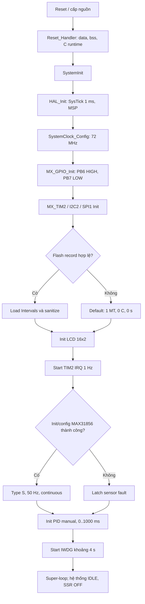
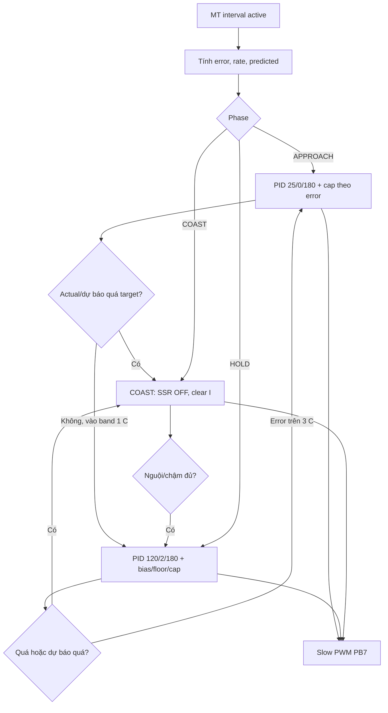
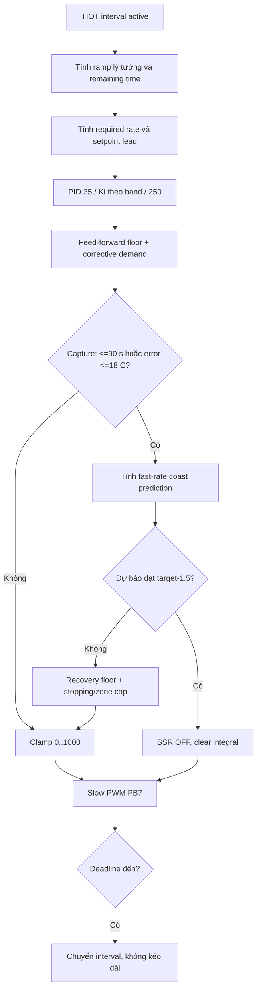
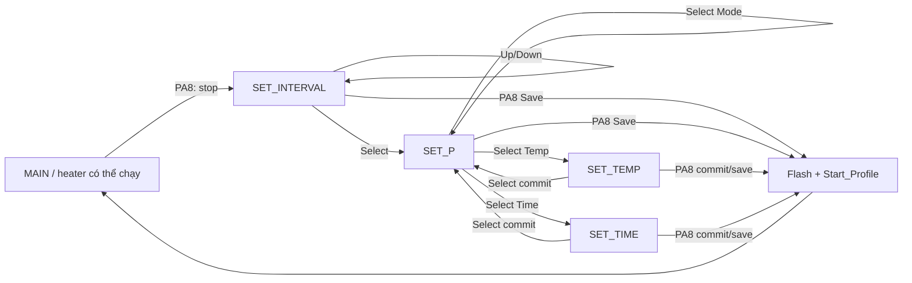
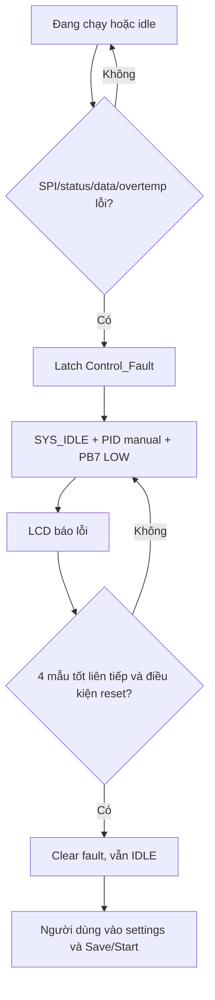
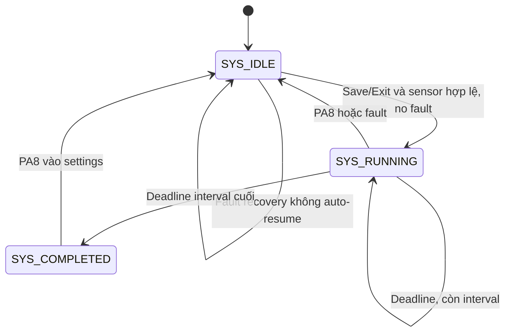
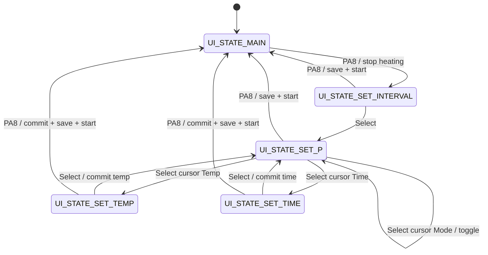
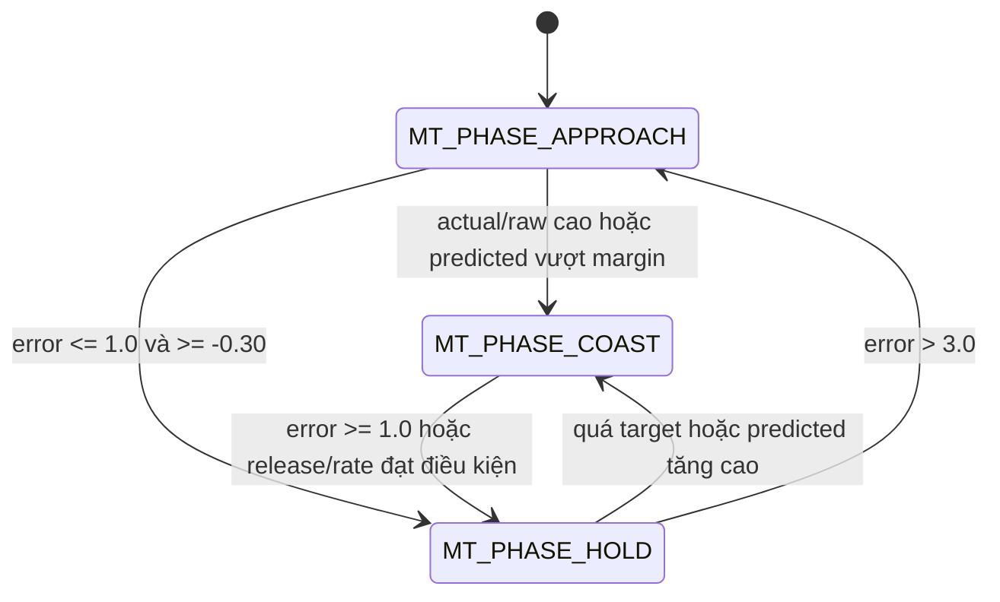
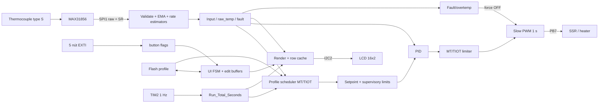
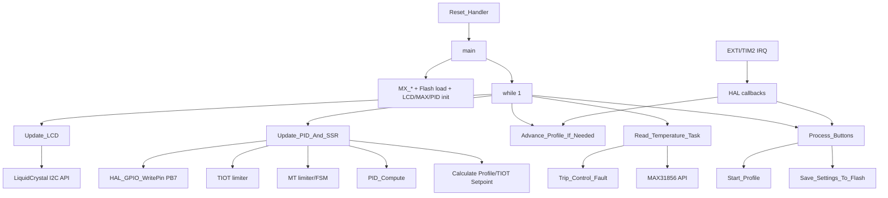

# PHÂN TÍCH THUẬT TOÁN SOURCE CODE STM32CUBEIDE

> Dự án: `Nabertherm_Code`  
> Vi điều khiển: `STM32F103C8T6` / target CubeIDE `STM32F103C8Tx`  
> Phạm vi kiểm kê: 209 file trong workspace tại thời điểm phân tích  
> Ngày phân tích: 2026-08-15  
> Kết quả kiểm tra build: GNU Arm Embedded GCC 13.3.1, cấu hình Debug `-O0 -Wall`, biên dịch và liên kết thành công, không phát sinh cảnh báo.

## Quy ước mức độ bằng chứng

- **XÁC NHẬN:** nội dung thể hiện trực tiếp trong source/config/build artifact.
- **SUY LUẬN:** kết luận kỹ thuật hợp lý từ nhiều vị trí source, nhưng chưa có sơ đồ nguyên lý hoặc kiểm thử phần cứng để xác nhận.
- **CHƯA XÁC ĐỊNH – cần bổ sung file hoặc thông tin phần cứng:** source hiện có không đủ chứng minh.

Các đường dẫn/vị trí như `Core/Src/main.c → main() → while(1)` là điểm truy vết chính. Số dòng tham chiếu theo phiên bản source tại thời điểm lập tài liệu.

## 1. Thông tin tổng quan

### 1.1. Nhận diện hệ thống

**Bảng 1-1. Nhận diện phần cứng, phần mềm và chức năng chính**

| Hạng mục | Kết quả |
| --- | --- |
| Tên dự án | `Nabertherm_Code` (`Nabertherm_Code.ioc:135-136`) |
| Mục đích | Bộ điều khiển nhiệt độ/lịch gia nhiệt cho lò Nabertherm (`Core/Src/main.c:5-16`) |
| MCU | STM32F103C8T6, Cortex-M3, LQFP48, Flash 64 KiB, RAM 20 KiB (`Nabertherm_Code.ioc:8-18`; `STM32F103C8TX_FLASH.ld:44-49`) |
| Clock | HSE 8 MHz × PLL9 = SYSCLK/HCLK 72 MHz; APB1 36 MHz, timer APB1 72 MHz (`Core/Src/main.c → SystemClock_Config()`; `Nabertherm_Code.ioc:146-166`) |
| Đầu vào | Thermocouple qua MAX31856; 5 nút PA8, PA9, PA10, PA11, PB15 |
| Đầu ra | SSR/heater tại PB7; LCD ký tự 16×2 qua I2C2; đèn nền LCD |
| Giao tiếp | SPI1 remap trên PB3/PB4/PB5; I2C2 trên PB10/PB11; không có UART/CAN/ADC/DMA trong đường chạy ứng dụng |
| Chế độ công nghệ | `MODE_MT` (đưa đến và giữ nhiệt độ) và `MODE_TIOT` (tăng nhiệt theo thời gian với deadline cố định) |
| Trạng thái hệ thống | `SYS_IDLE`, `SYS_RUNNING`, `SYS_COMPLETED` |
| Trạng thái giao diện | `UI_STATE_MAIN`, `UI_STATE_SET_INTERVAL`, `UI_STATE_SET_P`, `UI_STATE_SET_TEMP`, `UI_STATE_SET_TIME` |
| An toàn | Lỗi cảm biến/giao tiếp/quá nhiệt cưỡng bức SSR OFF; IWDG khoảng 4 s; giới hạn nhiệt cài đặt 1280 °C; trip quá nhiệt 1300 °C |

### 1.2. Tóm tắt nguyên lý

1. **XÁC NHẬN:** Sau reset, chương trình cấu hình clock 72 MHz, GPIO, TIM2, I2C2 và SPI1, đọc lịch gia nhiệt từ trang Flash cuối, rồi khởi tạo LCD, MAX31856, PID và IWDG (`Core/Src/main.c → main()`).
2. MAX31856 được cấu hình thermocouple loại S, lọc nhiễu 50 Hz và chuyển đổi liên tục; nhiệt độ được lấy mẫu mỗi 250 ms (`main()`, `Read_Temperature_Task()`).
3. Nhiệt độ thô được kiểm tra `isfinite` và dải -50…1800 °C, sau đó lọc EMA với `alpha = 0.20`; kết quả là `Input`, `Current_Temp` cho điều khiển và hiển thị.
4. TIM2 tạo ngắt 1 Hz và chỉ tăng `Run_Total_Seconds` khi `SYS_RUNNING` và không có lỗi (`HAL_TIM_PeriodElapsedCallback()`).
5. Một profile có 1…9 interval. Mỗi interval chứa mode, nhiệt độ đích và thời lượng `HH:MM:SS`; deadline là thời gian tích lũy tuyệt đối nên độ trễ vòng lặp không cộng dồn giữa các interval.
6. MT dùng ba pha giám sát `APPROACH → COAST/HOLD`, ước lượng tốc độ nhiệt và PID gain scheduling để giảm quá điều chỉnh; TIOT dùng ramp tuyến tính, setpoint bù trễ, feed-forward tốc độ và mô hình coast suy giảm để cố đạt nhiệt độ gần deadline mà không kéo dài interval.
7. Đầu ra PID là số mili giây ON trong cửa sổ 1000 ms; PB7 mức SET được code dùng như lệnh bật SSR và RESET là tắt (`Update_PID_And_SSR()`).
8. Nút được bắt bằng EXTI cạnh lên, debounce 200 ms trong callback, còn xử lý menu/Flash được hoãn về vòng lặp chính.
9. Mọi lỗi điều khiển gọi `Stop_Heating_Control()`, đưa PB7 LOW, chuyển PID sang manual và đưa hệ thống về `SYS_IDLE`; sau khi lỗi tự hồi phục, profile không tự chạy lại.
10. **SUY LUẬN:** Hệ thống hướng tới lò quán tính nhiệt lớn khoảng 3 kW theo comment, nhưng công suất lò, loại SSR và đặc tính tải chưa được sơ đồ/BOM xác nhận (`Core/Src/main.c:122-124`).

## 2. Danh sách và vai trò của các file

### 2.1. File ứng dụng và file sinh bởi CubeMX/CubeIDE

**Bảng 2-1. Vai trò các file ứng dụng/cấu hình**

| STT | Tên file | Loại file | Chức năng | Quan hệ với file khác |
| --: | --- | --- | --- | --- |
| 1 | `Core/Src/main.c` | Chương trình chính/thuật toán | FSM hệ thống và UI, profile MT/TIOT, đọc sensor, PID/SSR, Flash, IWDG, LCD, callback | Gọi MAX31856, PID, LCD, HAL; được startup gọi qua `main()` |
| 2 | `Core/Inc/main.h` | Header chung | Khai báo `Error_Handler()` và kéo HAL vào ứng dụng | Được mọi module tự viết include |
| 3 | `Core/Src/MAX31856.c` | Driver cảm biến | SPI blocking có timeout/retry, cấu hình thanh ghi, đọc fault và nhiệt độ | Dùng `hspi1`, PB6 do `main.c` cấp |
| 4 | `Core/Inc/MAX31856.h` | API/kiểu cảm biến | Register, fault bit, enum, handle và API MAX31856 | Dùng bởi `MAX31856.c`, `main.c` |
| 5 | `Core/Src/PID_Controller.c` | Thuật toán điều khiển | PID rời rạc P-on-E/P-on-M, giới hạn output, auto/manual | `main.c` sở hữu `pid_heater` và các con trỏ Input/Output/Setpoint |
| 6 | `Core/Inc/PID_Controller.h` | API/struct PID | Hằng mode/direction, `PID_TypeDef`, prototype | Include trong `main.c`, implementation PID |
| 7 | `Core/Src/LiquidCrystal_I2C.c` | Driver giao diện | Giao thức LCD 4-bit qua I/O expander I2C | Gọi HAL I2C2; được `Update_LCD()` gọi |
| 8 | `Core/Inc/LiquidCrystal_I2C.h` | API LCD | Lệnh/bit LCD, `LiquidCrystal_I2C_Def`, prototype | Dùng bởi driver và `main.c` |
| 9 | `Core/Src/stm32f1xx_it.c` | ISR sinh bởi CubeMX | Exception, SysTick, EXTI9_5, EXTI15_10, TIM2 | Chuyển vào HAL rồi callback mạnh trong `main.c` |
| 10 | `Core/Inc/stm32f1xx_it.h` | Header ISR | Prototype handler trong vector table | Khớp `startup_stm32f103c8tx.s` |
| 11 | `Core/Src/stm32f1xx_hal_msp.c` | Cấu hình ngoại vi | Clock GPIO/peripheral, remap SPI1, chân I2C/SPI, NVIC TIM2 | Được HAL Init gọi |
| 12 | `Core/Inc/stm32f1xx_hal_conf.h` | Cấu hình HAL | Bật GPIO/I2C/SPI/TIM/FLASH/RCC/PWR/DMA/EXTI/Cortex; tick priority 15 | Quyết định source HAL khả dụng |
| 13 | `Core/Src/system_stm32f1xx.c` | CMSIS system | `SystemInit()`, `SystemCoreClockUpdate()` | Startup gọi trước `main()`; HAL clock cập nhật biến |
| 14 | `Core/Src/syscalls.c` | Newlib stub | System calls tối thiểu cho `snprintf`/libc | Liên kết với newlib-nano |
| 15 | `Core/Src/sysmem.c` | Newlib heap | `_sbrk()` giới hạn heap trước vùng stack dự trữ | Dùng nếu libc cấp phát động |
| 16 | `Core/Startup/startup_stm32f103c8tx.s` | Startup/vector | Stack ban đầu, copy `.data`, zero `.bss`, vector ISR, gọi `SystemInit()` và `main()` | Dùng linker symbols và ISR trong `stm32f1xx_it.c` |
| 17 | `Nabertherm_Code.ioc` | CubeMX config | MCU, pinout, clock, TIM2, NVIC, SPI1, I2C2 | Nguồn sinh `main.c`, MSP, ISR |
| 18 | `STM32F103C8TX_FLASH.ld` | Linker script | Flash 64 KiB, RAM 20 KiB, heap 0x200, stack 0x400 | **Không dành riêng** trang `0x0800FC00` cho settings |
| 19 | `.cproject`, `.project`, `.mxproject`, `.settings/*` | Metadata IDE/build | Target, include path, define, Debug `-O0`, Release `-Os`, toolchain | Sinh makefile Debug |
| 20 | `Nabertherm_Code Debug.launch`, `Nabertherm Debug.launch` | Launch config | Cấu hình nạp/debug CubeIDE | Không tham gia thuật toán runtime |

### 2.2. Thư viện vendor và artefact build

**Bảng 2-2. Phạm vi thư viện vendor và artefact build**

| Nhóm | File đã kiểm kê | Vai trò thực tế |
| --- | ---: | --- |
| `Drivers/STM32F1xx_HAL_Driver/Inc` và `Src` | 46 | HAL F1 v1.1.10; 15 source được build: HAL core, Cortex, DMA, EXTI, Flash, GPIO, I2C, PWR, RCC, SPI, TIM. Ứng dụng chỉ đi qua API liệt kê ở mục 19.6. |
| `Drivers/CMSIS` | 26 | CMSIS Core(M) 5.1, device header STM32F103xB, register/IRQ definition; chỉ `core_cm3.h` và device headers liên quan trực tiếp target. |
| `Debug/*` | 110 | `.o/.d/.su/.cyclo`, map/list/elf/bin/hex và makefile. Dùng để xác nhận unit được link, kích thước, stack usage, cyclomatic complexity; không phải source chuẩn để sửa. |

**Phân loại:** chương trình/thuật toán chính: `main.c`, `PID_Controller.c`; driver: `MAX31856.c`, `LiquidCrystal_I2C.c`, HAL; cấu hình ngoại vi: `.ioc`, `main.c` các `MX_*`, MSP; hiển thị: LiquidCrystal + `Update_LCD()`; cảm biến: MAX31856 + `Read_Temperature_Task()`; lỗi/an toàn: `Trip_Control_Fault()`, `Stop_Heating_Control()`, `Error_Handler()`, IWDG.

## 3. Cấu hình phần cứng

### 3.1. Bảng ánh xạ ngoại vi/chân

**Bảng 3-1. Ánh xạ ngoại vi STM32 và chân phần cứng**

| Thành phần | Ngoại vi STM32 | Chân/kênh | Chế độ | Chức năng |
| --- | --- | --- | --- | --- |
| HSE | RCC | PD0-OSC_IN, PD1-OSC_OUT | External oscillator 8 MHz | Nguồn PLL ×9, SYSCLK 72 MHz |
| SWD | SYS/AFIO | PA13 SWDIO, PA14 SWCLK | Serial Wire; JTAG tắt | Nạp/debug; giải phóng PB3/PB4/PB5 |
| MAX31856 SCK | SPI1 remap | PB3 | AF push-pull, high speed | Clock SPI 4.5 Mbit/s |
| MAX31856 MISO | SPI1 remap | PB4 | Input floating/no pull | Dữ liệu từ MAX31856 |
| MAX31856 MOSI | SPI1 remap | PB5 | AF push-pull, high speed | Địa chỉ/lệnh ghi MAX31856 |
| MAX31856 CS | GPIOB | PB6 | Output push-pull, low speed; khởi động SET | Chip select active-low do driver kéo RESET khi giao dịch |
| SSR/heater | GPIOB | PB7 | Output push-pull, low speed; khởi động RESET | Slow PWM: SET = yêu cầu ON, RESET = OFF theo source |
| LCD SCL | I2C2 | PB10 | AF open-drain, high speed | I2C 100 kHz |
| LCD SDA | I2C2 | PB11 | AF open-drain, high speed | I2C 100 kHz |
| Nút Setting/Run | EXTI8 | PA8 | Rising edge, no internal pull | Vào cài đặt; hoặc save/exit/start profile |
| Nút Redirect | EXTI9 | PA9 | Rising edge, no internal pull | Đổi interval/digit/field tùy màn hình |
| Nút Down (`giam`) | EXTI10 | PA10 | Rising edge, no internal pull | Giảm giá trị/di chuyển menu |
| Nút Up (`tang`) | EXTI11 | PA11 | Rising edge, no internal pull | Tăng giá trị/di chuyển menu |
| Nút Select/OK | EXTI15 | PB15 | Rising edge, no internal pull | Xác nhận/chuyển màn hình/toggle mode |
| Clock chạy profile | TIM2 update IRQ | Không xuất chân | PSC=7199, ARR=9999, APB1 timer=72 MHz | `72 MHz/(7200×10000)=1 Hz` |
| HAL time base | SysTick | Nội bộ Cortex-M3 | IRQ priority 15 | `HAL_GetTick()`, timeout, debounce, schedule ms |
| Watchdog | IWDG | Nội bộ, LSI danh định 40 kHz | Prescaler /64, reload 2499 | Timeout xấp xỉ `(2499+1)×64/40000 = 4.0 s` |
| Flash settings | Internal Flash | `0x0800FC00`, page 63, 1 KiB | Erase page, program word | Lưu profile có magic/version/FNV-1a |

Nguồn: `Nabertherm_Code.ioc:8-99,146-190`; `Core/Src/main.c → MX_GPIO_Init()/MX_TIM2_Init()/MX_I2C2_Init()/MX_SPI1_Init()/MX_IWDG_Init()`; `Core/Src/stm32f1xx_hal_msp.c`.

### 3.2. Ngoại vi không sử dụng

- ADC, CAN, UART/USART, RTC, DAC, USB và PWM phần cứng không được cấu hình.
- DMA module được bật/compile do HAL config/CubeMX, nhưng không có DMA channel hay API DMA trong luồng ứng dụng.
- Không có buzzer, LED cảnh báo, relay phụ hoặc emergency-stop input trong source.
- **CHƯA XÁC ĐỊNH:** pull-up/pull-down ngoài cho các nút và I2C; model I/O expander LCD; mạch cách ly/driver SSR; mức logic điện thực tế; contactor an toàn; cảm biến/công tắc cửa; nguồn và phương án fail-safe khi MCU mất nguồn.

## 4. Các thư viện và module phần mềm

### 4.1. Điều phối hệ thống và profile

- **File:** `Core/Src/main.c`, `Core/Inc/main.h`.
- **Mục đích:** khởi tạo, cooperative super-loop, hai FSM (system/UI), profile 1…9 interval, điều khiển MT/TIOT, lỗi, Flash và watchdog.
- **Đầu vào:** `Input`, nút event, `Run_Total_Seconds`, `Intervals[]`, fault từ MAX31856.
- **Đầu ra:** `Setpoint`, `active_output`, PB7, LCD rows, Flash page.
- **Biến chính:** `System_Run_State`, `Current_UI_State`, `Control_Fault`, `Current_Interval`, `Target_Run_Seconds`, `Intervals[]`.
- **Hàm chính:** `Start_Profile()`, `Advance_Profile_If_Needed()`, `Calculate_Profile_Setpoint()`, `Update_PID_And_SSR()`, `Process_Buttons()`, `Update_LCD()`.
- **Caller/callee:** startup gọi `main()`; super-loop gọi sensor/UI/profile/control/display; module gọi PID/MAX31856/LCD/HAL.
- **Lỗi:** `Trip_Control_Fault()` latch lỗi, idle và SSR OFF; `Error_Handler()` PB7 LOW rồi spin.

### 4.2. Driver MAX31856

- **File:** `Core/Inc/MAX31856.h`, `Core/Src/MAX31856.c`.
- **Mục đích:** truy cập register qua SPI, cấu hình thermocouple/conversion/filter, đọc status và nhiệt độ.
- **Đầu vào:** handle SPI, CS port/pin, register/value; dữ liệu từ SPI.
- **Đầu ra:** fault byte, °C dạng `float`, diagnostic `communication_error`, `last_hal_status`, counter.
- **Biến chính:** các trường `MAX31856_HandleTypeDef`.
- **Caller:** `main()` lúc init; `Read_Temperature_Task()` mỗi 250 ms.
- **Callee:** `HAL_GPIO_WritePin`, `HAL_SPI_Transmit`, `HAL_SPI_Receive`, `HAL_Delay`, `HAL_GetTick`.
- **Lỗi:** timeout 10 ms, tối đa hai transaction attempts, luôn nhả CS; lỗi được latch cho đến `MAX31856_ClearCommunicationError()`.

### 4.3. PID controller

- **File:** `Core/Inc/PID_Controller.h`, `Core/Src/PID_Controller.c`.
- **Mục đích:** PID rời rạc, derivative on measurement, P-on-error hoặc P-on-measurement, auto/manual và bumpless initialization.
- **Đầu vào/ra:** con trỏ `myInput`, `mySetpoint`, `myOutput` trỏ lần lượt tới `Input`, `Setpoint`, `Output` trong `main.c`.
- **Biến chính:** `kp/ki/kd`, `outputSum`, `lastInput`, `lastTime`, `SampleTime`, `outMin/outMax`.
- **Caller:** `main()` và `Update_PID_And_SSR()`; supervisory MT/TIOT trực tiếp clamp `pid_heater.outputSum`.
- **Lỗi:** chỉ kiểm tra null/mức gain âm; không trả mã lỗi khi cấu hình không hợp lệ.

### 4.4. LCD I2C

- **File:** `Core/Inc/LiquidCrystal_I2C.h`, `Core/Src/LiquidCrystal_I2C.c`.
- **Mục đích:** phát lệnh LCD tương thích command set HD44780 ở bus 4-bit qua I2C expander.
- **Đầu vào:** chuỗi/byte/vị trí cursor, I2C handle, address 7-bit `0x27`.
- **Đầu ra:** HAL I2C truyền tới địa chỉ HAL `0x27 << 1 = 0x4E`.
- **Biến chính:** global `lcd`; cache màn hình nằm trong `main.c`.
- **Caller:** `main()` init; `Update_LCD()` runtime.
- **Lỗi:** `HAL_I2C_Master_Transmit(..., timeout=10)` bị bỏ qua status; không có retry, bus recovery hay fault hiển thị.
- **SUY LUẬN:** backpack có thể là PCF8574, nhưng source không nêu model nên chưa xác nhận.

### 4.5. HAL/CMSIS, startup và runtime

- `startup_stm32f103c8tx.s` thực hiện reset sequence, vector table và gọi C runtime.
- `HAL_Init()` bật prefetch, đặt priority group, cấu hình SysTick 1 ms rồi gọi `HAL_MspInit()` (`Drivers/.../stm32f1xx_hal.c → HAL_Init()`).
- HAL GPIO chuyển EXTI IRQ thành `HAL_GPIO_EXTI_Callback()`; HAL TIM chuyển update IRQ thành `HAL_TIM_PeriodElapsedCallback()`.
- Newlib-nano phục vụ `snprintf`; không có UART retarget thật nên `_write/_read` chỉ dựa vào weak `__io_putchar/__io_getchar` nếu được cung cấp ở nơi khác.

## 5. Các kiểu dữ liệu, cấu trúc và biến quan trọng

### 5.1. Macro và hằng số

#### 5.1.1. Lịch, cảm biến, an toàn và lưu trữ

**Bảng 5-1. Hằng lịch, cảm biến, an toàn và lưu trữ**

| Tên | Giá trị | File | Ý nghĩa/nơi sử dụng |
| --- | ---: | --- | --- |
| `DEBOUNCE_DELAY` | 200 ms | `main.c:97` | Khoảng khóa mỗi nút trong EXTI callback |
| `MAX_INTERVALS` | 9 | `main.c:100` | Kích thước profile và guard scheduler |
| `WINDOW_SIZE` | 1000 ms | `main.c:103` | Cửa sổ slow PWM và PID sample time |
| `SENSOR_SAMPLE_MS` | 250 ms | `main.c:106` | Chu kỳ gọi MAX31856 |
| `SENSOR_INVALID_LIMIT` | 3 | `main.c:107` | 3 mẫu số học không hợp lệ mới trip data fault |
| `SENSOR_RECOVERY_VALID_SAMPLES` | 4 | `main.c:108` | 4 mẫu tốt liên tiếp để clear fault có thể hồi phục |
| `SENSOR_MIN_VALID_C` | -50 °C | `main.c:109` | Cận thấp software |
| `SENSOR_MAX_VALID_C` | 1800 °C | `main.c:110` | Cận cao software |
| `PROCESS_MAX_TEMP_C` | 1280 °C | `main.c:111` | Clamp cài đặt/ramp |
| `OVERTEMP_TRIP_C` | 1300 °C | `main.c:112` | Trip nếu raw hoặc filtered đạt ngưỡng |
| `OVERTEMP_RESET_C` | 1250 °C | `main.c:113` | Điều kiện nhiệt cho recovery |
| `TEMP_FILTER_ALPHA` | 0.20 | `main.c:114` | EMA nhiệt độ |
| `TEMP_RATE_UPDATE_MS` | 5000 ms | `main.c:126` | Chu kỳ rate estimator chậm |
| `TEMP_RATE_FILTER_ALPHA` | 0.25 | `main.c:127` | EMA tốc độ nhiệt chậm |
| `TEMP_RATE_MAX_ABS_C_PER_MIN` | 80 °C/min | `main.c:128` | Clamp rate tức thời |
| `OUTPUT_DEADBAND_MS` | 20 ms | `main.c:120` | ≤20 OFF; ≥980 ON liên tục trong window |
| `FLASH_STORAGE_ADDR` | `0x0800FC00` | `main.c:259` | Đầu trang Flash cuối 1 KiB |
| `FLASH_MAGIC_WORD` | `0xAABBCCDE` | `main.c:260` | Nhận dạng record |
| `FLASH_DATA_VERSION` | 2 | `main.c:261` | Version layout |
| `IWDG_PR_DIV64_VALUE` | `0x04` | `main.c:252` | Prescaler IWDG /64 |
| `IWDG_RELOAD_VALUE` | 2499 | `main.c:253` | Timeout danh định khoảng 4 s |
| `IWDG_CONFIG_TIMEOUT_MS` | 100 ms | `main.c:254` | Giới hạn chờ IWDG SR |
| `IWDG_KR_START_KEY` | `0xCCCC` | `main.c:249` | Start IWDG |
| `IWDG_KR_WRITE_ACCESS_KEY` | `0x5555` | `main.c:250` | Cho phép ghi PR/RLR |
| `IWDG_KR_REFRESH_KEY` | `0xAAAA` | `main.c:251` | Refresh IWDG cuối loop |

`INTEGRAL_ENABLE_BAND_C`, `INTEGRAL_DISABLE_BAND_C`, `HEATER_CUTOFF_ABOVE_SP_C` được khai báo tại `main.c:117-119` nhưng **không được tham chiếu** trong bản source hiện tại; đây là dấu vết thuật toán cũ, không phải hành vi runtime.

#### 5.1.2. Hằng MT

**Bảng 5-2. Hằng thuật toán MT**

| Nhóm | Tên = giá trị | Ý nghĩa |
| --- | --- | --- |
| Prediction | `MT_PREDICT_MARGIN_C=0.20`, `MT_THERMAL_LOOKAHEAD_MIN=0.42`, `MT_PREDICT_ACTIVE_BAND_C=2.50`, `MT_MIN_RISING_RATE_C_PER_MIN=0.15` | Điều kiện coast dự báo gần target |
| Chuyển pha | `MT_HOLD_ENTRY_ERROR_C=1.00`, `MT_HOLD_ENTRY_RATE_C_PER_MIN=0.80`, `MT_REHEAT_ERROR_C=3.00`, `MT_COAST_RELEASE_ERROR_C=0.60`, `MT_COAST_RELEASE_RATE_C_PER_MIN=0.30`, `MT_HARD_CUTOFF_C=0.30` | Hysteresis APPROACH/COAST/HOLD |
| PID | `MT_APPROACH_KP=25`, `MT_APPROACH_KD=180`, `MT_HOLD_KP=120`, `MT_HOLD_KI=2.00`, `MT_HOLD_KD=180` | Gain scheduling; approach/coast Ki=0 |
| Hold bias/floor | `MT_HOLD_MIN_PULSE_MS=40`, `MT_HOLD_BIAS_FRACTION=0.75`, `MT_HOLD_BIAS_CAP_FRACTION=0.35`, `MT_HOLD_FLOOR_START_ERROR_C=0.60`, `MT_HOLD_RECOVERY_ERROR_C=0.90`, `MT_HOLD_FLOOR_FRACTION=0.35`, `MT_HOLD_RECOVERY_FRACTION=0.55` | Bumpless entry và chống droop |
| Approach caps | `MT_MAX_OUTPUT_FAR_MS=1000`, `MT_MAX_OUTPUT_40_20_MS=900`, `MT_MAX_OUTPUT_20_10_MS=750`, `MT_MAX_OUTPUT_10_5_MS=550`, `MT_MAX_OUTPUT_5_3_MS=450`, `MT_MAX_OUTPUT_3_2_MS=350`, `MT_MAX_OUTPUT_2_1_MS=280`, `MT_MAX_OUTPUT_NEAR_MS=220` | Cap lần lượt cho error `>40`, `>20`, `>10`, `>5`, `>3`, `>2`, `>1`, còn lại |

`MT_TARGET_TOLERANCE_C=1.0` được dùng ở pha COAST. Toàn bộ nguồn: `Core/Src/main.c:130-177`.

#### 5.1.3. Hằng TIOT

**Bảng 5-3. Hằng thuật toán TIOT**

| Nhóm | Tên = giá trị | Ý nghĩa |
| --- | --- | --- |
| PID/deadline | `TIOT_KP=35`, `TIOT_KI=0.10`, `TIOT_KD=250`, `TIOT_INTEGRAL_ENABLE_BAND_C=30`, `TIOT_HARD_CUTOFF_C=0.25`, `TIOT_TARGET_TOLERANCE_C=1.5` | PID và cutoff vùng target |
| Setpoint lead | `TIOT_PROFILE_LEAD_GAIN=1.20`, `TIOT_RATE_LEAD_TIME_MIN=1.20`, `TIOT_BASE_LEAD_TIME_MIN=1.00`, `TIOT_MAX_SETPOINT_LEAD_C=45` | Bù trễ cho ramp tuyến tính |
| Rate learning | `TIOT_INITIAL_FULL_POWER_RATE_C_MIN=5.0`, `TIOT_RATE_EST_ALPHA=0.10`, `TIOT_RATE_EST_WARMUP_SEC=45`, `TIOT_RATE_EST_MIN_OUTPUT_MS=650`, `TIOT_RATE_EST_MIN_C_MIN=0.10`, `TIOT_RATE_EST_MIN_FULL_C_MIN=0.50`, `TIOT_RATE_EST_MAX_FULL_C_MIN=40`, `TIOT_RATE_EST_FREEZE_BAND_C=25` | Ước lượng tốc độ full-power |
| Feed-forward | `TIOT_RATE_FF_SAFETY_FACTOR=1.03`, `TIOT_PACE_BOOST_MS_PER_C=25`, `TIOT_RATE_BOOST_MS_PER_C_MIN=45` | Floor duty để giữ tiến độ |
| Fast rate/coast | `TIOT_FAST_RATE_UPDATE_MS=1500`, `TIOT_FAST_RATE_ALPHA=0.60`, `TIOT_FAST_RATE_MAX_ABS_C_MIN=80`, `TIOT_BRAKE_TIME_MIN=0.60`, `TIOT_ENDPOINT_MARGIN_C=1.5`, `TIOT_BRAKE_CAP_HEADROOM_MS=70` | Dự báo coast suy giảm |
| Capture | `TIOT_CAPTURE_WINDOW_SEC=90`, `TIOT_CAPTURE_BAND_C=18`, `TIOT_RECOVERY_TRIGGER_C=1.5`, `TIOT_RECOVERY_SAFETY_FACTOR=1.05`, `TIOT_MIN_USEFUL_PULSE_MS=40` | Bắt endpoint trước deadline |
| Zone caps | `TIOT_CAP_ERROR_8C_MS=1000`, `TIOT_CAP_ERROR_5C_MS=900`, `TIOT_CAP_ERROR_3C_MS=700`, `TIOT_CAP_ERROR_1P5C_MS=450`, `TIOT_CAP_ERROR_0P7C_MS=260`, `TIOT_CAP_ERROR_NEAR_MS=120` | Trần output vùng cuối theo error |

Nguồn: `Core/Src/main.c:187-242`.

#### 5.1.4. MAX31856, PID và LCD

**Bảng 5-4. Hằng driver MAX31856, PID và LCD**

| Nhóm | Hằng chính | Ý nghĩa |
| --- | --- | --- |
| SPI reliability | `MAX31856_SPI_TIMEOUT_MS=10`, `MAX31856_SPI_MAX_ATTEMPTS=2` | Timeout hữu hạn, retry một lần |
| MAX registers | `MAX31856_CR0_REG=0x00`, `MAX31856_CR1_REG=0x01`, `MAX31856_MASK_REG=0x02`, `MAX31856_CJHF_REG=0x03`, `MAX31856_CJLF_REG=0x04`, `MAX31856_LTHFTH_REG=0x05`, `MAX31856_LTHFTL_REG=0x06`, `MAX31856_LTLFTH_REG=0x07`, `MAX31856_LTLFTL_REG=0x08`, `MAX31856_CJTO_REG=0x09`, `MAX31856_CJTH_REG=0x0A`, `MAX31856_CJTL_REG=0x0B`, `MAX31856_LTCBH_REG=0x0C`, `MAX31856_LTCBM_REG=0x0D`, `MAX31856_LTCBL_REG=0x0E`, `MAX31856_SR_REG=0x0F` | Register map driver |
| MAX CR0 bits | `MAX31856_CR0_AUTOCONVERT=0x80`, `MAX31856_CR0_1SHOT=0x40`, `MAX31856_CR0_OCFAULT1=0x20`, `MAX31856_CR0_OCFAULT0=0x10`, `MAX31856_CR0_CJ=0x08`, `MAX31856_CR0_FAULT=0x04`, `MAX31856_CR0_FAULTCLR=0x02` | Bit điều khiển CR0 |
| MAX fault bits | `CJRANGE=0x80`, `TCRANGE=0x40`, `CJHIGH=0x20`, `CJLOW=0x10`, `TCHIGH=0x08`, `TCLOW=0x04`, `OVUV=0x02`, `OPEN=0x01` | Byte status; bất kỳ bit nào cũng trip |
| PID | `PID_AUTOMATIC=1`, `PID_MANUAL=0`, `PID_DIRECT=0`, `PID_REVERSE=1`, `PID_P_ON_M=0`, `PID_P_ON_E=1` | Mode/direction/form proportional |
| PID tick | `PID_GET_TICK()=HAL_GetTick()` mặc định | Time base PID; có thể override bằng preprocessor |
| LCD command | `LCD_CLEARDISPLAY=0x01`, `LCD_RETURNHOME=0x02`, `LCD_ENTRYMODESET=0x04`, `LCD_DISPLAYCONTROL=0x08`, `LCD_CURSORSHIFT=0x10`, `LCD_FUNCTIONSET=0x20`, `LCD_SETCGRAMADDR=0x40`, `LCD_SETDDRAMADDR=0x80` | Command set LCD |
| LCD mode flags | `LCD_ENTRYRIGHT`, `LCD_ENTRYLEFT`, `LCD_ENTRYSHIFTINCREMENT`, `LCD_ENTRYSHIFTDECREMENT`, `LCD_DISPLAYON`, `LCD_DISPLAYOFF`, `LCD_CURSORON`, `LCD_CURSOROFF`, `LCD_BLINKON`, `LCD_BLINKOFF`, `LCD_DISPLAYMOVE`, `LCD_CURSORMOVE`, `LCD_MOVERIGHT`, `LCD_MOVELEFT`, `LCD_8BITMODE`, `LCD_4BITMODE`, `LCD_2LINE`, `LCD_1LINE`, `LCD_5x10DOTS`, `LCD_5x8DOTS` | Các cờ đúng tên trong `LiquidCrystal_I2C.h:23-48`; giá trị 0 hoặc bit mask theo header |
| LCD expander bits | `LCD_BACKLIGHT=0x08`, `LCD_NOBACKLIGHT=0x00`, `En=0x04`, `Rw=0x02`, `Rs=0x01` | Ánh xạ control bits ra expander |

### 5.2. Enum và trạng thái

**Bảng 5-5. Enum và điều kiện chuyển trạng thái**

| Enum/trạng thái | Ý nghĩa | Điều kiện đi vào | Điều kiện thoát |
| --- | --- | --- | --- |
| `SYS_IDLE` | Không chạy timer/profile | Reset, PA8 vào settings, lỗi | `Start_Profile()` hợp lệ |
| `SYS_RUNNING` | Profile đang chạy, timer tăng 1 Hz | `Start_Profile()` có sensor tốt/no fault | Hết profile → `SYS_COMPLETED`; lỗi/PA8 → `SYS_IDLE` |
| `SYS_COMPLETED` | Tất cả interval đã hết, giữ thời gian cuối | `Current_Interval >= Total_Intervals` tại deadline | Người dùng vào settings rồi start profile mới |
| `UI_STATE_MAIN` | Màn hình nhiệt độ/thời gian/fault | Reset hoặc Save & Exit | PA8 → `UI_STATE_SET_INTERVAL` |
| `UI_STATE_SET_INTERVAL` | Chọn số interval | PA8 từ main | Select → `SET_P`; PA8 → main + start |
| `UI_STATE_SET_P` | Chọn interval/menu mode-temp-time | Select từ set interval; return từ edit | Select theo cursor hoặc PA8 save/exit |
| `UI_STATE_SET_TEMP` | Sửa 4 digit nhiệt | Select khi cursor=1 | Select commit về `SET_P`; PA8 commit/save/start |
| `UI_STATE_SET_TIME` | Sửa H/M/S | Select khi cursor=2 | Select commit về `SET_P`; PA8 commit/save/start |
| `MODE_MT` | Target cố định trong interval | Profile data hoặc toggle từ TIOT | Hết thời lượng interval |
| `MODE_TIOT` | Ramp có deadline cố định | Profile data hoặc toggle từ MT | Hết thời lượng interval |
| `CONTROL_FAULT_NONE` | Cho phép chạy | Reset hoặc đủ mẫu recovery | Bất kỳ sensor/MAX/overtemp fault |
| `CONTROL_FAULT_MAX31856` | SPI hoặc status byte lỗi | Init/config/read fault/read temp lỗi | 4 mẫu hoàn toàn tốt; riêng init fail không có đường re-init runtime |
| `CONTROL_FAULT_SENSOR_DATA` | Sensor chưa sẵn sàng hoặc 3 mẫu ngoài dải/NaN | `Read_Temperature_Task()`/`Start_Profile()` | 4 mẫu tốt nếu MAX vẫn có thể đọc |
| `CONTROL_FAULT_OVERTEMP` | ≥1300 °C | raw hoặc filtered | ≤1250 °C trong 4 mẫu tốt liên tiếp |
| `MT_PHASE_APPROACH` | Gia nhiệt tiến tới target, output có cap theo error | Start/new interval/reheat >3 °C | Dự báo/actual cao → COAST; vào band → HOLD |
| `MT_PHASE_COAST` | Cưỡng bức SSR OFF | Quá target hoặc dự báo vượt target | Nguội/đủ chậm → HOLD; error lớn → APPROACH |
| `MT_PHASE_HOLD` | PID PI(D) giữ quanh target | Gần target/coast release | Quá/dự báo quá → COAST; error >3 °C → APPROACH |

Các enum phụ của MAX31856 gồm filter 50/60 Hz; thermocouple B/E/J/K/N/R/S/T và voltage modes G8/G32; conversion one-shot/one-shot-nowait/continuous (`Core/Inc/MAX31856.h:65-89`).

### 5.3. Struct

**Bảng 5-6. Các struct và trường dữ liệu**

| Struct | Trường | Kiểu | Ý nghĩa | Nơi sử dụng |
| --- | --- | --- | --- | --- |
| `Interval_TypeDef` | `Mode` | `uint8_t` | `MODE_MT` hoặc `MODE_TIOT` | `Intervals[]`, Flash |
|  | `Temp` | `uint16_t` | Target °C, clamp ≤1280 | Profile/control/UI |
|  | `Time_Hour/Time_Min/Time_Sec` | `uint8_t` | Thời lượng interval | Scheduler |
| `Flash_Data_t` | `MagicWord` | `uint32_t` | `FLASH_MAGIC_WORD` | Validate record |
|  | `Version` | `uint32_t` | `FLASH_DATA_VERSION` | Chống đọc layout cũ |
|  | `TotalIntervals` | `uint32_t` | 1…9 | Load/save |
|  | `Intervals[9]` | `Interval_TypeDef[]` | Payload | Load/save |
|  | `Checksum` | `uint32_t` | FNV-1a phần trước field này | Integrity |
| `MAX31856_HandleTypeDef` | `hspi`, `cs_port`, `cs_pin` | pointer/pin | Tài nguyên phần cứng | Driver SPI |
|  | `conversionMode`, `initialized` | enum/bool | Mode và trạng thái init | Driver |
|  | `communication_error` | `bool` | Latch lỗi transaction | App kiểm tra mỗi sample |
|  | `last_hal_status` | `HAL_StatusTypeDef` | Status cuối | Diagnostic API |
|  | `communication_error_count` | `uint32_t` | Tổng lỗi, bão hòa tại UINT32_MAX | Diagnostic API |
| `PID_TypeDef` | `dispKp/dispKi/dispKd` | `float` | Gain do caller đặt | Getter/tuning |
|  | `kp/ki/kd` | `float` | Gain đã scale theo sample time/direction | `PID_Compute()` |
|  | `controllerDirection`, `pOn`, `pOnE`, `inAuto` | byte/bool | Cấu hình PID | PID API |
|  | `myInput/myOutput/mySetpoint` | `float *` | Liên kết dữ liệu live | Trỏ `Input/Output/Setpoint` |
|  | `lastTime`, `SampleTime` | `uint32_t` | Lịch compute | 1000 ms runtime |
|  | `outputSum`, `lastInput` | `float` | Integral và input trước | PID/anti-windup |
|  | `outMin/outMax` | `float` | 0…1000 ms | Clamp PID |
| `LiquidCrystal_I2C_Def` | `hi2c`, `Addr`, `cols`, `rows` | handle/bytes | Bus/address/kích thước | Global `lcd` |
|  | `backlightval`, `displayfunction`, `displaycontrol`, `displaymode` | `uint8_t` | Shadow config LCD | LCD driver |

**Layout Flash:** với ABI ARM hiện tại, `Interval_TypeDef` có padding và kích thước thực tế phụ thuộc ABI; build hiện tại ghi toàn bộ byte struct. `Flash_Data_t` được zero trước save nên padding của bản ghi save có giá trị xác định. Tuy vậy, thay compiler/packing có thể đổi layout; `Version` phải tăng khi thay đổi.

### 5.4. Biến toàn cục và biến static

#### 5.4.1. Điều khiển, sensor và profile

**Bảng 5-7. Biến global điều khiển, sensor và profile**

| Tên biến | Kiểu/giá trị đầu | Hàm đọc | Hàm thay đổi | Ý nghĩa |
| --- | --- | --- | --- | --- |
| `hi2c2`, `hspi1`, `htim2` | HAL handles/zero | Driver/HAL | `MX_*_Init()` | Ngoại vi |
| `max31856` | handle/zero | sensor task | MAX init/driver | Trạng thái cảm biến |
| `pid_heater` | PID/zero | control | PID API/supervisor | Bộ điều khiển heater |
| `Input` | `float 0` | PID/MT/TIOT | sensor task | Nhiệt lọc °C |
| `Output` | `float 0` | control | PID/supervisor | Output PID trước/sau clamp |
| `Setpoint` | `float 0` | PID | profile control | Target PID hiện hành |
| `Kp/Ki/Kd` | `20/0.02/250` | init PID | Không đổi | Gain init ban đầu; khi chạy bị gain scheduling thay thế |
| `windowStartTime` | `uint32_t 0` | SSR | init/start | Mốc slow-PWM |
| `active_output` | `float 0` | SSR/rate learning | PID + limiter | ON-time thực tế ms/window |
| `filtered_temp` | `float -1` | sensor/control | sensor EMA | Nhiệt lọc |
| `raw_temp` | `float 0` | safety/limiter | sensor task | Mẫu gần nhất |
| `ki_is_active` | `bool true` | Diagnostic only | `Apply_PID_Tunings()` | Cờ Ki; không điều khiển nhánh khác |
| `last_setpoint` | `float 0` | control | start/control | Phát hiện trajectory giảm |
| `max31856_fault_bits` | `uint8_t 0` | LCD/debug gián tiếp | sensor task | Byte SR gần nhất |
| `invalid_temp_count` | `uint8_t 0` | sensor task | sensor task | Đếm mẫu số học lỗi |
| `valid_recovery_count` | `uint8_t 0` | sensor task | sensor task | Đếm mẫu hồi phục |
| `sensor_has_valid_sample` | `bool false` | start/control/display | sensor task | Gate chạy heater |
| `max31856_ready` | `bool false` | sensor task | startup | Init/config sensor thành công |
| `Control_Fault` | `volatile enum NONE` | main + TIM ISR | main sensor/fault recovery | Latch fault dùng chung ISR |
| `Intervals[9]` | zero BSS | scheduler/UI/control | Flash/default/UI | Profile |
| `Total_Intervals` | `uint8_t 1` | UI/scheduler | Flash/UI | Số interval |
| `System_Run_State` | `volatile SYS_IDLE` | main + TIM ISR | main/fault | FSM chạy, dùng chung ISR |
| `Current_UI_State` | `volatile UI_MAIN` | main + TIM ISR | button processing | FSM UI, dùng chung ISR |
| `Current_Interval` | `uint8_t 1` | control/display | scheduler/start | Interval 1-based |
| `Run_Total_Seconds` | `volatile uint32_t 0` | main/display | TIM2 ISR/start | Đồng hồ profile |
| `Target_Run_Seconds` | `uint32_t 0` | scheduler/TIOT | start/scheduler | Deadline tích lũy |
| `Current_Temp` | `float 0` | display | sensor task | Alias hiển thị của filtered temp |
| `Current_Interval_Start_Sec` | `uint32_t 0` | ramp | start/scheduler | Mốc thời gian segment |
| `Current_Interval_Start_Temp` | `float 0` | ramp/TIOT | start/scheduler | Nhiệt đo đầu segment |

#### 5.4.2. UI, LCD, MT và TIOT

**Bảng 5-8. Biến global UI, LCD, MT và TIOT**

| Tên biến | Kiểu/giá trị đầu | Hàm thay đổi | Ý nghĩa |
| --- | --- | --- | --- |
| `last_time_PA8`, `last_time_PA9`, `last_time_PA10`, `last_time_PA11`, `last_time_PB15` | `volatile uint32_t 0` | EXTI callback | Mốc debounce từng nút |
| `button_setting`, `button_redirect`, `button_select`, `button_tang`, `button_giam` | `volatile uint8_t 0` | ISR set, `Process_Buttons()` atomic clear | Event queue 1-bit; nhiều nhấn trước một loop bị gộp |
| `Setting_P_Index` | `uint8_t 1` | buttons | Interval đang sửa |
| `Menu_Cursor` | `uint8_t 0` | buttons | 0 mode, 1 temp, 2 time |
| `Temp_Digit_Index` | `uint8_t 0` | buttons | Digit 0…3 |
| `Time_Field_Index` | `uint8_t 0` | buttons | Hour/min/sec |
| `Temp_Edit_Val` | `uint16_t 0` | buttons/commit | Buffer nhiệt độ |
| `Time_Edit_H`, `Time_Edit_M`, `Time_Edit_S` | `uint8_t 0` | buttons/commit | Buffer thời gian |
| `LCD_Needs_Update` | `volatile bool true` | ISR/main/buttons/sensor/display | Cờ redraw |
| `prev_lcd_row1[17]`, `prev_lcd_row2[17]` | zero | `Update_LCD()` | Double buffer so sánh chuỗi |
| `last_temp_read_time` | `uint32_t 0` | sensor/startup | Schedule 250 ms |
| `flash_write_ok` | `bool true` | save | Kết quả verify; hiện không được UI/fault dùng |
| `temp_rate_c_per_min` | `float 0` | slow rate estimator | Tốc độ lọc 5 s |
| `temp_rate_last_temp`, `temp_rate_last_time_ms`, `temp_rate_initialized` | 0/false | reset/update rate | Memory estimator |
| `mt_control_phase` | `APPROACH` | MT FSM | Pha MT |
| `mt_predicted_temp_c` | `0` | MT/TIOT diagnostics | Nhiệt dự báo |
| `mt_output_limit_ms` | `0` | MT limiter/TIOT display state | Trần MT hiện tại |
| `mt_precoast_output_ms` | `0` | MT phase/limiter | Demand trước coast để bias hold |
| `last_control_interval` | `0` | control | Phát hiện interval mới |
| `last_control_mode` | `0xFF` | control | Phát hiện mode mới |
| `tiot_ideal_temp_c` | `0` | TIOT setpoint | Ramp lý tưởng |
| `tiot_command_setpoint_c` | `0` | TIOT setpoint | Setpoint PID đã lead |
| `tiot_required_rate_c_per_min` | `0` | TIOT setpoint | Rate cần từ hiện tại đến deadline |
| `tiot_full_power_rate_est_c_per_min` | `5.0` | start/rate learning | Gain lò online |
| `tiot_output_floor_ms` | `0` | TIOT limiter | Duty floor |
| `tiot_predicted_temp_c` | `0` | TIOT limiter | Endpoint dự báo |
| `tiot_fast_rate_c_per_min`, `tiot_fast_rate_last_temp`, `tiot_fast_rate_last_time_ms`, `tiot_fast_rate_initialized` | 0/false | fast estimator | Rate 1.5 s cho coast model |
| `lcd` | `LiquidCrystal_I2C_Def`, zero | LCD init/API | Driver state |

**Biến cần `volatile`:** các biến thật sự chia sẻ ISR/main (`last_time_*`, `button_*`, `Control_Fault`, `System_Run_State`, `Current_UI_State`, `Run_Total_Seconds`, `LCD_Needs_Update`) đã được khai báo `volatile`. `htim2` không cần volatile vì HAL truy cập qua handle nhưng không được logic main sửa đồng thời sau init. Xem race condition tại mục 15.

## 6. Trình tự khởi động hệ thống

### 6.1. Từ reset đến super-loop

1. `Reset_Handler` lấy SP từ `_estack`, gọi `SystemInit()`, copy `.data` từ Flash sang RAM, zero `.bss`, gọi constructor C và `main()` (`Core/Startup/startup_stm32f103c8tx.s:61-101`).
2. `HAL_Init()` reset/khởi tạo nền HAL, prefetch, NVIC grouping, SysTick 1 ms và gọi `HAL_MspInit()`; MSP bật AFIO/PWR và disable JTAG nhưng giữ SWD.
3. `SystemClock_Config()` chọn HSE 8 MHz, PLL×9, HCLK 72 MHz, PCLK1 36 MHz, PCLK2 72 MHz; lỗi HAL chuyển `Error_Handler()`.
4. `MX_GPIO_Init()` chạy trước các module: PB6 được SET (CS inactive), PB7 RESET (heater OFF), năm nút cấu hình rising EXTI, NVIC EXTI priority 0.
5. `MX_TIM2_Init()`, `MX_I2C2_Init()`, `MX_SPI1_Init()` cấu hình timer 1 Hz, LCD bus 100 kHz và sensor bus 4.5 Mbit/s, SPI CPOL LOW/second edge/NSS software.
6. `Load_Settings_From_Flash()` kiểm magic/version/count/checksum; hợp lệ thì copy RAM và sanitize, không hợp lệ thì một interval MT, target/time bằng 0.
7. LCD init tại địa chỉ 0x27, 16×2; code có delay blocking khoảng 1.061 s tối thiểu trong driver init; backlight bật, display clear.
8. TIM2 update interrupt bắt đầu bằng `HAL_TIM_Base_Start_IT()`.
9. MAX31856 init baseline K/one-shot, sau đó app đổi sang type S, filter 50 Hz, continuous. Mọi lỗi SPI tạo `Control_Fault`.
10. PID liên kết với `Input/Output/Setpoint`, manual, limits 0…1000 ms, sample time 1000 ms; PB7 vẫn OFF.
11. IWDG được start cuối cùng; từ đây không dừng được bằng software và phải refresh sau mỗi vòng lặp hoàn chỉnh.
12. Chương trình vào `while(1)` với `SYS_IDLE`, `UI_STATE_MAIN`; không tự chạy profile sau power-on.

**Hình 6-1. Luồng khởi động thực tế**



### 6.2. Trạng thái đầu ra lúc khởi động

- PB7 được ghi RESET trước khi cấu hình output, rồi được cấu hình push-pull: software intended state là OFF (`MX_GPIO_Init():2221-2244`).
- PB6 được ghi SET: MAX31856 không bị select.
- LCD backlight ON; nội dung đầu tiên chỉ được render khi super-loop gọi `Update_LCD()`.
- **CHƯA XÁC ĐỊNH:** trạng thái heater vật lý trong khoảng từ reset đến lúc PB7 được cấu hình, vì không có sơ đồ pull-down/driver SSR.

## 7. Phân tích vòng lặp chính

### 7.1. Thứ tự tác vụ

`Core/Src/main.c → main() → while(1):1998-2018`:

**Bảng 7-1. Thứ tự tác vụ trong super-loop**

| Thứ tự | Tác vụ | Lịch chạy | Ghi chú |
| --: | --- | --- | --- |
| 1 | `now_ms = HAL_GetTick()` | Mỗi vòng | Snapshot ms dùng chung |
| 2 | `Read_Temperature_Task(now_ms)` | Gate 250 ms | Có SPI blocking hữu hạn; trip lỗi |
| 3 | `Process_Buttons()` | Mỗi vòng | Atomic snapshot/clear event; có thể ghi Flash |
| 4 | Snapshot `Run_Total_Seconds` | Mỗi vòng | Word 32-bit atomic trên Cortex-M3 |
| 5 | `Advance_Profile_If_Needed()` | Mỗi vòng | Có `while` guard tối đa 9 để skip zero-duration/đã quá deadline |
| 6 | `Update_PID_And_SSR()` | Mỗi vòng; PID compute gate 1000 ms | PWM software vẫn cập nhật PB7 theo vị trí window mỗi vòng |
| 7 | `Update_LCD()` | Khi `LCD_Needs_Update` | Chỉ ghi row thay đổi |
| 8 | Refresh IWDG | Mỗi vòng thành công | Nếu foreground kẹt đủ lâu, IWDG reset |

### 7.2. Pseudocode super-loop

```text
lặp vô hạn:
    now_ms = HAL_GetTick()

    nếu đã đủ 250 ms:
        đọc status MAX31856
        nếu lỗi SPI hoặc fault bit: trip fault, SSR OFF
        ngược lại đọc thermocouple
        validate, lọc EMA, cập nhật rate estimators, kiểm tra quá nhiệt

    atomically lấy và xóa các event nút
    xử lý UI/save/start/stop

    current_run_seconds = snapshot Run_Total_Seconds
    trong khi deadline interval đã đến và guard < 9:
        chuyển interval kế hoặc complete

    nếu đang RUNNING, không fault, đã có mẫu sensor:
        tính profile setpoint MT/TIOT
        cập nhật PID nếu đủ 1000 ms
        áp supervisor/limiter tương ứng
        phát PB7 theo ON-time trong cửa sổ 1000 ms
    ngược lại:
        SSR OFF; PID manual; xóa output/integral

    nếu LCD dirty:
        dựng hai row; chỉ truyền row khác cache

    refresh IWDG
```

### 7.3. Quan hệ main/interrupt và độ blocking

- SysTick 1 ms duy trì `HAL_GetTick()`; TIM2 1 Hz tăng giây profile; EXTI chỉ set event.
- SPI: mỗi complete transaction có tối đa 2 attempts. Read register có thể chờ gần `2 × (10 ms TX + 10 ms RX) + 1 ms retry`; sample thường đọc SR rồi LTCB.
- LCD: mỗi nibble gây ba I2C transmit; một row 16 ký tự có thể tạo 96 transaction. Mỗi transaction timeout 10 ms nên đường bus lỗi có thể giữ foreground lâu, dù vẫn có giới hạn.
- `Save_Settings_To_Flash()` disable toàn bộ IRQ trong erase/program/verify portion. Khi gọi, button logic đã đưa hệ thống IDLE nên không mất thời gian đang chạy profile, nhưng SysTick/TIM2 bị hoãn trong cửa sổ đó.
- `LCDI2C_init()` có `HAL_Delay(1000)` nhưng chạy trước IWDG nên không gây watchdog reset.

## 8. Phân tích đầy đủ từng chế độ vận hành

### 8.1. Chế độ `MODE_MT`

#### Mục đích

Đưa lò tới `Intervals[index].Temp`, sau đó duy trì gần target trong **thời lượng interval đã cài**. MT không phải hold vô hạn; scheduler vẫn chuyển interval đúng deadline (`Calculate_Profile_Setpoint()`, `Advance_Profile_If_Needed()`).

#### Điều kiện đi vào chế độ

- Profile đang `SYS_RUNNING`, sensor đã có mẫu tốt, `Control_Fault == NONE`.
- `Intervals[Current_Interval-1].Mode == MODE_MT`.
- Profile bắt đầu bằng Save & Exit (PA8 khi không ở main), hoặc scheduler chuyển sang interval MT.

#### Dữ liệu đầu vào

- Target `Intervals[index].Temp`; `Input` filtered; `raw_temp`; rate `temp_rate_c_per_min`.
- PID state và thời điểm `now_ms`; duration/deadline chỉ dùng để kết thúc interval.

#### Trình tự và thuật toán

1. `Setpoint = target_temp` cố định.
2. Khi interval/mode đổi, reset phase, integral, output, fast estimator.
3. `Update_MT_Control_Phase()` tính `error = target - input` và:
   `mt_predicted_temp_c = input + max(rate,0) × 0.42`.
4. `APPROACH`: Ki=0, gains 25/0/180; actual/raw ≥ target+0.30 hoặc dự báo vượt target+0.20 trong band 2.5 °C thì COAST; error ≤1.0 và ≥-0.30 thì HOLD.
5. `COAST`: output/integral=0. Khi error ≥1.0 → HOLD; nhánh `error >3 && rate<=0` có sau điều kiện này nên trên thực tế bị điều kiện `error>=1` bắt trước và **không thể đi APPROACH trực tiếp từ COAST qua nhánh đó**. Đây là bằng chứng logic cần lưu ý.
6. `HOLD`: gains 120/2/180; quá target/dự báo tăng nhanh thì COAST; error>3 thì APPROACH.
7. PID compute mỗi 1 s. `Limit_MT_Output()` áp cap approach theo error hoặc hold cap `clamp(180 + 0.45×target, 250, 850)` ms.
8. HOLD dùng bias ban đầu `max(0.75×precoast_output, 0.35×hold_cap)` và floor 35%/55% cap khi error ≥0.60/0.90 °C theo điều kiện rate.
9. At/above target trong HOLD: output 0; ở COAST hoặc ≥target+0.30: xóa output/integral.

#### Dữ liệu đầu ra

- `active_output` 0…1000 ms, PB7 slow PWM; diagnostics `mt_*`; LCD chỉ hiển thị nhiệt/time/interval, không hiển thị phase/output.

#### Kết thúc/chuyển chế độ

- Deadline tuyệt đối đến: interval kế tiếp hoặc `SYS_COMPLETED`.
- PA8 vào settings: `SYS_IDLE`, SSR OFF.
- Sensor/communication/overtemp fault: `SYS_IDLE`, SSR OFF.

#### Pseudocode

```text
target = interval.Temp
Setpoint = target
predicted = Input + max(rate, 0) * 0.42

chuyển phase theo actual/raw, error, rate và predicted
nếu HOLD: PID gains = 120, 2, 180
ngược lại: PID gains = 25, 0, 180; clear integral

nếu PID đến kỳ 1 s: requested = PID(Input, target)
nếu COAST hoặc Input/raw >= target+0.30: actual = 0
nếu APPROACH: actual = min(requested, cap_theo_error)
nếu HOLD:
    hold_cap = clamp(180 + 0.45*target, 250, 850)
    actual = min(requested, hold_cap)
    nếu dưới target và có nguy cơ droop: actual = max(actual, floor)
phát SSR theo actual ms / 1000 ms
```

**Hình 8-1. Thuật toán điều khiển MT**



#### Ví dụ mô phỏng

**Ví dụ minh họa, không phải thông số đo từ source:** target 500 °C, Input 497 °C, rate +1 °C/min, requested PID 500 ms. Predicted = 497.42 °C, chưa đạt điều kiện coast; error đúng 3 °C nên cap approach rơi vào nhánh `>2`, bằng 280 ms. SSR được ON khoảng 280 ms trong mỗi cửa sổ 1000 ms. Khi Input tiến vào 499.2 °C, FSM có thể vào HOLD và dùng hold cap `180+0.45×500=405 ms` cùng bias/floor.

### 8.2. Chế độ `MODE_TIOT`

#### Mục đích

Tăng nhiệt từ nhiệt đo tại đầu interval đến target theo thời gian định trước. Deadline là tuyệt đối: hết thời gian thì chuyển interval dù nhiệt chưa đạt (`Advance_Profile_If_Needed():606-610`).

#### Điều kiện đi vào và dữ liệu đầu vào

- Điều kiện an toàn giống MT; interval mode là TIOT.
- Start temperature `Current_Interval_Start_Temp`, start/deadline seconds, target/duration, `Input/raw_temp`, slow/fast rate, learned full-power rate, PID state.

#### Trình tự và công thức

1. Ramp lý tưởng:
   `fraction = clamp(elapsed/duration,0,1)`;
   `profile = start_temp + (target-start_temp)×fraction`.
2. Nếu duration=0 hoặc target≤start: command setpoint = target; heater không thể chủ động làm mát.
3. Rate cần từ hiện tại:
   `required_rate = max(target-Input,0) / remaining_minutes`, clamp 0…40 °C/min.
4. Setpoint lead:
   `lead = planned_rate×1.0 + max(profile-Input,0)×1.20 + max(required_rate-positive_slow_rate,0)×1.20`, clamp 0…45 °C; command = min(profile+lead,target,1280).
5. PID gains 35/0.10/250 khi `abs(error)≤30`, ngược lại Ki=0 và clear integral.
6. Learned full-power rate chỉ update sau 45 s, output≥650 ms, rate≥0.10 và target còn cách >25 °C:
   `observed_full_rate = slow_rate×1000/active_output`, clamp 0.5…40;
   estimate EMA alpha 0.10.
7. Bulk feed-forward floor:
   `rate_ff = required_rate/rate_est×1000×1.03`, cộng logic floor lớn hơn giữa rate_ff và corrective demand.
8. Endpoint capture active nếu remaining≤90 s hoặc target error≤18 °C. Coast model:
   `coast_rise = fast_rate×tau×(1-exp(-remaining_min/tau))`, `tau=0.60 min`;
   `predicted = safety_temp + coast_rise`, với safety temperature là max(Input, raw_temp).
9. Nếu predicted≥target-1.5 và fast rate đủ dương: output 0, clear integral. Nếu dự báo thiếu >1.5 °C: tạo recovery floor theo deficit/time nhưng không vượt zone cap.
10. Áp zone cap theo target error và min useful pulse 40 ms; at/above target cưỡng bức 0.

#### Đầu ra/kết thúc

- PB7 slow PWM; `tiot_*` diagnostics không hiển thị/không truyền ra ngoài.
- Hết duration chuyển ngay, không chờ tolerance; mọi stop/fault giống MT.

#### Pseudocode

```text
ideal = interpolate(start_temp, target, elapsed/duration)
required_rate = clamp(max(target-Input,0)/remaining_min, 0, 40)
lead = clamp(planned_rate*1.0 + positive_pace_error*1.2
             + positive_rate_deficit*1.2, 0, 45)
Setpoint = min(ideal + lead, target)

chọn PID 35/(0 hoặc 0.10)/250 theo abs(error) <= 30
requested = PID mỗi 1 s
floor = max(rate_feedforward, pace/rate corrective demand)
limited = max(requested, floor)

nếu trong capture window/band:
    predicted = max(Input,raw) + fast_rate*tau*(1-exp(-remaining/tau))
    nếu predicted >= target-1.5: limited = 0
    ngược lại:
        thêm recovery floor nếu deficit >1.5
        áp stopping cap và zone cap
nếu pulse 0..40 ms: giữ 40 chỉ khi thực sự còn thiếu, ngược lại 0
nếu ở/trên target: 0
phát slow PWM; scheduler vẫn kết thúc đúng deadline
```

**Hình 8-2. Thuật toán điều khiển TIOT**



#### Ví dụ mô phỏng

**Ví dụ minh họa:** start 100 °C, target 500 °C, duration 60 phút; tại phút 30, ideal=300 °C, Input=280 °C, slow rate=5 °C/min, rate estimate=8 °C/min. Required rate còn lại là `(500-280)/30=7.33 °C/min`; planned rate 6.67. Lead xấp xỉ `6.67 + 20×1.2 + (7.33-5)×1.2 = 33.47 °C`, nên command khoảng 333.47 °C. Feed-forward xấp xỉ `7.33/8×1000×1.03=944 ms`; đây chỉ minh họa đường tính, không dự báo chính xác lò thực.

### 8.3. Chế độ cài đặt/UI

#### Mục đích và vào chế độ

PA8 tại main luôn dừng hệ thống, SSR OFF và vào `UI_STATE_SET_INTERVAL`. Không có chỉnh profile trong nền khi lò tiếp tục chạy.

#### Dữ liệu đầu vào/đầu ra và kết thúc

- Đầu vào: năm event nút, payload `Intervals[]`, `Total_Intervals`, edit buffers và cursor/index.
- Đầu ra: payload RAM đã sửa, record Flash, UI rows/cursor blink; heater luôn OFF trong settings.
- Kết thúc duy nhất trong source là PA8 Save & Exit; không có cancel. Sau save, app thử start profile và về MAIN dù start thành công hay thất bại.

#### Trình tự

1. Chọn `Total_Intervals` 1…9 bằng Up/Down.
2. Select vào `SET_P`, interval index=1, cursor=Mode.
3. Redirect ở `SET_P` đổi P1…Pn; Up/Down quay cursor Mode/Temp/Time.
4. Select tại Mode toggle MT/TIOT ngay trên `Intervals[]`.
5. Select tại Temp/Time nạp buffer tạm; Redirect đổi digit/field; Up/Down quay vòng giá trị.
6. Select commit buffer về interval rồi về `SET_P`.
7. PA8 ở bất kỳ màn hình settings: commit edit đang dở, sanitize, erase/program Flash, về main và gọi `Start_Profile()`.

#### Pseudocode

```text
nếu PA8 tại MAIN:
    UI = SET_INTERVAL
    system = IDLE
    stop heater
ngược lại nếu PA8 trong settings:
    commit edit hiện hành nếu có
    sanitize profile
    save Flash
    UI = MAIN
    try Start_Profile()
    return

nếu Redirect:
    SET_P: đổi interval 1..N
    SET_TEMP: đổi digit 0..3
    SET_TIME: đổi field H/M/S

nếu Select:
    SET_INTERVAL -> SET_P
    SET_P/Mode -> toggle MT/TIOT
    SET_P/Temp hoặc Time -> nạp buffer và vào edit
    edit -> commit và về SET_P

nếu chỉ một trong Up/Down:
    sửa quantity/cursor/digit/time theo state và giới hạn
```

#### Giới hạn

- Interval 1…9; Temp digit quay 0000…9999 nhưng ngay sau mỗi edit bị clamp 1280; hour 0…99, minute/second 0…59.
- Không có thao tác cancel/khôi phục giá trị cũ; PA8 là Save & Exit.
- Không có long-press/auto-repeat.

**Hình 8-3. Luồng giao diện cài đặt**



**Ví dụ minh họa:** người dùng chọn 2 interval, P1 TIOT 500 °C/01:00:00, P2 MT 500 °C/00:30:00 rồi PA8. Source ghi profile vào Flash, reset run clock, lấy nhiệt hiện tại làm start của P1 và chạy P1; tại 3600 s chuyển P2, tại 5400 s complete.

### 8.4. Chế độ cảnh báo/dừng an toàn

Không có enum UI riêng; fault phủ lên màn hình main. `Trip_Control_Fault()` ghi loại fault, `SYS_IDLE`, gọi `Stop_Heating_Control()` và dirty LCD. Main hiển thị `==OVER TEMP!==` hoặc `==SENSOR ERROR==`, dòng 2 `SSR: OFF`.

Đầu vào là SPI health, MAX status, tính hợp lệ/nhiệt độ sensor và ngưỡng quá nhiệt. Đầu ra là PB7 LOW, PID manual/reset, trạng thái IDLE và thông báo LCD. Điều kiện thoát là recovery 4 mẫu đúng theo loại fault; sau đó hệ thống vẫn IDLE.

```text
nếu fault != NONE:
    latch fault
    System_Run_State = IDLE
    PB7 = LOW
    PID = MANUAL; Output = active_output = integral = 0
    LCD dirty

mỗi mẫu sensor tốt tiếp theo:
    MAX/sensor fault: clear sau 4 mẫu tốt
    overtemp fault: chỉ đếm nếu filtered <= 1250; clear sau 4 mẫu
    sau clear vẫn IDLE; người dùng phải start profile mới
```

**Hình 8-4. Luồng fault và recovery**



**Ví dụ minh họa:** raw=1302 °C làm `CONTROL_FAULT_OVERTEMP`, SSR OFF tức thì trong sensor task. Khi filtered≤1250 °C và có 4 mẫu tốt 250 ms liên tiếp, fault clear sau tối thiểu khoảng 1 s; profile không tự tiếp tục.

**Emergency stop:** **CHƯA XÁC ĐỊNH – không có input, enum hoặc thuật toán emergency-stop độc lập trong source.**

## 9. Máy trạng thái của chương trình

### 9.1. FSM hệ thống

**Bảng 9-1. Chuyển trạng thái hệ thống**

| Trạng thái hiện tại | Điều kiện/sự kiện | Tiếp theo | Hành động |
| --- | --- | --- | --- |
| `SYS_IDLE` | Save & Exit, sensor tốt, no fault | `SYS_RUNNING` | Reset clock/interval/control; skip zero-duration |
| `SYS_IDLE` | Start nhưng fault/no valid sample | `SYS_IDLE` | SSR OFF; có thể latch sensor-data fault |
| `SYS_RUNNING` | `Run_Total_Seconds >= Target_Run_Seconds`, còn interval | `SYS_RUNNING` | Tăng interval, deadline += duration kế, start temp = Input |
| `SYS_RUNNING` | Hết interval cuối | `SYS_COMPLETED` | SSR OFF, PID manual |
| `SYS_RUNNING` | PA8 | `SYS_IDLE` | Vào settings, SSR OFF |
| `SYS_RUNNING` | Control fault | `SYS_IDLE` | Latch fault, SSR OFF |
| `SYS_COMPLETED` | PA8 | `SYS_IDLE` | Vào settings |

**Hình 9-1. Máy trạng thái hệ thống**



### 9.2. FSM UI

**Hình 9-2. Máy trạng thái giao diện**



### 9.3. FSM nội bộ MT

**Hình 9-3. Máy trạng thái pha MT**



## 10. Thuật toán đọc và xử lý cảm biến

### 10.1. Giao tiếp và cấu hình

- SPI1 master, 8-bit, MSB first, CPOL LOW, CPHA second edge, baud 4.5 Mbit/s; CS PB6 active-low theo sequence driver.
- Init ghi `MASK=0`, `CR0=MAX31856_CR0_OCFAULT0`, `CJTO=0`, type K/one-shot baseline; app đổi CR1 type S, CR0 filter 50 Hz và auto-convert continuous.
- Source không cấu hình threshold register CJ/TC; mọi `SR != 0` vẫn bị app coi là fault.

### 10.2. Transaction và lỗi

```text
mỗi attempt tối đa 2:
    CS LOW
    transmit address [và data nếu write], timeout 10 ms
    nếu read và transmit OK: receive N byte, timeout 10 ms
    CS HIGH trên mọi đường
    nếu OK: return
    nếu còn attempt: delay 1 ms
nếu thất bại: latch communication_error, last_hal_status, tăng counter
```

Read dùng address `addr & 0x7F`; write dùng `addr | 0x80`. Read fault thất bại trả `0xFF` fail-safe và đồng thời latch communication error.

### 10.3. Chuyển đổi nhiệt độ

- Thermocouple: đọc 24-bit big-endian từ `LTCBH/LTCBM/LTCBL`; nếu bit 23 set thì sign-extend; arithmetic shift right 5; `temperature_C = signed_value × 0.0078125` (1/128 °C). Đây là công thức đúng với implementation (`MAX31856_ReadThermocoupleTemperature():332-341`).
- Cold junction: implementation đọc 16-bit rồi `raw/256.0`. Hàm này không được app gọi. Không có sign extension trong code; vì vậy nhiệt âm có rủi ro sai và cần đối chiếu datasheet trước khi sử dụng.
- One-shot có polling tối đa 250 ms và delay 10 ms, nhưng app runtime dùng continuous nên nhánh blocking này không chạy sau cấu hình thành công.

### 10.4. Validate, lọc và tần suất

1. Mỗi 250 ms clear communication latch, đọc SR; bất kỳ SPI error hoặc `SR != 0` trip ngay.
2. Đọc thermocouple; SPI error trip ngay.
3. `valid = isfinite(measured) && -50 <= measured <= 1800`.
4. Mẫu invalid số học bị bỏ; 3 mẫu liên tiếp mới `CONTROL_FAULT_SENSOR_DATA` (xấp xỉ 750 ms kể từ mẫu lỗi đầu nếu loop đúng lịch).
5. Mẫu hợp lệ đầu tiên: `filtered=measured`; các mẫu sau: `filtered += 0.20×(measured-filtered)`.
6. Gán `raw_temp=measured`, `Current_Temp=Input=filtered`; cập nhật fast rate 1.5 s và slow rate 5 s.
7. Overtemp dùng cả measured và filtered ở 1300 °C.

### 10.5. Fault bit MAX31856

**Bảng 10-1. Giải mã bit lỗi MAX31856 theo macro source**

| Bit | Macro | Ý nghĩa theo tên macro | Phản ứng app |
| ---: | --- | --- | --- |
| 7 | `MAX31856_FAULT_CJRANGE` | Cold-junction range | Trip MAX31856 fault |
| 6 | `MAX31856_FAULT_TCRANGE` | Thermocouple range | Trip |
| 5 | `MAX31856_FAULT_CJHIGH` | CJ high | Trip |
| 4 | `MAX31856_FAULT_CJLOW` | CJ low | Trip |
| 3 | `MAX31856_FAULT_TCHIGH` | TC high | Trip |
| 2 | `MAX31856_FAULT_TCLOW` | TC low | Trip |
| 1 | `MAX31856_FAULT_OVUV` | Over/under-voltage | Trip |
| 0 | `MAX31856_FAULT_OPEN` | Thermocouple open | Trip |

App không phân biệt thông báo từng bit; LCD chỉ hiện `SENSOR ERROR`. Diagnostic counter/status có API nhưng không được display/log.

## 11. Thuật toán điều khiển PID

### 11.1. Liên kết và chu kỳ

- `PID_Init(&pid_heater, &Input, &Output, &Setpoint, ...)` liên kết trực tiếp ba biến global.
- `PID_SetSampleTime(...,1000)` và `WINDOW_SIZE=1000`, nên compute danh định 1 Hz và output có đơn vị ms ON trong mỗi window.
- PID internal mode mặc định manual; chỉ chuyển automatic khi profile hợp lệ đang chạy. `Stop_Heating_Control()` luôn đưa manual.
- Direction `PID_DIRECT`: tăng output làm tăng nhiệt.

### 11.2. Công thức đúng theo source

`PID_SetTunings()` scale gain theo `Ts = SampleTime/1000`:

```text
kp = Kp
ki = Ki * Ts
kd = Kd / Ts
```

Mỗi lần `PID_Compute()` đủ thời gian:

```text
error  = Setpoint - Input
dInput = Input - lastInput
outputSum = clamp(outputSum + ki*error, outMin, outMax)

nếu P_ON_M:
    outputSum -= kp*dInput
    P = 0
ngược lại P_ON_E:
    P = kp*error

Output = clamp(P + outputSum - kd*dInput, outMin, outMax)
lastInput = Input
lastTime = now
```

Runtime luôn gọi `PID_P_ON_E`; với Ts=1 s, công thức là `Output[k]=clamp(Kp·e[k]+I[k]-Kd·(Input[k]-Input[k-1]),0,1000)`, `I[k]=clamp(I[k-1]+Ki·e[k],0,1000)`. Derivative đặt trên measurement nên tránh derivative kick trực tiếp do đổi setpoint.

### 11.3. Gain scheduling và anti-windup

**Bảng 11-1. Gain PID theo mode/pha**

| Mode/pha | Kp | Ki | Kd | Điều kiện |
| --- | ---: | ---: | ---: | --- |
| MT approach/coast | 25 | 0 | 180 | Không ở HOLD |
| MT hold | 120 | 2.00 | 180 | `MT_PHASE_HOLD` |
| TIOT xa command SP | 35 | 0 | 250 | `abs(Setpoint-Input)>30` |
| TIOT gần command SP | 35 | 0.10 | 250 | `abs(error)<=30` |

Các lớp chống windup:

- PID clamp `outputSum` 0…1000.
- Approach/coast/trajectory giảm/overshoot xóa `outputSum`.
- MT limiter clamp integral về actuator cap thật; TIOT endpoint clamp integral về final cap.
- MT HOLD khởi tạo bias để chuyển pha ít giật và dùng output floor chống sụt nhiệt.
- Auto transition gọi `PID_Initialize()` lấy `Output` hiện tại và `Input` hiện tại.

### 11.4. Khi vượt setpoint và reset PID

- MT: ở/above target, HOLD output=0; từ target+0.30 °C hoặc dự báo cao chuyển COAST và clear integral.
- TIOT: target error≤0 hoặc safety temp≥target+0.25 thì output/integral=0.
- Profile stop/fault/complete: PID manual, Output/active output/integral=0.
- Interval/mode mới: supervisor state, output và integral reset.

### 11.5. Rủi ro triển khai PID

1. Gain/threshold hard-code theo comment “starting values”; không có calibration per furnace/load, autotune hoặc lưu gain.
2. Direct field access `pid_heater.outputSum` phá encapsulation nhưng được dùng chủ ý cho supervisor anti-windup.
3. `PID_Init()` gọi `PID_SetControllerDirection()` trước khi khởi tạo rõ `controllerDirection`; global `pid_heater` được BSS-zero nên trường hợp hiện tại an toàn cho `PID_DIRECT`, nhưng API không an toàn nếu dùng với object stack chưa zero.
4. PID dùng thời gian thực tế chỉ để quyết định “đã đủ sample”; công thức dùng gain scale theo Ts danh định, không hiệu chỉnh khi một compute bị trễ nhiều hơn 1 s.
5. Source không có test định lượng stability/overshoot; độ chính xác ±1 °C trong comment chưa được chứng minh bằng file test hiện có.

## 12. Thuật toán điều khiển relay, SSR hoặc PWM

### 12.1. Chân và logic

- Chân: GPIOB PB7, output push-pull low-speed.
- Source coi `GPIO_PIN_SET` là ON và `GPIO_PIN_RESET` là OFF (`Update_PID_And_SSR():1532-1540`; `Stop_Heating_Control():526-533`).
- **CHƯA XÁC ĐỊNH:** tầng driver có đảo logic hay không; do đó “SSR vật lý active-high” chưa thể xác nhận chỉ bằng firmware.

### 12.2. Slow PWM 1 giây

```text
ms_in_window = (now_ms - windowStartTime) % 1000

nếu active_output <= 20: PB7 LOW toàn window
ngược lại nếu active_output >= 980: PB7 HIGH toàn window
ngược lại:
    PB7 HIGH khi ms_in_window < floor(active_output)
    PB7 LOW phần còn lại
```

Ví dụ output 350 ms → duty xấp xỉ 35%; pulse nằm đầu mỗi window. Không dùng TIM PWM/DMA; độ phân giải thực phụ thuộc tốc độ super-loop và blocking LCD/SPI.

### 12.3. Điều kiện cưỡng bức OFF

- Không `SYS_RUNNING`, fault active hoặc chưa có mẫu sensor.
- PA8 vào settings, profile complete, start bị từ chối.
- MT COAST/quá target; TIOT predicted coast/at-above target.
- `Error_Handler()`.
- Sensor SPI/status fault trip ngay; data NaN/out-of-range trip sau 3 mẫu.
- IWDG reset nếu foreground không refresh; `MX_GPIO_Init()` sau reboot đặt PB7 LOW.

### 12.4. Đánh giá đóng cắt

- Window 1 s phù hợp SSR zero-cross hơn relay cơ; **loại thiết bị chưa xác định**. Nếu PB7 điều khiển relay cơ, 1 Hz và pulse 40 ms là không phù hợp, gây mòn/không đáp ứng.
- Deadband bỏ pulse ≤20 ms; MT/TIOT giữ pulse hữu ích tối thiểu 40 ms ở một số vùng.
- Main-loop blocking có thể kéo dài một pulse vì PB7 chỉ đổi khi foreground quay lại `Update_PID_And_SSR()`; IWDG chỉ xử lý nếu trễ gần 4 s, không bảo đảm giới hạn pulse ở mức ms khi bus treo ngắn.

## 13. Thuật toán xử lý nút nhấn và giao diện

### 13.1. Thu nhận và debounce

- Năm chân dùng EXTI rising edge, no internal pull.
- Callback đọc `HAL_GetTick()` và nhận event nếu `current-last>200`. Lần nhấn trong 200 ms đầu sau reset bị bỏ vì `last=0` và điều kiện dùng `>`.
- ISR chỉ set cờ byte; main atomically disable IRQ, copy và clear cả năm cờ.
- Event cùng lúc: PA8 có ưu tiên cao nhất và return; Redirect xử lý trước Select; Up+Down cùng snapshot bị bỏ.
- Không đọc lại mức GPIO để xác nhận, không phát hiện release, short/long hold hoặc nhấn đồng thời chính xác theo thời gian.

### 13.2. Bảng thao tác

**Bảng 13-1. Ánh xạ nút, trạng thái và hành động UI**

| Nút/thao tác | Trạng thái | Hành động | Biến thay đổi | Màn hình sau |
| --- | --- | --- | --- | --- |
| PA8 Setting/Run | MAIN | Dừng heater, vào settings | `SYS_IDLE`, `UI_SET_INTERVAL`, PID/output | Set Interval |
| PA8 | Bất kỳ settings | Commit, sanitize, save Flash, main, start profile | Profile/Flash/FSM/run clock | Main |
| PA9 Redirect | SET_P | P kế, wrap 1…N | `Setting_P_Index` | Set Pn |
| PA9 | SET_TEMP | Digit kế, modulo 4 | `Temp_Digit_Index` | Cursor blink digit |
| PA9 | SET_TIME | Field kế, modulo 3 | `Time_Field_Index` | Cursor blink H/M/S |
| PB15 Select | SET_INTERVAL | Vào cấu hình P1 | UI/index/cursor | Set P1 |
| PB15 | SET_P cursor Mode | Toggle MT↔TIOT | `Intervals[n].Mode` | Set Pn |
| PB15 | SET_P cursor Temp | Nạp temp buffer | UI/edit/digit | Set Temp |
| PB15 | SET_P cursor Time | Nạp time buffer | UI/edit/field | Set Time |
| PB15 | SET_TEMP/TIME | Commit buffer | `Intervals[n]`, UI | Set Pn |
| PA11 Up | SET_INTERVAL | N+1 đến 9 | `Total_Intervals` | Quantity |
| PA10 Down | SET_INTERVAL | N-1 đến 1 | `Total_Intervals` | Quantity |
| PA11/PA10 | SET_P | Cursor lùi/tiến vòng 3 mục | `Menu_Cursor` | Mode/Temp/Time |
| PA11/PA10 | SET_TEMP | Digit +1/-1 wrap, tổng clamp 1280 | `Temp_Edit_Val` | Temp |
| PA11/PA10 | SET_TIME | Field +1/-1 wrap | `Time_Edit_*` | Time |

### 13.3. Lưu/hủy và giới hạn

- Không có nút Cancel. Mode toggle sửa trực tiếp payload; temp/time chỉ commit khi Select hoặc PA8.
- Giảm `Total_Intervals` không xóa interval dư; nếu tăng lại trong cùng/lần sau, dữ liệu cũ vẫn còn trong mảng và Flash.
- `Sanitize_Settings()` clamp mode/temp/min/sec nhưng hour `uint8_t` không clamp 99 khi load Flash; UI chỉ tạo 0…99. Record có checksum nhưng dữ liệu hợp lệ về checksum có thể chứa hour 100…255.

## 14. Thuật toán hiển thị LCD

### 14.1. Loại và khởi tạo

- LCD ký tự 16×2, 4-bit command interface; I2C2 100 kHz; address input 7-bit 0x27.
- Init delay 50 ms + 1000 ms, sequence 0x3 ba lần rồi 0x2, 2-line/5×8, display ON, cursor/blink OFF, left-to-right.
- Mỗi byte tách high/low nibble; mỗi nibble ghi data, Enable high rồi Enable low.

### 14.2. Nội dung màn hình

**Bảng 14-1. Nội dung LCD theo UI/system state**

| UI/state | Row 1 | Row 2 |
| --- | --- | --- |
| MAIN + fault overtemp | `==OVER TEMP!==` | `SSR: OFF` |
| MAIN + sensor/MAX fault | `==SENSOR ERROR==` | `SSR: OFF` |
| MAIN + IDLE | `Temp:%4d°C P0/N` | `Time: HH:MM:SS` |
| MAIN + RUNNING | `Temp:%4d°C Pn/N` | Tổng run time |
| MAIN + COMPLETED | `Temp:%4d°C DONE` | Tổng run time |
| SET_INTERVAL | `[SET INTERVAL]` | `Quantity: N` |
| SET_P | `==== SET Pn ====` | `>Mode: MT/TIOT`, `>Set Temp` hoặc `>Set Time` |
| SET_TEMP | `[SET TEMP Pn]` | `Thres: dddd °C` |
| SET_TIME | `[SET TIME Pn]` | `Time: HH:MM:SS` |

Nhiệt hiển thị được `lroundf(Current_Temp)` rồi cast int. Nếu chưa có mẫu, hiển thị 0.

### 14.3. Cập nhật và chống nhấp nháy

- `LCD_Needs_Update` được set bởi sensor ở main screen, timer mỗi giây, buttons, transition và fault.
- `Update_LCD()` dựng chính xác 16 ký tự + null trong RAM; `strcmp` với `prev_lcd_row*`; chỉ row thay đổi mới ghi.
- Không clear display mỗi refresh, giúp tránh flicker.
- Edit temp/time bật blink và đặt cursor; các state khác tắt blink.
- I2C error bị bỏ qua. Cache vẫn được cập nhật sau khi gọi write, dù transfer có thể fail; vì vậy LCD có thể giữ nội dung sai mà không retry cho đến khi row logic thay đổi lần nữa.

## 15. Ngắt, callback, Timer và DMA

### 15.1. Bảng ngắt/callback

**Bảng 15-1. Nguồn ngắt, callback và dữ liệu chia sẻ**

| Hàm | Nguồn | Tần suất/priority | Biến thay đổi | Ảnh hưởng |
| --- | --- | --- | --- | --- |
| `SysTick_Handler()` | SysTick | 1 kHz, priority 15 | HAL `uwTick` | Time base/timeout |
| `TIM2_IRQHandler()` | TIM2 update | 1 Hz, priority 0 | Qua callback | Clock profile |
| `HAL_TIM_PeriodElapsedCallback()` | HAL TIM2 | 1 Hz khi IRQ | `Run_Total_Seconds`, `LCD_Needs_Update` | Tăng giây chỉ khi RUN/no fault |
| `EXTI9_5_IRQHandler()` | PA8/PA9 | Theo cạnh, priority 0 | Qua callback | Setting/redirect events |
| `EXTI15_10_IRQHandler()` | PA10/PA11/PB15 | Theo cạnh, priority 0 | Qua callback | Down/up/select events |
| `HAL_GPIO_EXTI_Callback()` | HAL EXTI | Event, debounce 200 ms | `last_time_*`, `button_*` | Hoãn xử lý về main |
| `NMI/HardFault/MemManage/BusFault/UsageFault` | Cortex fault | Bất thường | Không | Spin vô hạn |
| `SVC/DebugMon/PendSV` | Cortex | Không dùng RTOS | Không | Empty handlers |

### 15.2. Luồng thực thi

**Hình 15-1. Quan hệ IRQ–HAL callback–super-loop**

```mermaid
sequenceDiagram
    participant HW as "TIM2/EXTI/SysTick"
    participant ISR as "stm32f1xx_it.c"
    participant HAL as "HAL handler"
    participant CB as "callback main.c"
    participant LOOP as "while(1)"
    HW->>ISR: IRQ
    ISR->>HAL: HAL_*_IRQHandler
    HAL->>CB: weak callback override
    CB-->>LOOP: tăng clock hoặc set event/dirty flag
    LOOP->>LOOP: atomic snapshot buttons, profile/control/display
```

### 15.3. Đồng bộ và race condition

- Button flags được snapshot/clear trong critical section nên không mất event do read-modify-clear giữa ISR/main; tuy nhiên nhiều cạnh cùng nút trước snapshot vẫn gộp thành một event.
- `Run_Total_Seconds` là aligned 32-bit nên read/write atomic; start reset cùng state trong critical section.
- `LCD_Needs_Update`: có cửa sổ race nhỏ giữa `if (!flag)` và `flag=false`; ISR có thể set true rồi main clear mất event. Trên MAIN, sensor 250 ms/timer 1 s thường set lại nên hậu quả thấp, nhưng pattern chưa atomic.
- EXTI/TIM2 đều priority 0, không preempt lẫn nhau; SysTick priority 15 không preempt chúng. Callback EXTI gọi `HAL_GetTick()` nhưng không chờ tick nên an toàn.
- Không có DMA runtime; không có DMA callback/race buffer.

### 15.4. Độ dài ISR

ISR ngắn, không ghi Flash/LCD/SPI. Đây là thiết kế tốt. Fault handlers lại spin không đưa PB7 OFF; xem rủi ro nghiêm trọng ở mục 23.

## 16. Cơ chế xử lý lỗi và an toàn

### 16.1. Bảng lỗi

**Bảng 16-1. Phát hiện, phản ứng và khôi phục lỗi**

| Mã/tên lỗi | Điều kiện | Phản ứng | Khôi phục |
| --- | --- | --- | --- |
| `CONTROL_FAULT_MAX31856` | SPI init/config/read lỗi hoặc SR !=0 | IDLE, PB7 LOW, PID reset, LCD sensor error | Runtime: 4 mẫu tốt; init fail: không có re-init nên cần reset/sửa phần cứng |
| `CONTROL_FAULT_SENSOR_DATA` | Chưa ready khi task/start; 3 mẫu NaN/outside -50…1800 | Như trên | 4 mẫu tốt nếu driver còn đọc được; `max31856_ready=false` thì không thể tự hồi phục |
| `CONTROL_FAULT_OVERTEMP` | raw hoặc filtered ≥1300 | Như trên, LCD overtemp | filtered≤1250 trong 4 mẫu tốt; vẫn không auto-run |
| Flash record invalid | Magic/version/count/checksum sai | Default 1 MT, 0 °C, 0 s | Người dùng cài/save lại |
| Flash write error | Unlock/erase/program/verify fail | `flash_write_ok=false`, nhưng vẫn start profile | Không thông báo/không retry |
| HAL init/clock/peripheral lỗi | HAL API != HAL_OK | `Error_Handler()`: PB7 LOW, disable IRQ, spin | Nếu IWDG đã start: reset; trước IWDG: cần external reset/power cycle |
| IWDG config wait >100 ms | `IWDG->SR !=0` quá lâu | `Error_Handler()` | IWDG đã start nên dự kiến reset |
| Foreground treo | Không tới refresh trong khoảng 4 s | Hardware reset | Tự boot lại; profile không auto-resume |
| CPU exception | NMI/HardFault/Mem/Bus/Usage | Spin vô hạn | IWDG reset nếu đã start; không chủ động PB7 LOW trước reset |

### 16.2. Các tình huống bắt buộc kiểm tra

- Cảm biến ngắt dây: MAX fault `OPEN` dự kiến làm `SR!=0` và trip; xác nhận logic, chưa có test/hardware record.
- Đọc sai nhưng vẫn finite trong -50…1800: không phát hiện plausibility/rate-of-change ngoài rate clamp dùng điều khiển; một spike hợp lệ về dải đi vào EMA và có thể ảnh hưởng output.
- Quá nhiệt: có software trip 1300 °C và hysteresis reset; không có thermostat/cutout độc lập trong source.
- Mất giao tiếp LCD: không ảnh hưởng trực tiếp heater, không báo lỗi; có thể làm main chậm.
- Treo SPI: timeout/retry hữu hạn; treo HAL/LCD dài hơn IWDG sẽ reset.
- Giá trị cài đặt: temp/min/sec/count/mode sanitize; hour load chưa clamp 99.
- Mất điện: profile và elapsed time không lưu; reboot về IDLE, heater command low sau GPIO init.
- Watchdog: có IWDG; reset cause không được đọc/log.
- Emergency stop: không có.
- `USE_FULL_ASSERT` tắt; `assert_failed()` không hoạt động ở build hiện tại.

### 16.3. Trạng thái an toàn đầu ra

Đường lỗi ứng dụng và `Error_Handler()` có đưa PB7 LOW. Tuy nhiên Cortex exception handlers không làm vậy trước vòng lặp vô hạn, và chân chỉ được cấu hình LOW khi boot tới `MX_GPIO_Init()`. Do đó tính fail-safe vật lý phụ thuộc IWDG và mạch ngoài; chưa đủ bằng chứng để kết luận đạt chuẩn an toàn lò.

## 17. Lưu và khôi phục thông số

### 17.1. Dữ liệu và địa chỉ

- Địa chỉ `0x0800FC00`, page cuối 1 KiB của STM32F103C8 64 KiB.
- Record: magic, version 2, count, 9 interval, checksum FNV-1a 32-bit.
- Mỗi save erase cả page rồi program từng word; số word `ceil(sizeof(Flash_Data_t)/4)`.
- Save chỉ xảy ra khi PA8 Save & Exit; load một lần lúc boot.

### 17.2. Validate và mặc định

Load yêu cầu magic/version/count 1…9 và checksum đúng. Sau copy, sanitize mode, temp≤1280, min/sec≤59. Invalid record → clear toàn bộ intervals, mode MT, total=1, các trường còn lại 0.

### 17.3. Tính toàn vẹn và tuổi thọ

- FNV-1a phát hiện hỏng ngẫu nhiên nhưng không phải CRC có đặc tính burst được định nghĩa và không bảo vệ khỏi ghi dở bằng cơ chế transaction.
- Không có dual slot/generation/rollback. Mất điện sau erase hoặc giữa program làm record invalid; boot sau dùng default, an toàn về heater nhưng mất cấu hình.
- Mỗi Save & Exit luôn erase page, kể cả dữ liệu không đổi; không có wear leveling hoặc đếm chu kỳ. Tuổi thọ Flash phụ thuộc số lần người dùng lưu; source không định lượng.
- `flash_write_ok` verify magic/version/checksum nhưng không báo UI và không ngăn profile chạy với dữ liệu RAM.
- Linker vẫn khai báo toàn bộ 64 KiB cho code; page `0x0800FC00…0x0800FFFF` không được reserve. Build hiện tại có load image end khoảng `0x0800C2BC`, còn khoảng 14.7 KiB trước settings, nhưng firmware tương lai có thể link đè page mà không có linker error.

## 18. Luồng dữ liệu tổng thể

### 18.1. Bảng truy vết dữ liệu

**Bảng 18-1. Luồng dữ liệu từ nguồn đến thiết bị nhận**

| Nguồn | Hàm đọc | Biến lưu | Hàm xử lý | Kết quả | Thiết bị nhận |
| --- | --- | --- | --- | --- | --- |
| Thermocouple S/MAX31856 | `MAX31856_ReadThermocoupleTemperature()` | `raw_temp` | validate + EMA | `Input`, `Current_Temp` | PID, safety, LCD |
| MAX status/SPI | `MAX31856_ReadFault()`, health API | `max31856_fault_bits`, handle diagnostics | `Read_Temperature_Task()` | `Control_Fault` | SSR OFF, LCD |
| TIM2 | callback | `Run_Total_Seconds` | scheduler/ramp | interval/deadline/setpoint | PID, LCD |
| Flash page | `Load_Settings_From_Flash()` | `Intervals[]`, `Total_Intervals` | sanitize/profile | target/duration/mode | MT/TIOT controller |
| Buttons | EXTI callback | `button_*` | `Process_Buttons()` | UI/profile/Flash/start-stop | LCD, SSR, Flash |
| Profile | `Calculate_Profile_Setpoint()` | `Setpoint`/TIOT diagnostics | PID + supervisor | `active_output` | PB7 SSR |
| PID/supervisor | `PID_Compute()`, limiters | `Output`, `active_output` | slow-PWM compare | GPIO state | SSR/heater |
| UI/control state | `Update_LCD()` | row buffers/cache | LCD driver | I2C byte stream | LCD 16×2 |

### 18.2. Sơ đồ luồng dữ liệu

**Hình 18-1. Luồng dữ liệu tổng thể**



## 19. Danh mục hàm trong toàn bộ dự án

Phạm vi “đầy đủ” dưới đây gồm mọi hàm định nghĩa trong application/Core source và mọi HAL API nằm trên call graph ứng dụng. HAL/CMSIS chứa hàng trăm API generic cho mọi use case STM32F1; các API không được gọi không phải thuật toán của firmware và không liệt kê từng hàm vendor không sử dụng.

### 19.1. `Core/Src/main.c`

**Bảng 19-1. Danh mục hàm `main.c`**

| Hàm | Tham số → trả về | Chức năng | Hàm gọi nó | Hàm nó gọi chính |
| --- | --- | --- | --- | --- |
| `HAL_GPIO_EXTI_Callback` | `uint16_t GPIO_Pin` → void | Debounce và set event nút | HAL GPIO EXTI | `HAL_GetTick()` |
| `HAL_TIM_PeriodElapsedCallback` | `TIM_HandleTypeDef *` → void | Tăng run clock 1 Hz | HAL TIM IRQ | Không |
| `Copy_To_LCD_Row` | row,text → void | Copy tối đa 16 char vào row đã space-fill | `Update_LCD()` | `strlen`, `memcpy` |
| `Interval_Duration_Seconds` | index → `uint32_t` | HH:MM:SS → giây | start/scheduler/ramp/TIOT | Không |
| `Sanitize_Settings` | void | Clamp count/mode/temp/min/sec | load/save/start/UI | Không |
| `Commit_Pending_Edit` | void | Commit buffer temp/time hiện hành | buttons | Không |
| `Stop_Heating_Control` | void | PB7 LOW, PID manual, clear output/control state | fault/start fail/complete/buttons/control guard | HAL GPIO, PID mode getter/setter |
| `Trip_Control_Fault` | `ControlFault_t` → void | Latch fault, idle, stop heater, dirty LCD | sensor task | `Stop_Heating_Control()` |
| `Start_Profile` | void → bool | Validate, reset timeline/controller và start | `Process_Buttons()` | sanitize, stop, PID tuning, reset estimators, advance |
| `Advance_Profile_If_Needed` | current seconds → void | Chuyển segment theo deadline; complete | start + main loop | duration, stop heater |
| `Calculate_Profile_Setpoint` | current seconds → float | MT target hoặc TIOT ramp tuyến tính | control | duration |
| `Calculate_TIOT_Control_Setpoint` | seconds, profile SP → float | Required rate + setpoint lead | control | math/clamp |
| `Update_TIOT_Rate_Estimate` | void | Học tốc độ full-power EMA | slow rate update | `isfinite` |
| `Reset_TIOT_Fast_Rate` | now → void | Reset fast estimator | start/new interval/update init | `isfinite` |
| `Update_TIOT_Fast_Rate` | now → void | Rate EMA mỗi 1.5 s | sensor task | reset/math |
| `Limit_TIOT_Output` | requested, seconds → float | Feed-forward, coast prediction, endpoint recovery/caps | control | `expf`, math/clamp |
| `Reset_MT_Control` | now → void | Reset phase và slow estimator | start | `isfinite` |
| `Update_Temperature_Rate` | now → void | Rate EMA mỗi 5 s | sensor task | TIOT rate learner |
| `Apply_PID_Tunings` | kp,ki,kd → void | Chỉ ghi gain khi đổi | start/control | PID getters/set tuning |
| `MT_Hold_Output_Cap` | target → float | `clamp(180+0.45T,250,850)` | hold bias/MT limiter | Không |
| `MT_Hold_Initial_Bias` | target → float | Bias từ precoast/loss estimate | enter hold | hold cap |
| `Enter_MT_Phase` | new phase,target → void | Reset/bias output theo pha | MT phase FSM | hold bias, HAL tick |
| `Update_MT_Control_Phase` | target,input → void | FSM APPROACH/COAST/HOLD | control | `Enter_MT_Phase`, `fabsf` |
| `Limit_MT_Output` | requested,target,input → float | Cap/floor/cutoff và integral clamp | control | hold cap |
| `Read_Temperature_Task` | now → void | Sample, validate, filter, rate, fault/recovery | main loop | MAX API, trip, rate updates, `isfinite` |
| `Update_PID_And_SSR` | now,run seconds → void | Chọn mode, setpoint/gain, PID, limiter và PB7 | main loop | profile/TIOT/MT/PID/HAL GPIO |
| `Process_Buttons` | void | UI FSM, edit, save/start/stop | main loop | critical section, Flash/profile/control |
| `Update_LCD` | void | Render/cache/ghi 2 row và cursor blink | main loop | LCD API, `snprintf`, string/math |
| `Init_Default_Intervals` | void | Zero profile, set mọi mode MT, count=1 | Flash load | `memset` |
| `Flash_Checksum` | record → `uint32_t` | FNV-1a đến trước field checksum | save/load | Không |
| `Save_Settings_To_Flash` | void | Erase/program/verify record | buttons | HAL Flash, checksum, critical section |
| `Load_Settings_From_Flash` | void | Validate/copy/default settings | `main()` | checksum, sanitize/default, memcpy |
| `main` | void → int (không return) | Startup ứng dụng và super-loop | C runtime | tất cả MX/module/task chính |
| `SystemClock_Config` | void | HSE/PLL/bus clock | `main()` | HAL RCC; `Error_Handler` |
| `MX_IWDG_Init` | void | Program IWDG trực tiếp | `main()` | register + tick/error |
| `MX_I2C2_Init` | void | I2C2 100 kHz | `main()` | `HAL_I2C_Init` |
| `MX_SPI1_Init` | void | SPI1 mode master/remap pins do MSP | `main()` | `HAL_SPI_Init` |
| `MX_TIM2_Init` | void | Timer base 1 Hz | `main()` | HAL TIM base/clock/master sync |
| `MX_GPIO_Init` | void | Pin state/mode và EXTI NVIC | `main()` | HAL GPIO/NVIC |
| `Error_Handler` | void | PB7 LOW, disable IRQ, spin | Mọi MX/clock error | HAL GPIO/clock macro |
| `assert_failed` | file,line → void | Stub chỉ khi `USE_FULL_ASSERT` | assert macro | Không |

### 19.2. `Core/Src/MAX31856.c`

**Bảng 19-2. Danh mục hàm driver MAX31856**

| Hàm | Tham số → trả về | Chức năng | Caller | Callee chính |
| --- | --- | --- | --- | --- |
| `MAX31856_RecordCommunicationError` | dev,status → void | Latch status và tăng counter | low-level read/write | Không |
| `MAX31856_WriteRegister8` | dev,addr,data → bool | Transaction write 2 bytes, retry | init/config API | GPIO CS, HAL SPI TX, delay |
| `MAX31856_ReadRegisterN` | dev,addr,buf,n → bool | Address TX + N-byte RX, retry | read8/16/24 | GPIO CS, HAL SPI TX/RX, delay |
| `MAX31856_ReadRegister8` | dev,addr,value → bool | Wrapper 1 byte | config/fault | read N |
| `MAX31856_ReadRegister16` | dev,addr,value → bool | Big-endian 2 byte | CJ read | read N |
| `MAX31856_ReadRegister24` | dev,addr,value → bool | Big-endian 3 byte | TC read | read N |
| `MAX31856_ClearCommunicationError` | dev → void | Clear latch/current status | main sensor/startup | Không |
| `MAX31856_HasCommunicationError` | const dev → bool | Query latch; null=true | main/driver | Không |
| `MAX31856_GetLastHALStatus` | const dev → HAL status | Diagnostic | Không gọi trong app | Không |
| `MAX31856_GetCommunicationErrorCount` | const dev → u32 | Diagnostic | Không gọi trong app | Không |
| `MAX31856_Init` | dev,hspi,port,pin → bool | Bind handle, baseline register config | `main()` | write/config API, GPIO |
| `MAX31856_SetConversionMode` | dev,mode → void | Sửa CR0 auto/oneshot | init/main | read8/write8 |
| `MAX31856_GetConversionMode` | dev → enum | Trả shadow mode | Không gọi trong app | Không |
| `MAX31856_SetThermocoupleType` | dev,type → void | Sửa low nibble CR1 | init/main | read8/write8 |
| `MAX31856_GetThermocoupleType` | dev → enum | Đọc low nibble CR1 | Không gọi trong app | read8 |
| `MAX31856_ReadFault` | dev → u8 | Đọc SR; fail trả 0xFF | sensor task | read8 |
| `MAX31856_SetColdJunctionFaultThreshholds` | dev,low,high → void | Ghi CJ low/high | Không gọi | write8 |
| `MAX31856_SetNoiseFilter` | dev,filter → void | CR0 bit 0: 50/60 Hz | main | read8/write8 |
| `MAX31856_SetTempFaultThreshholds` | dev,low,high float → void | ×16 và ghi bốn threshold bytes | Không gọi | write8 |
| `MAX31856_TriggerOneShot` | dev → void | Set 1SHOT nếu không continuous | TC read one-shot | read8/write8 |
| `MAX31856_ConversionComplete` | dev → bool | Continuous=true; one-shot poll CR0 | TC read one-shot | read8 |
| `MAX31856_ReadCJTemperature` | dev → float | `raw16/256`, fail NAN | Không gọi | read16 |
| `MAX31856_ReadThermocoupleTemperature` | dev → float | Optional one-shot; signed 19-bit ×1/128 °C | sensor task | trigger/poll/read24/tick/delay |

### 19.3. `Core/Src/PID_Controller.c`

**Bảng 19-3. Danh mục hàm PID**

| Hàm | Tham số → trả về | Chức năng | Caller | Callee |
| --- | --- | --- | --- | --- |
| `PID_Initialize` | pid → void | Bumpless sum/lastInput, clamp | `PID_SetMode()` | Không |
| `PID_Init` | pid, Input/Output/SP ptr, gains,POn,direction → void | Khởi tạo PID | `main()`, standard wrapper | setters, tick |
| `PID_Init_Standard` | pid,ptrs,gains,direction → void | Init P-on-error | Không gọi app | `PID_Init` |
| `PID_Compute` | pid → bool | Compute rời rạc khi đủ sample | control | tick/math |
| `PID_SetTunings` | pid,Kp,Ki,Kd,POn → void | Validate và scale gain | init/app tuning | Không |
| `PID_SetTunings_Standard` | pid,Kp,Ki,Kd → void | Giữ POn cũ | Không gọi app | set tunings |
| `PID_SetSampleTime` | pid,new ms → void | Rescale ki/kd | `main()` | Không |
| `PID_SetOutputLimits` | pid,min,max → void | Set/clamp range | init/main | Không |
| `PID_SetMode` | pid,mode → void | Manual/auto, init khi vào auto | main/control/stop | `PID_Initialize` |
| `PID_SetControllerDirection` | pid,direction → void | Đảo dấu gain nếu đổi khi auto | init | Không |
| `PID_GetKp` | pid → float | Gain display Kp | tuning helper | Không |
| `PID_GetKi` | pid → float | Gain display Ki | tuning helper | Không |
| `PID_GetKd` | pid → float | Gain display Kd | tuning helper | Không |
| `PID_GetMode` | pid → u8 | Auto/manual | control/stop | Không |
| `PID_GetDirection` | pid → u8 | Direction | Không gọi app | Không |

### 19.4. `Core/Src/LiquidCrystal_I2C.c`

**Bảng 19-4. Danh mục hàm LCD I2C**

| Hàm | Tham số → trả về | Chức năng | Caller | Callee chính |
| --- | --- | --- | --- | --- |
| `LCDI2C_init` | hi2c,address,cols,rows → void | Bind handle, init 4-bit/display | `main()` | expander/write4/command/delay/clear |
| `LCDI2C_begin` | cols,rows → void | Chỉ sửa kích thước shadow | Không gọi | Không |
| `LCDI2C_clear` | void | Clear + delay 2 ms | init/main | command/delay |
| `LCDI2C_home` | void | Return home + delay 2 ms | Không gọi | command/delay |
| `LCDI2C_noDisplay` | void | Clear DISPLAYON | Không gọi | command |
| `LCDI2C_display` | void | Set DISPLAYON | init | command |
| `LCDI2C_noBlink` | void | Clear BLINKON | wrapper/update | command |
| `LCDI2C_blink` | void | Set BLINKON | wrapper/update | command |
| `LCDI2C_noCursor` | void | Clear CURSORON | wrapper | command |
| `LCDI2C_cursor` | void | Set CURSORON | wrapper | command |
| `LCDI2C_scrollDisplayLeft` | void | Display shift left | Không gọi | command |
| `LCDI2C_scrollDisplayRight` | void | Display shift right | Không gọi | command |
| `LCDI2C_leftToRight` | void | Entry left | Không gọi | command |
| `LCDI2C_rightToLeft` | void | Entry right | Không gọi | command |
| `LCDI2C_autoscroll` | void | Entry shift increment | Không gọi | command |
| `LCDI2C_noAutoscroll` | void | Entry shift decrement | Không gọi | command |
| `LCDI2C_backlight` | void | Set backlight shadow/output | main/wrapper | expander write |
| `LCDI2C_noBacklight` | void | Clear backlight | wrapper | expander write |
| `LCDI2C_setCursor` | col,row → void | Set DDRAM address | update/create char | command |
| `LCDI2C_createChar` | location,charmap → void | Ghi 8-byte CGRAM | wrapper | command/write/cursor |
| `LCDI2C_command` | value → void | Send RS=0 | nhiều LCD API | send |
| `LCDI2C_write` | value → void | Send RS=1 | string/create/float | send |
| `LCDI2C_write_String` | `char *` → void | Ghi đến null | update/int/printstr | write |
| `LCDI2C_write_Int` | int → void | `snprintf` decimal | Không gọi | snprintf/string |
| `LCDI2C_write_Float` | float,precision → void | Format thủ công | Không gọi | write/string/snprintf |
| `LCDI2C_send` | value,mode → void | Tách high/low nibble | command/write | write4bits |
| `LCDI2C_write4bits` | value → void | Data then pulse enable | init/send | expander/pulse |
| `LCDI2C_expanderWrite` | data → void | I2C TX 1 byte timeout 10 ms | driver | `HAL_I2C_Master_Transmit` |
| `LCDI2C_pulseEnable` | data → void | En high rồi low | write4bits | expander write |
| `LCDI2C_blink_on` | void | Alias blink | `Update_LCD()` | blink |
| `LCDI2C_blink_off` | void | Alias noBlink | `Update_LCD()` | noBlink |
| `LCDI2C_cursor_on` | void | Alias cursor | Không gọi | cursor |
| `LCDI2C_cursor_off` | void | Alias noCursor | Không gọi | noCursor |
| `LCDI2C_setBacklight` | bool-like byte → void | Chọn on/off | Không gọi | backlight/noBacklight |
| `LCDI2C_load_custom_character` | char_num,rows → void | Alias createChar | Không gọi | createChar |
| `LCDI2C_printstr` | const string → void | Alias write string | Không gọi | write_String |

### 19.5. ISR, MSP, system và Newlib stubs

**Bảng 19-5. Danh mục hàm generated/runtime**

| File/hàm | Tham số → trả về | Chức năng/caller/callee |
| --- | --- | --- |
| startup `Reset_Handler` | void | Vector reset → `SystemInit`, init memory/runtime, `main` |
| startup `Default_Handler` | void | Weak target cho IRQ không override; loop vô hạn |
| `NMI_Handler` | void | Loop vô hạn |
| `HardFault_Handler` | void | Loop vô hạn |
| `MemManage_Handler` | void | Loop vô hạn |
| `BusFault_Handler` | void | Loop vô hạn |
| `UsageFault_Handler` | void | Loop vô hạn |
| `SVC_Handler`, `DebugMon_Handler`, `PendSV_Handler` | void | Handler rỗng |
| `SysTick_Handler` | void | Gọi `HAL_IncTick()` |
| `EXTI9_5_IRQHandler` | void | Gọi HAL EXTI cho pin 8,9 |
| `TIM2_IRQHandler` | void | Gọi `HAL_TIM_IRQHandler(&htim2)` |
| `EXTI15_10_IRQHandler` | void | Gọi HAL EXTI cho pin 10,11,15 |
| `HAL_MspInit` | void | AFIO/PWR clock, NOJTAG/SWD |
| `HAL_I2C_MspInit` | I2C handle → void | PB10/PB11 + I2C2 clock setup |
| `HAL_I2C_MspDeInit` | I2C handle → void | Tắt I2C2 clock, de-init PB10/PB11 |
| `HAL_SPI_MspInit` | SPI handle → void | PB3/4/5, SPI1 remap/clock setup |
| `HAL_SPI_MspDeInit` | SPI handle → void | Tắt SPI1 clock, de-init PB3/4/5 |
| `HAL_TIM_Base_MspInit` | TIM handle → void | TIM2 clock và NVIC enable |
| `HAL_TIM_Base_MspDeInit` | TIM handle → void | Tắt TIM2 clock và NVIC |
| `SystemInit` | void | Vector relocation nếu macro bật; target hiện không relocate |
| `SystemCoreClockUpdate` | void | Tính `SystemCoreClock` từ RCC registers |
| `SystemInit_ExtMemCtl` | void | Hàm cấu hình external SRAM có điều kiện cho density E/G; bị preprocessor loại ở target `STM32F103xB` |
| `initialise_monitor_handles` | void | Stub rỗng |
| `_getpid` | void → int | Trả 1 |
| `_kill` | pid,sig → int | `errno=EINVAL`, trả -1 |
| `_exit` | status → void | Gọi kill rồi loop |
| `_read` | file,ptr,len → int | Weak loop qua `__io_getchar` |
| `_write` | file,ptr,len → int | Weak loop qua `__io_putchar` |
| `_close` | file → int | Trả -1 |
| `_fstat` | file,stat → int | Đánh dấu character device |
| `_isatty` | file → int | Trả 1 |
| `_lseek` | file,ptr,dir → int | Trả 0 |
| `_open` | path,flags,… → int | Trả -1 |
| `_wait` | status → int | `ECHILD`, -1 |
| `_unlink` | name → int | `ENOENT`, -1 |
| `_times` | tms → int | Trả -1 |
| `_stat` | file,stat → int | Character device |
| `_link` | old,new → int | `EMLINK`, -1 |
| `_fork` | void → int | `EAGAIN`, -1 |
| `_execve` | name,argv,env → int | `ENOMEM`, -1 |
| `_sbrk` | increment → pointer | Cấp heap từ `_end`, chặn trước stack reserve |

### 19.6. HAL/CMSIS API thực sự tham gia call graph

**Bảng 19-6. HAL/CMSIS API reachable từ ứng dụng**

| API | File vendor | Vai trò trong firmware |
| --- | --- | --- |
| `HAL_Init`, `HAL_InitTick`, `HAL_IncTick`, `HAL_GetTick`, `HAL_Delay` | `stm32f1xx_hal.c` | HAL startup/time base/schedule/timeout |
| `HAL_RCC_OscConfig`, `HAL_RCC_ClockConfig` | `stm32f1xx_hal_rcc.c` | Clock 72 MHz |
| `HAL_GPIO_Init`, `HAL_GPIO_DeInit`, `HAL_GPIO_WritePin`, `HAL_GPIO_EXTI_IRQHandler` | `stm32f1xx_hal_gpio.c` | Pin, CS, SSR, EXTI dispatch |
| `HAL_I2C_Init`, `HAL_I2C_Master_Transmit` | `stm32f1xx_hal_i2c.c` | LCD blocking write |
| `HAL_SPI_Init`, `HAL_SPI_Transmit`, `HAL_SPI_Receive` | `stm32f1xx_hal_spi.c` | MAX31856 blocking transfer |
| `HAL_TIM_Base_Init`, `HAL_TIM_Base_Start_IT`, `HAL_TIM_ConfigClockSource`, `HAL_TIM_IRQHandler` | `stm32f1xx_hal_tim.c` | Clock profile 1 Hz |
| `HAL_TIMEx_MasterConfigSynchronization` | `stm32f1xx_hal_tim_ex.c` | TIM2 master config |
| `HAL_FLASH_Unlock`, `HAL_FLASH_Lock`, `HAL_FLASH_Program` | `stm32f1xx_hal_flash.c` | Ghi settings |
| `HAL_FLASHEx_Erase` | `stm32f1xx_hal_flash_ex.c` | Erase page settings |
| `HAL_NVIC_SetPriority`, `HAL_NVIC_EnableIRQ`, `HAL_NVIC_DisableIRQ` | HAL Cortex | NVIC EXTI/TIM |
| `__get_PRIMASK`, `__disable_irq`, `__enable_irq` | CMSIS core | Critical section buttons/start/Flash |

`stm32f1xx_hal_dma.c`, `pwr.c`, `rcc_ex.c`, `gpio_ex.c`, `exti.c` được compile theo project/HAL configuration; không có DMA transfer hay direct EXTI object API trong application. Linker `--gc-sections` loại các function section không reachable.

### 19.7. Hàm quan trọng và quan hệ gọi tổng quát

**Hình 19-1. Call graph mức module**



## 20. Pseudocode tổng thể của chương trình

```text
RESET_HANDLER:
    SystemInit()
    copy .data; clear .bss; init C runtime
    main()

MAIN_INIT:
    HAL_Init()                         // SysTick 1 ms, MSP
    SystemClock_Config()               // 72 MHz
    MX_GPIO_Init()                     // CS HIGH, SSR LOW, EXTI buttons
    MX_TIM2_Init(); MX_I2C2_Init(); MX_SPI1_Init()

    if Flash record magic/version/count/checksum valid:
        load Intervals and sanitize
    else:
        default one zero-duration MT interval

    init LCD 0x27, 16x2; backlight; clear
    start TIM2 interrupt 1 Hz

    init MAX31856 over SPI PB6 CS
    if success:
        configure Type S, 50 Hz, continuous conversion
        if config SPI error: latch MAX31856 fault
    else:
        latch MAX31856 fault

    init PID pointers Input/Output/Setpoint
    PID manual, output 0..1000 ms, sample 1000 ms
    start IWDG about 4 s

SUPER_LOOP:
    forever:
        now = HAL_GetTick()

        // Sensor task every 250 ms
        if due:
            if max driver not ready:
                trip sensor fault
            else:
                clear communication latch
                sr = read MAX fault
                if SPI error or sr != 0:
                    trip MAX fault
                else:
                    measured = read TC temperature
                    if SPI error:
                        trip MAX fault
                    else if measured is NaN/Inf/outside -50..1800:
                        invalid_count++
                        if count >= 3: trip sensor-data fault
                    else:
                        raw = measured
                        filtered = first ? raw : filtered + 0.2*(raw-filtered)
                        Input = Current_Temp = filtered
                        update fast rate each 1.5 s
                        update slow rate each 5 s and TIOT plant estimate
                        if raw or filtered >= 1300: trip overtemp
                        else process 4-good-sample fault recovery

        // UI task
        atomically snapshot+clear five button flags
        if PA8:
            if UI main: stop; UI=set interval
            else: commit; sanitize; save Flash; UI=main; try Start_Profile
        else:
            process redirect, select, and exactly one of up/down

        // Fixed-deadline profile task
        run_sec = Run_Total_Seconds
        while RUNNING and run_sec >= current deadline and guard < 9:
            if another interval:
                increment interval
                start time = old deadline
                start temp = valid Input or previous target
                deadline = old deadline + next duration
            else:
                state=COMPLETED; stop heater

        // Control task
        if not RUNNING or fault or no valid sensor:
            stop heater
        else:
            if interval/mode changed: reset supervisor and integral
            profile_sp = MT target or TIOT linear ramp
            if MT:
                Setpoint = profile_sp
                update APPROACH/COAST/HOLD state
                select MT gains
            else:
                Setpoint = deadline-aware led setpoint
                select TIOT gains/integral zone

            if PID sample due: Output = PID(Input,Setpoint)
            active_output = MT limiter or TIOT limiter
            clamp active_output 0..1000
            if <=20: SSR LOW
            else if >=980: SSR HIGH
            else SSR = HIGH for first active_output ms of each 1000-ms window

        // Display task
        if dirty:
            compose two 16-char rows from UI/system/fault
            write only rows different from cache
            set blink cursor for temp/time edit

        refresh IWDG

INTERRUPTS:
    SysTick every 1 ms: HAL tick++
    TIM2 every 1 s:
        if RUNNING and no fault: Run_Total_Seconds++
    Button EXTI rising:
        if more than 200 ms since same pin: set corresponding event flag
```

## 21. Bảng truy vết yêu cầu – thuật toán – source code

**Bảng 21-1. Truy vết chức năng đến source và phần cứng**

| Chức năng | Thuật toán | Hàm | File/vị trí | Biến | Phần cứng |
| --- | --- | --- | --- | --- | --- |
| Boot fail-safe | PB7 reset trước output init | `MX_GPIO_Init` | `main.c:2209-2256` | — | PB7 |
| Clock 72 MHz | HSE×9, APB dividers | `SystemClock_Config` | `main.c:2026-2059` | `SystemCoreClock` | HSE/RCC |
| Đọc thermocouple | SPI register 24-bit signed ×1/128 | `MAX31856_ReadThermocoupleTemperature` | `MAX31856.c:317-342` | raw local | MAX31856/SPI1/PB6 |
| Kiểm sensor | SR, SPI latch, finite/range | `Read_Temperature_Task` | `main.c:1331-1420` | fault/counts | MAX31856 |
| Lọc nhiệt | EMA alpha 0.20 | `Read_Temperature_Task` | `main.c:1381-1393` | `raw_temp`, `Input` | — |
| Rate chậm | 5 s EMA alpha 0.25 | `Update_Temperature_Rate` | `main.c:1052-1083` | `temp_rate_*` | — |
| Clock profile | IRQ 1 Hz có gate state/fault | TIM callback | `main.c:468-478` | `Run_Total_Seconds` | TIM2 |
| Deadline interval | So sánh time tích lũy, không cộng latency | `Advance_Profile_If_Needed` | `main.c:603-640` | interval/deadline | — |
| MT target | Setpoint cố định | `Calculate_Profile_Setpoint` | `main.c:642-663` | `Setpoint` | — |
| MT FSM | Approach/coast/hold + prediction | `Update_MT_Control_Phase` | `main.c:1150-1219` | `mt_control_phase` | — |
| MT output | Error caps, hold cap/floor | `Limit_MT_Output` | `main.c:1221-1329` | `active_output` | SSR |
| TIOT ramp | Linear interpolation | `Calculate_Profile_Setpoint` | `main.c:650-662` | ideal SP | — |
| TIOT lead | Required rate + lag compensation | `Calculate_TIOT_Control_Setpoint` | `main.c:667-736` | `tiot_*` | — |
| TIOT endpoint | Exponential passive-coast model | `Limit_TIOT_Output` | `main.c:812-1035` | predicted/floor | SSR |
| PID | Discrete P+I-D(measurement) | `PID_Compute` | `PID_Controller.c:64-108` | PID struct | — |
| Slow PWM | Output ms vs position in 1000 ms | `Update_PID_And_SSR` | `main.c:1528-1541` | `active_output` | PB7 |
| Nút/debounce | Rising EXTI, per-pin 200 ms, deferred event | callback + `Process_Buttons` | `main.c:448-462,1548-1692` | button/UI vars | PA8-11, PB15 |
| LCD | Compose/cache/write row | `Update_LCD` | `main.c:1700-1813` | row/cache/dirty | I2C2 LCD |
| Save profile | FNV-1a, erase+word program+verify | save/load/checksum | `main.c:1827-1909` | `Flash_Data_t` | Internal Flash |
| Fault trip | Latch, idle, PID reset, PB7 LOW | `Trip_Control_Fault`, `Stop_Heating_Control` | `main.c:526-555` | `Control_Fault` | PB7/LCD |
| Watchdog | Direct IWDG + refresh cuối loop | `MX_IWDG_Init`, main loop | `main.c:2065-2085,2010-2014` | IWDG regs | IWDG/LSI |

## 22. Đánh giá chất lượng source code

**Bảng 22-1. Đánh giá chất lượng có bằng chứng**

| Vấn đề | Đánh giá | Bằng chứng |
| --- | --- | --- |
| Tổ chức file | Trung bình | Driver sensor/PID/LCD tách riêng, nhưng toàn bộ profile/UI/safety/Flash nằm trong `main.c` 2.298 dòng |
| Module hóa | Khá ở driver; yếu ở application | MAX/PID/LCD có API/handle; `main.c` chia nhiều static function nhưng dùng nhiều globals và chạm trực tiếp `pid_heater.outputSum` |
| Tên biến/hàm | Phần lớn rõ; ngôn ngữ pha trộn | `Start_Profile`, `Limit_TIOT_Output` rõ; `button_tang/giam`, typo `Threshholds`, `PARAMETTERS` làm giảm nhất quán |
| Biến toàn cục | Nhiều | Hơn 60 global state/diagnostic ở `main.c:269-399`; thuận tiện embedded nhỏ nhưng tăng coupling/test difficulty |
| Code lặp | Có | Reset output/integral/diagnostic lặp ở stop/start/new interval/limiters; phase transition đã giảm một phần lặp |
| Hàm quá dài | Có, nổi bật TIOT/UI | Build `.cyclo`: `Limit_TIOT_Output` complexity 59, `Process_Buttons` 43, `Limit_MT_Output` 28, `Read_Temperature_Task` 28 |
| Xử lý thời gian | Tốt về overflow cơ bản | Dùng unsigned subtraction và deadline tích lũy; TIM2 độc lập 1 Hz; slow PWM modulo tick |
| Code blocking | Có giới hạn nhưng đáng chú ý | SPI timeout/retry; LCD nhiều I2C blocking; Flash critical section; LCD init delay >1 s |
| Xử lý ngắt | Tốt | ISR chỉ dispatch/set flag/tăng counter; logic nặng ở main; button snapshot atomic |
| An toàn dữ liệu ISR | Khá | Shared vars volatile; start/flags critical section; còn race dirty LCD nhỏ |
| Kiểm tra lỗi | Tốt cho heater sensor, yếu cho LCD/Flash UI | SPI latch+retry, SR/data/overtemp; I2C status bỏ qua, Flash fail không báo |
| Khả năng mở rộng | Trung bình-thấp | 9 interval fixed, no communication/logging; nhiều hằng tuning compile-time |
| Khả năng bảo trì | Trung bình | Comment công thức tốt nhưng một số macro cũ không dùng, behavior dày đặc trong `main.c` |
| An toàn điều khiển | Có nhiều lớp software nhưng chưa đủ xác nhận hệ thống | Sensor fault, overtemp, SSR OFF, IWDG; thiếu E-stop/cutout độc lập/schematic |
| Kiểm thử/build | Build tốt; test thiếu | Clean compile/link `-Wall` không warning; không có unit/integration/HIL tests trong workspace |
| Footprint | Còn dư hiện tại | Debug build: text 49.348 B, data 496 B, BSS 2.568 B; Flash image end khoảng `0x0800C2BC` |

Điểm mạnh nổi bật là deadline scheduler không trôi, SPI timeout hữu hạn, fault làm heater OFF, watchdog refresh đặt cuối vòng, UI double buffering và ISR ngắn. Điểm yếu chính là safety phụ thuộc software/mạch chưa biết, control logic quá tập trung và thiếu observability/test evidence.

## 23. Các lỗi hoặc rủi ro tiềm ẩn

**Bảng 23-1. Lỗi/rủi ro theo mức độ và hướng khắc phục**

| Mức độ | Vị trí | Vấn đề | Hậu quả | Hướng khắc phục |
| --- | --- | --- | --- | --- |
| Nghiêm trọng – rủi ro cần kiểm tra | `stm32f1xx_it.c → HardFault/MemManage/BusFault/UsageFault/NMI` | Exception handlers spin mà không cưỡng bức PB7 LOW | Nếu PB7 đang HIGH, heater có thể giữ ON đến khi IWDG reset (~4 s); nếu fault trước khi IWDG start, có thể không tự reset | Handler an toàn tối thiểu bằng register write PB7 OFF rồi reset; thêm pull-down/contactor/cutout phần cứng |
| Nghiêm trọng – thiếu bằng chứng an toàn | Toàn dự án | Không có E-stop, door interlock, thermostat độc lập hoặc safety relay trong source | Một lỗi MCU/SSR short có thể không được firmware khống chế | Xác nhận mạch; bắt buộc safety chain độc lập cho lò công suất lớn |
| Cao | Linker + `FLASH_STORAGE_ADDR` | Page settings không reserve khỏi linker | Firmware tăng kích thước có thể chiếm page; save erase một phần code và brick thiết bị | Giảm vùng FLASH linker còn 63 KiB hoặc tạo section settings + ASSERT |
| Cao – rủi ro cần kiểm tra | `Update_LCD` + LCD driver | I2C status bỏ qua; nhiều transaction timeout có thể giữ PB7 ở trạng thái trước lâu hơn pulse dự kiến | Sai năng lượng gia nhiệt, LCD stale; watchdog chỉ can thiệp khoảng 4 s | LCD task nonblocking/budgeted, I2C recovery, update PB7 từ timer ISR hoặc hardware timer |
| Cao – rủi ro cần kiểm tra | PB7 hardware | Firmware giả định SET=heater ON, RESET=OFF nhưng không có schematic | Có thể đảo logic hoặc startup floating không fail-safe | Xác nhận tầng driver; thiết kế active-low-safe/pull-down và contactor |
| Trung bình | `MAX31856_ReadCJTemperature()` | Raw 16-bit chia 256, không sign-extend | Nhiệt cold-junction âm có thể sai nếu hàm dùng sau này | Triển khai đúng signed register format theo datasheet; unit test; hiện app không gọi |
| Trung bình | `Read_Temperature_Task()` init fail path | `max31856_ready=false` không có re-init; task đổi lỗi sang SENSOR_DATA | Lỗi khởi động thoáng qua cần reset thủ công; mất diagnostic nguyên nhân | Retry init có backoff khi IDLE; giữ fault cause riêng |
| Trung bình | Sensor validation | Mẫu finite trong dải rộng vẫn được chấp nhận; invalid data cho phép dùng mẫu cũ tới mẫu lỗi thứ ba | Spike plausible hoặc stale ~0.75 s có thể tác động heater | Plausibility/slew limit, timestamp age, immediate reduced-power/off policy |
| Trung bình | `Save_Settings_To_Flash()` | `flash_write_ok` không được dùng để báo/khóa start | Người dùng tưởng đã lưu; reboot mất cấu hình | Hiển thị save error, retry/dual-slot, chỉ start theo policy rõ |
| Trung bình | Flash architecture | Erase mỗi Save, no wear leveling/transaction | Mòn Flash hoặc mất profile khi mất điện giữa ghi | Skip nếu unchanged; A/B slots + sequence + CRC |
| Trung bình | `Sanitize_Settings()` | Không clamp `Time_Hour` từ Flash về ≤99 | Record checksum-valid có thể tạo duration đến 255 giờ, UI không tạo được giá trị đó | Clamp hour; validate toàn record trước copy |
| Trung bình | `Update_MT_Control_Phase()` COAST | `if(error>=1)` đứng trước `else if(error>3 && rate<=0)`, khiến nhánh thứ hai unreachable | Ý đồ chuyển thẳng COAST→APPROACH không xảy ra; thực tế đi HOLD rồi có thể APPROACH vòng sau | Sắp xếp điều kiện/viết test transition |
| Trung bình | PID timing | Gain dùng Ts danh định dù compute có thể trễ do foreground | I/D effective thay đổi khi loop trễ | Dùng dt thực hoặc task timer định kỳ; giới hạn jitter |
| Trung bình | Nút/I2C pins | GPIO button no internal pull; I2C pull-up không mô tả | Input floating/nhiễu nếu thiếu điện trở ngoài | Xác nhận schematic/BOM; thêm pull phù hợp |
| Thấp | EXTI debounce | `>` và timestamps=0 bỏ nhấn trong 200 ms đầu; cờ 1-bit gộp nhiều nhấn | UX mất event | State machine debounce có press/release/queue |
| Thấp | `LCD_Needs_Update` | Check rồi clear không atomic với ISR set | Có thể mất một yêu cầu refresh | Atomic exchange/critical section; hậu quả hiện tại thường tự phục hồi |
| Thấp | Macro/global cũ | Ba macro integral/cutoff không dùng; Kp/Ki/Kd init bị gain scheduling thay | Người bảo trì hiểu nhầm tuning active | Xóa hoặc document legacy; gom config theo mode |

Không có bằng chứng về lỗi overflow deadline trong phạm vi UI hiện tại: 9 × 99:59:59 nhỏ hơn `uint32_t`. `HAL_GetTick()` unsigned subtraction cũng chịu wrap; pha modulo slow PWM có thể dịch nhẹ tại tick wrap nhưng không tạo overflow điều kiện schedule.

## 24. Đề xuất cải tiến

### 24.1. Ưu tiên 1 – an toàn bắt buộc

1. Xác nhận và bổ sung chuỗi an toàn phần cứng độc lập: thermostat/cutout quá nhiệt, E-stop, contactor, door interlock, fuse và trạng thái SSR khi MCU reset/floating.
2. Mọi exception/default handler phải cưỡng bức heater OFF bằng thao tác register tối thiểu trước khi chờ watchdog/system reset.
3. Reserve trang settings trong linker và thêm link-time `ASSERT`; không cho firmware hợp lệ link vào `0x0800FC00`.
4. Tách actuator service có deadline cứng khỏi I2C/LCD; ưu tiên timer ISR/hardware timer để PB7 không bị kéo dài bởi foreground blocking.

### 24.2. Ưu tiên 2 – sửa logic

1. Sửa thứ tự điều kiện COAST để nhánh reheat >3 °C đúng ý đồ; viết table-driven transition tests.
2. Sửa sign/format cold-junction theo datasheet MAX31856 trước khi dùng API.
3. Clamp `Time_Hour`, kiểm mọi field Flash trước copy; phân biệt init-not-ready và runtime communication fault.
4. Quy định rõ policy khi sensor data invalid lần đầu: OFF tức thì, reduced power, hay timeout tuổi mẫu; hiện source tiếp tục bằng mẫu cũ đến ba mẫu.

### 24.3. Ưu tiên 3 – độ ổn định

1. I2C status/retry/bus-unwedge; chỉ cập nhật LCD cache khi transfer thành công.
2. MAX31856 background re-init khi IDLE với bounded backoff; log `last_hal_status`, fault bits và error count.
3. Flash A/B record, CRC32, sequence counter, power-loss-safe commit; skip erase khi không đổi.
4. Đo reset flags và ghi last fault/reset reason vào retained/Flash diagnostic có giới hạn wear.

### 24.4. Ưu tiên 4 – hiệu suất và timing

1. Giảm số I2C transaction: gửi burst nếu backpack/driver cho phép; giới hạn một số ký tự mỗi loop.
2. Dùng task periods rõ và đo worst-case execution/jitter; PID dùng dt thực nếu task trễ.
3. Release build `-Os`; tránh kéo float `snprintf` nếu không cần để giảm Flash, nhưng chỉ sau khi bảo đảm format UI.

### 24.5. Ưu tiên 5/6 – tái cấu trúc và bảo trì

1. Tách `profile_scheduler`, `temperature_service`, `heater_control`, `safety_manager`, `ui`, `settings_store` khỏi `main.c`.
2. Đóng gói state vào context structs thay vì nhiều globals; không truy cập trực tiếp PID internals, cung cấp API anti-windup/reset/bias.
3. Tách config tuning theo MT/TIOT vào `const` struct có version; ghi rõ đơn vị trong tên.
4. Xóa macro/API không dùng hoặc đánh dấu deprecated; chuẩn hóa ngôn ngữ/tên/typo.
5. Thêm unit tests cho deadline/zero-duration, Flash corruption, MT transitions, TIOT endpoint math, tick wrap, button ordering và fault recovery; HIL tests cho SSR timing/sensor disconnect.

### 24.6. Ưu tiên 7 – logging/chẩn đoán

1. Thêm UART hoặc debug telemetry: raw/filtered temp, setpoint, phase, output, rates, fault bits, HAL status, reset source.
2. Màn hình service hiển thị fault cụ thể, output duty, thermocouple type, firmware/settings version.
3. Lưu ring buffer fault có timestamp tương đối và giới hạn write rate.

Các đề xuất trên không được áp dụng vào source trong lần phân tích này.

## 25. Những thông tin còn thiếu

### 25.1. File/thông tin chưa có

**Bảng 25-1. Thông tin thiếu và tác động**

| Thiếu | Ảnh hưởng đến phân tích |
| --- | --- |
| Sơ đồ nguyên lý, PCB netlist/BOM, wiring diagram | Không xác nhận được PB7 active-high vật lý, pull resistor, isolation, contactor, E-stop, I2C pull-up, MAX31856 wiring |
| Datasheet/model chính xác SSR/heater/lò | Không đánh giá được window 1 s, pulse 40 ms, công suất 3 kW, zero-cross và giới hạn nhiệt |
| Part number/backpack LCD | Không xác nhận I/O expander và mapping bit; source chỉ cho thấy protocol tương thích |
| Chứng nhận/model thermocouple thực tế | Source cấu hình type S nhưng không có BOM/nhãn cảm biến xác minh |
| Dữ liệu tuning/thermal test hiện hành | Không xác minh ±1 °C, coast tau 0.42/0.60 min, gain và rate estimate trên tải thật |
| Unit test, integration test, HIL test, safety validation | Chỉ xác nhận build tĩnh; chưa chứng minh behavior động/phần cứng |
| Specification chính thức MT/TIOT/UI/fault recovery | Comment/source là nguồn duy nhất; chưa biết expected behavior khách hàng |
| Production/Release map và binary đã xác nhận | Workspace chỉ có Debug artifacts; cấu hình Release có `-Os` nhưng chưa có thư mục Release build |
| Bootloader/update strategy | Không có; ảnh hưởng reservation Flash và recovery khi code/settings hỏng |
| Logging/reset/fault history requirements | Source không có giao tiếp/log |

Không thiếu source/header nào cần cho **build Debug hiện tại**: clean compile/link đã thành công. `.ioc`, linker, startup và toàn bộ HAL/CMSIS subset đều có.

### 25.2. Chế độ/ngoại vi không thể phân tích vì không tồn tại trong source

- AUTO/MANUAL như chế độ người dùng: không có; chỉ có internal PID automatic/manual.
- Emergency stop, calibration, service mode, UART/CAN/Modbus, RTC, ADC, DMA acquisition, buzzer/LED alarm: không có implementation.
- Điều khiển làm mát: không có actuator; TIOT target giảm chỉ có thể tắt heater và chờ nguội thụ động.

### 25.3. Câu hỏi cần bổ sung

1. Có thể cung cấp schematic/BOM và model SSR không? PB7 HIGH có chắc là bật, và driver có pull-down khi reset không?
2. Lò thực tế bao nhiêu kW, nhiệt độ tối đa được phép, có thermostat/cutout/E-stop/door interlock độc lập không?
3. Thermocouple lắp thực tế có đúng type S và dải sử dụng không? Có yêu cầu bù/hiệu chuẩn offset không?
4. MT được định nghĩa là giữ target trong toàn bộ interval hay thời lượng chỉ bắt đầu tính sau khi đạt target? Source hiện tính từ đầu interval.
5. TIOT cần ưu tiên deadline tuyệt đối hay phải báo/abort nếu không thể đạt target? Source hiện luôn chuyển interval đúng thời gian.
6. Khi sensor có một mẫu invalid, policy an toàn mong muốn là tắt ngay hay cho phép tối đa 3 mẫu như hiện tại?
7. Sau fault recovery có cần resume profile, restart từ P1, hay bắt buộc người dùng xác nhận? Source hiện bắt buộc start lại gián tiếp qua settings.
8. Có yêu cầu hiển thị/lưu lỗi Flash/LCD/MAX chi tiết và reset cause không?
9. Số lần Save & Exit dự kiến mỗi ngày và tuổi thọ sản phẩm là bao nhiêu để chọn wear strategy?
10. Có file test/tuning mới nhất cho MT/TIOT để đối chiếu các hằng `0.42`, `0.60`, gain và duty cap không?

## 26. Kết luận

### 26.1. Kết luận kỹ thuật

Đây là firmware điều khiển lò Nabertherm trên STM32F103C8T6, đọc thermocouple type S bằng MAX31856, điều khiển heater/SSR qua PB7 bằng time-proportional output 1 giây, và cung cấp UI LCD 16×2 với năm nút. Hai thuật toán công nghệ chính là MT ba pha dự báo quán tính và TIOT ramp deadline có feed-forward/online rate estimate/exponential coast prediction. Timer 1 Hz giữ timeline profile tuyệt đối; PID chạy 1 Hz; sensor lấy mẫu 4 Hz và có kiểm tra SPI/status/dải/quá nhiệt. Module MAX31856, PID và LCD được tách file, nhưng orchestration/UI/safety/Flash và cả hai thuật toán lớn vẫn tập trung trong `main.c`.

Các lớp an toàn software đáng ghi nhận gồm startup PB7 LOW, sensor fault latch, overtemp trip/reset hysteresis, output/integral reset và IWDG. Tuy vậy, chưa thể xác nhận an toàn hệ thống vì thiếu schematic/SSR/safety chain; exception handler không tắt PB7 ngay, LCD blocking có thể làm kéo dài pulse, và trang Flash settings chưa được linker reserve. Persistence có magic/version/FNV-1a/verify nhưng không transactional, không wear leveling và không báo write failure.

Mức độ phân tích đủ để một kỹ sư/AI khác tìm từ chức năng tới file/hàm/biến, hiểu startup, FSM, data flow, công thức MT/TIOT/PID, ngắt, UI, Flash và các đường lỗi. Phần chưa thể hoàn tất là xác nhận điện/phần cứng, performance nhiệt thực và yêu cầu chức năng chính thức.

### 26.2. Mức độ chắc chắn theo phần

**Bảng 26-1. Mức chắc chắn của từng nhóm phân tích**

| Phần | Mức chắc chắn | Cơ sở/giới hạn |
| --- | --- | --- |
| Inventory/build/file relationships | Cao | 209 file kiểm kê; build sạch thành công |
| MCU/clock/pin/peripheral | Cao về firmware | `.ioc`, MSP, `MX_*`; điện ngoài chưa biết |
| Startup/main loop/interrupt | Cao | Startup, HAL path, ISR/callback đọc trực tiếp |
| FSM system/UI/MT | Cao | Enum/switch/if và transition trực tiếp |
| TIOT formulas/deadline | Cao | Công thức triển khai đầy đủ trong source |
| PID formula/gain scheduling | Cao | PID implementation + caller đã đối chiếu |
| MAX31856 register/temperature conversion | Cao về code; Trung bình về device semantics | Không dùng external datasheet để chứng minh electrical/register nuance |
| LCD content/protocol | Cao về code; Trung bình về hardware | Model expander chưa biết |
| SSR logic/timing | Cao về lệnh GPIO; Thấp-Trung bình về tải thật | Thiếu driver/SSR schematic/model |
| Flash record/current memory gap | Cao | Linker/source/map build hiện tại |
| Safety/risk severity | Trung bình-Cao | Code evidence rõ, severity vật lý phụ thuộc mạch/công suất |
| MT/TIOT performance/±1 °C | Thấp | Không có test log, plant model hay HIL evidence |
| File/chức năng còn thiếu | Cao | Đối chiếu toàn workspace và build units |

### 26.3. Tự kiểm tra tính đầy đủ

- [x] Kiểm kê toàn bộ workspace trước khi kết luận.
- [x] Đọc Core headers trước implementations; đọc `.ioc`, startup, linker, MSP, ISR.
- [x] Đối chiếu HAL callback và API thực tế; kiểm tra HAL/CMSIS versions.
- [x] Phân tích `main()`, `while(1)`, callback, interrupt, timer, volatile/global/static.
- [x] Dựng FSM system/UI/MT, call graph và data flow.
- [x] Ghi công thức PID/MT/TIOT theo implementation, không thay bằng công thức chung.
- [x] Phân tích MAX31856 register/fault/type S/conversion/timeout.
- [x] Phân tích SSR, nút, LCD, Flash, watchdog và lỗi/an toàn.
- [x] Đánh dấu suy luận và nội dung chưa xác định.
- [x] Biên dịch/link lại trong thư mục tạm, không sửa source ứng dụng.
- [x] Không chép nguyên source; chỉ ghi pseudocode/công thức/vị trí bằng chứng.

## Phụ lục A. Danh sách file đã phân tích

### A.1. Core/source/config — phân tích chi tiết

```text
Core/Startup/startup_stm32f103c8tx.s
Core/Inc/main.h
Core/Inc/MAX31856.h
Core/Inc/PID_Controller.h
Core/Inc/LiquidCrystal_I2C.h
Core/Inc/stm32f1xx_it.h
Core/Inc/stm32f1xx_hal_conf.h
Core/Src/main.c
Core/Src/MAX31856.c
Core/Src/PID_Controller.c
Core/Src/LiquidCrystal_I2C.c
Core/Src/stm32f1xx_it.c
Core/Src/stm32f1xx_hal_msp.c
Core/Src/system_stm32f1xx.c
Core/Src/syscalls.c
Core/Src/sysmem.c
Nabertherm_Code.ioc
STM32F103C8TX_FLASH.ld
.project
.cproject
.mxproject
.settings/stm32cubeide.project.prefs
.settings/org.eclipse.core.resources.prefs
.settings/org.eclipse.cdt.core.prefs
.settings/language.settings.xml
Nabertherm_Code Debug.launch
Nabertherm Debug.launch
```

### A.2. HAL STM32F1 — đọc/đối chiếu package và đường gọi

```text
Drivers/STM32F1xx_HAL_Driver/Src/stm32f1xx_hal.c
Drivers/STM32F1xx_HAL_Driver/Src/stm32f1xx_hal_cortex.c
Drivers/STM32F1xx_HAL_Driver/Src/stm32f1xx_hal_dma.c
Drivers/STM32F1xx_HAL_Driver/Src/stm32f1xx_hal_exti.c
Drivers/STM32F1xx_HAL_Driver/Src/stm32f1xx_hal_flash.c
Drivers/STM32F1xx_HAL_Driver/Src/stm32f1xx_hal_flash_ex.c
Drivers/STM32F1xx_HAL_Driver/Src/stm32f1xx_hal_gpio.c
Drivers/STM32F1xx_HAL_Driver/Src/stm32f1xx_hal_gpio_ex.c
Drivers/STM32F1xx_HAL_Driver/Src/stm32f1xx_hal_i2c.c
Drivers/STM32F1xx_HAL_Driver/Src/stm32f1xx_hal_pwr.c
Drivers/STM32F1xx_HAL_Driver/Src/stm32f1xx_hal_rcc.c
Drivers/STM32F1xx_HAL_Driver/Src/stm32f1xx_hal_rcc_ex.c
Drivers/STM32F1xx_HAL_Driver/Src/stm32f1xx_hal_spi.c
Drivers/STM32F1xx_HAL_Driver/Src/stm32f1xx_hal_tim.c
Drivers/STM32F1xx_HAL_Driver/Src/stm32f1xx_hal_tim_ex.c
```

Các header HAL đã đọc/kiểm kê: `stm32f1xx_hal.h`, `_def`, `_cortex`, `_dma/_dma_ex`, `_exti`, `_flash/_flash_ex`, `_gpio/_gpio_ex`, `_i2c`, `_pwr`, `_rcc/_rcc_ex`, `_spi`, `_tim/_tim_ex`; 12 header LL (`bus`, `cortex`, `dma`, `exti`, `gpio`, `i2c`, `pwr`, `rcc`, `spi`, `system`, `tim`, `utils`), `Legacy/stm32_hal_legacy.h` và license. HAL version xác nhận từ `stm32f1xx_hal.c`: 1.1.10.

### A.3. CMSIS — đọc/đối chiếu target

```text
Drivers/CMSIS/Device/ST/STM32F1xx/Include/stm32f103xb.h
Drivers/CMSIS/Device/ST/STM32F1xx/Include/stm32f1xx.h
Drivers/CMSIS/Device/ST/STM32F1xx/Include/system_stm32f1xx.h
Drivers/CMSIS/Include/core_cm3.h
Drivers/CMSIS/Include/cmsis_compiler.h
Drivers/CMSIS/Include/cmsis_gcc.h
Drivers/CMSIS/Include/cmsis_version.h
```

Các portability headers còn lại (`cmsis_armcc`, `cmsis_armclang`, `cmsis_iccarm`, core CM0/0+/1/23/33/4/7/SC000/SC300, Armv8-M, MPU, TrustZone context) đã được kiểm kê/đọc package nhưng không thuộc preprocessor path của target Cortex-M3/GCC. CMSIS Core(M) version 5.1.

### A.4. Debug artefacts — kiểm kê và dùng làm bằng chứng

Toàn bộ 110 file dưới `Debug/` đã được kiểm kê. `sources.mk`, `objects.mk`, `objects.list`, các `subdir.mk` và `makefile` xác nhận chính xác 9 Core C unit + startup + 15 HAL C unit được build. `.su/.cyclo` dùng cho stack/complexity; `.map/.list/.elf/.bin/.hex` dùng cho symbol/memory/artifact verification. File object/binary không được coi là nguồn thuật toán thay cho `.c/.h`.

## Phụ lục B. Danh sách file còn thiếu

```text
Không thiếu file source/header để build Debug hiện tại.
Thiếu ngoài source: schematic, BOM, wiring, hardware datasheet/model,
system requirements, safety concept, test/HIL logs, Release build artifacts,
bootloader/update documentation và calibration/tuning records.
```
