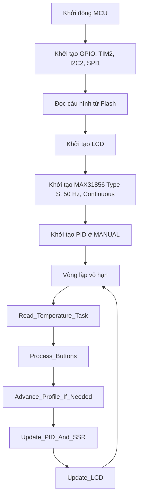

# Nabertherm Furnace Control Panel

## 1. Mục đích

Đây là chương trình điều khiển lò nung Nabertherm bằng STM32F103C8T6, cảm biến can nhiệt loại S qua MAX31856, LCD 16x2 I2C và SSR điều khiển dây nung.

Chương trình cho phép người vận hành khai báo tối đa 9 khoảng nhiệt `P1...P9`. Mỗi khoảng có:

- Chế độ điều khiển `MODE_MT` hoặc `MODE_TIOT`.
- Nhiệt độ đích từ `0...1280 °C`.
- Thời gian theo định dạng `giờ:phút:giây`.

Hai chế độ nhiệt:

- `MODE_MT`: tiến đến nhiệt độ đích, hạn chế vọt nhiệt và giữ nhiệt quanh Setpoint.
- `MODE_TIOT`: tăng nhiệt theo quỹ đạo thời gian, bù độ trễ của lò và chỉ hoàn thành khi nhiệt độ thực tế đạt vùng cho phép.

> Phần mềm có các lớp bảo vệ cảm biến và quá nhiệt, nhưng không thay thế bộ giới hạn nhiệt độ độc lập bằng phần cứng.

---

## 2. Phần cứng và ánh xạ chân

| Thành phần | Giao tiếp/chân | Vai trò |
|---|---|---|
| STM32F103C8T6 | MCU chính | Chạy máy trạng thái, PID, menu và giám sát an toàn |
| MAX31856 | SPI1, CS = `PA15` | Đọc can nhiệt loại S |
| LCD 16x2 | I2C2, địa chỉ `0x27` | Hiển thị nhiệt độ, thời gian và menu |
| SSR | `PB7`, active-high | Đóng/cắt công suất dây nung |
| SETTING/RUN | `PA8`, EXTI rising | Vào cài đặt hoặc lưu và chạy |
| REDIRECT | `PA9`, EXTI rising | Chuyển khoảng, chữ số hoặc trường thời gian |
| DOWN | `PA10`, EXTI rising | Giảm giá trị/di chuyển menu |
| UP | `PA11`, EXTI rising | Tăng giá trị/di chuyển menu |
| SELECT/OK | `PB15`, EXTI rising | Chọn/xác nhận |

Cấu hình chính:

- Hệ thống dùng HSE và PLL x9, CPU dự kiến 72 MHz.
- I2C2 chạy 100 kHz.
- SPI1 chạy master, 8 bit, polarity low, phase second edge, prescaler 16.
- TIM2 tạo ngắt 1 Hz để tăng đồng hồ vận hành.
- MAX31856 được cấu hình:
  - can nhiệt `MAX31856_TCTYPE_S`;
  - lọc nhiễu điện lưới 50 Hz;
  - chế độ chuyển đổi liên tục.

---

## 3. Kiến trúc tổng thể

Chương trình dùng kiến trúc vòng lặp sự kiện không chặn. Không dùng `HAL_Delay()` trong vòng lặp chính.



Thứ tự trong vòng lặp là một phần của thiết kế:

1. Đọc và kiểm tra nhiệt độ.
2. Xử lý sự kiện nút nhấn.
3. Kiểm tra kết thúc/chuyển khoảng nhiệt.
4. Tính điều khiển PID và phát lệnh SSR.
5. Cập nhật LCD nếu nội dung thay đổi.

---

## 4. Các máy trạng thái

### 4.1. Trạng thái hệ thống

```c
SYS_IDLE
SYS_RUNNING
SYS_COMPLETED
```

| Trạng thái | Ý nghĩa |
|---|---|
| `SYS_IDLE` | Không chạy profile; SSR phải tắt; đồng hồ không tăng |
| `SYS_RUNNING` | Đang chạy profile; TIM2 tăng `Run_Total_Seconds` mỗi giây |
| `SYS_COMPLETED` | Hoàn thành tất cả khoảng; giữ thời gian cuối; SSR tắt |

Chỉ khi `System_Run_State == SYS_RUNNING`, không có lỗi và đã có mẫu cảm biến hợp lệ thì bộ điều khiển mới được phép phát công suất.

### 4.2. Trạng thái giao diện

```c
UI_STATE_MAIN
UI_STATE_SET_INTERVAL
UI_STATE_SET_P
UI_STATE_SET_TEMP
UI_STATE_SET_TIME
```

Máy trạng thái giao diện độc lập với cấu trúc dữ liệu profile. Khi người dùng nhấn `PA8` từ màn hình chính, chương trình vào cài đặt, chuyển hệ thống về `SYS_IDLE` và tắt SSR.

### 4.3. Trạng thái điều khiển MODE_MT

```c
MT_PHASE_APPROACH
MT_PHASE_COAST
MT_PHASE_HOLD
```

- `APPROACH`: gia nhiệt đến gần Setpoint, không tích phân và giảm dần công suất.
- `COAST`: tắt SSR để nhiệt tích trữ tiếp tục đưa lò đến Setpoint.
- `HOLD`: dùng PID giữ nhiệt mạnh hơn quanh Setpoint.

---

## 5. Cấu trúc dữ liệu profile

Mỗi khoảng nhiệt dùng:

```c
typedef struct {
    uint8_t  Mode;
    uint16_t Temp;
    uint8_t  Time_Hour;
    uint8_t  Time_Min;
    uint8_t  Time_Sec;
} Interval_TypeDef;
```

Mảng:

```c
Interval_TypeDef Intervals[MAX_INTERVALS];
```

Quy ước:

- `Current_Interval` đánh số từ 1.
- Chỉ số mảng thực tế là `Current_Interval - 1`.
- `Total_Intervals` nằm trong `1...9`.
- `Target_Run_Seconds` là mốc thời gian tuyệt đối cộng dồn của khoảng hiện tại.
- `Current_Interval_Start_Sec` là thời điểm bắt đầu khoảng hiện tại.
- `Current_Interval_Start_Temp` là nhiệt độ thực tế tại lúc bắt đầu khoảng.

`Sanitize_Settings()` cưỡng chế:

- Mode chỉ được là MT hoặc TIOT.
- Nhiệt độ không vượt `1280 °C`.
- Phút và giây không vượt 59.
- Số khoảng luôn từ 1 đến 9.

---

## 6. Khởi động một profile

`Start_Profile()` chỉ cho phép chạy khi:

- không có `Control_Fault`;
- đã nhận được ít nhất một mẫu cảm biến hợp lệ.

Trình tự:

1. Đặt đồng hồ tổng về 0.
2. Chọn `P1`.
3. Lưu nhiệt độ hiện tại làm nhiệt độ bắt đầu.
4. Tính mốc kết thúc của `P1`.
5. Chuyển trạng thái sang `SYS_RUNNING`.
6. Xóa đầu ra, tích phân và lịch sử PID.
7. Đặt PID ban đầu không tích phân.
8. Khởi tạo bộ ước lượng tốc độ nhiệt.
9. Bỏ qua ngay các khoảng có thời gian bằng 0.

---

## 7. Đồng hồ và chuyển khoảng

TIM2 gọi `HAL_TIM_PeriodElapsedCallback()` mỗi giây.

```text
Nếu hệ thống RUNNING và không có lỗi:
    Run_Total_Seconds++
```

`Advance_Profile_If_Needed()` so sánh:

```text
Run_Total_Seconds >= Target_Run_Seconds
```

### MODE_MT

Khi hết thời gian, chương trình chuyển sang khoảng kế tiếp hoặc kết thúc profile. MODE_MT không chờ thêm điều kiện nhiệt độ.

### MODE_TIOT

Với khoảng TIOT có thời gian khác 0, chương trình không được chuyển khoảng nếu nhiệt độ cuối chưa đạt:

```text
|Input - Target| <= 1 °C
và
|raw_temp - Target| <= 2 °C
```

Nếu chưa đạt, `tiot_deadline_extension = true` và khoảng hiện tại tiếp tục chạy tại nhiệt độ đích.

Khi đạt đích trễ:

- mốc bắt đầu khoảng kế tiếp được neo vào thời điểm hoàn thành thực tế;
- nhiệt độ bắt đầu khoảng kế tiếp lấy từ `Input`;
- tránh việc đồng hồ cộng dồn làm bỏ qua các khoảng sau.

Nếu TIOT có nhiệt độ đích thấp hơn nhiệt độ đầu khoảng, chương trình không chờ điều kiện tăng nhiệt vì bộ gia nhiệt không thể chủ động làm mát.

---

## 8. Chuỗi đo nhiệt độ

`Read_Temperature_Task()` chạy tối đa mỗi 250 ms.

### 8.1. Kiểm tra phần cứng

1. Kiểm tra MAX31856 đã khởi tạo.
2. Đọc thanh ghi lỗi MAX31856.
3. Nếu có bit lỗi, ngắt điều khiển và tắt SSR.

### 8.2. Kiểm tra dữ liệu

Mẫu chỉ hợp lệ khi:

```text
isfinite(measured)
-50 °C <= measured <= 1800 °C
```

Ba mẫu không hợp lệ liên tiếp gây `CONTROL_FAULT_SENSOR_DATA`.

### 8.3. Lọc nhiệt độ

```text
filtered_temp =
    filtered_temp
    + 0.20 × (measured - filtered_temp)
```

Biến sử dụng:

- `raw_temp`: mẫu trực tiếp từ MAX31856.
- `filtered_temp`: nhiệt độ đã lọc.
- `Input`: đầu vào PID, bằng `filtered_temp`.
- `Current_Temp`: giá trị hiển thị, bằng `filtered_temp`.

### 8.4. Ước lượng tốc độ nhiệt

Cập nhật mỗi 5 giây:

```text
instant_rate = ΔInput / Δtime
temp_rate = temp_rate + 0.25 × (instant_rate - temp_rate)
```

Đơn vị là `°C/phút`, giới hạn trong `-80...+80 °C/phút`.

Tốc độ này được dùng cho:

- dự báo quán tính MODE_MT;
- kiểm tra tốc độ MODE_TIOT;
- tự học tốc độ toàn công suất của lò.

---

## 9. Thuật toán MODE_MT

### 9.1. Setpoint

Trong MT:

```text
Setpoint = Intervals[current].Temp
```

Không có ramp thời gian.

### 9.2. Dự báo quán tính

```text
rising_rate = max(temp_rate_c_per_min, 0)
predicted_temp = Input + rising_rate × 4.0 phút
```

Khi còn cách Setpoint không quá 12 °C và nhiệt dự báo đủ đạt gần Setpoint, hệ thống chuyển sang `COAST`.

### 9.3. Pha APPROACH

PID:

```text
Kp = 20
Ki = 0
Kd = 250
```

Không tích phân để tránh tích trữ yêu cầu nhiệt quá lớn.

Giới hạn thời gian bật SSR trong mỗi cửa sổ 1000 ms:

| Sai số `target - Input` | Công suất tối đa |
|---:|---:|
| `> 40 °C` | 1000 ms |
| `20...40 °C` | 800 ms |
| `10...20 °C` | 550 ms |
| `5...10 °C` | 320 ms |
| `3...5 °C` | 220 ms |
| `2...3 °C` | 160 ms |
| `1...2 °C` | 120 ms |
| `0...1 °C` | 90 ms |

Chuyển sang COAST khi:

- nhiệt độ đã vượt Setpoint `+0.5 °C`; hoặc
- nhiệt dự báo đạt `Setpoint - 0.3 °C`.

Chuyển sang HOLD khi:

- sai số không quá `1.5 °C`; và
- tốc độ nhiệt tuyệt đối không quá `0.2 °C/phút`.

### 9.4. Pha COAST

- SSR bị cưỡng bức OFF.
- `Output` và `outputSum` về 0.
- Chờ quán tính nhiệt.

Quay lại APPROACH khi lò thấp hơn đích trên 3 °C và không còn tăng nhiệt.

Chuyển HOLD khi nhiệt độ gần đích và tốc độ đủ nhỏ.

### 9.5. Pha HOLD

PID:

```text
Kp = 80
Ki = 0.40
Kd = 300
```

Giới hạn công suất giữ nhiệt:

```text
hold_cap_ms = 180 + 0.45 × target_temp
clamp trong 250...850 ms
```

Khi vừa vào HOLD, tích phân được mồi bằng 25% công suất trước COAST để giảm sụt nhiệt.

Nếu nhiệt độ cao hơn Setpoint thì không cấp nhiệt. Nếu lò đang nguội, thấp hơn Setpoint và lệnh quá nhỏ, chương trình bảo đảm xung hữu ích tối thiểu 40 ms.

---

## 10. Thuật toán MODE_TIOT

### 10.1. Quỹ đạo lý tưởng

Với thời gian khoảng `duration`:

```text
elapsed = current_time - interval_start_time
fraction = clamp(elapsed / duration, 0...1)

ideal_temp =
    start_temp
    + (target_temp - start_temp) × fraction
```

`ideal_temp` mô tả nhiệt độ lý tưởng theo lịch.

### 10.2. Setpoint điều khiển có độ dẫn trước

Do lò có quán tính và độ trễ, PID không điều khiển trực tiếp theo `ideal_temp`.

Chương trình tính:

```text
planned_rate =
    (target_temp - start_temp) × 60 / duration_sec

required_rate =
    (target_temp - Input) / remaining_time_min

pace_error = ideal_temp - Input
rate_deficit = required_rate - max(measured_rate, 0)
```

Độ dẫn trước:

```text
lead =
    planned_rate × 1.00 phút
    + max(pace_error, 0) × 1.20
    + max(rate_deficit, 0) × 1.20 phút
```

`lead` được giới hạn tối đa 45 °C.

```text
command_setpoint =
    min(ideal_temp + lead, target_temp)
```

Sau timeout, `command_setpoint = target_temp`.

### 10.3. PID TIOT

```text
Kp = 35
Ki = 0.10
Kd = 250
```

- Bật Ki khi sai số điều khiển không quá 30 °C.
- Tắt Ki và xóa tích phân khi sai số lớn hơn 30 °C.
- Xóa tích phân nếu Setpoint giảm hoặc nhiệt độ vượt ngưỡng trên.

### 10.4. Feed-forward theo tốc độ yêu cầu

Bộ điều khiển ước lượng tốc độ tăng nhiệt toàn công suất của lò:

```text
full_power_rate_est ≈ measured_rate × 1000 / active_output_ms
```

Giá trị khởi đầu là 5 °C/phút và được học bằng lọc mũ với hệ số 0.08.

Chỉ học khi:

- đang chạy TIOT;
- đã qua 60 giây đầu khoảng;
- công suất ít nhất 250 ms/1000 ms;
- tốc độ tăng ít nhất 0.10 °C/phút;
- còn cách đích trên 10 °C.

Duty feed-forward:

```text
rate_feedforward_ms =
    required_rate / full_power_rate_est
    × 1000
    × 1.05
```

Ngoài ra có mức bù theo sai số quỹ đạo và thiếu tốc độ:

```text
corrective_floor_ms =
    max(pace_error, 0) × 20
    + max(rate_deficit, 0) × 35
```

Công suất tối thiểu yêu cầu là giá trị lớn hơn giữa hai cách tính trên.

Nếu timeout mà nhiệt độ còn thấp hơn đích trên 1 °C, mức công suất sàn được đặt 1000 ms cho tới khi bước dự báo quán tính hoặc giới hạn cuối can thiệp.

### 10.5. Dự báo COAST cuối đoạn

Trong vùng cách đích tối đa 10 °C:

```text
predicted_temp =
    Input + max(measured_rate, 0) × 2.5 phút
```

Nếu dự báo đạt `target - 0.25 °C`, chương trình tắt SSR để tránh vọt nhiệt.

Giới hạn công suất gần đích:

| Sai số đến đích | Công suất tối đa |
|---:|---:|
| `<= 4 °C` | 350 ms |
| `<= 1.5 °C` | 180 ms |

Nếu `Input` hoặc `raw_temp` vượt `target + 0.5 °C`, SSR bị tắt và tích phân bị xóa.

### 10.6. Điều kiện hoàn thành

Một khoảng TIOT có thời gian khác 0 chỉ hoàn thành khi:

```text
|filtered temperature - target| <= 1 °C
và
|raw temperature - target| <= 2 °C
```

Đây là cơ chế `deadline extension`, bảo đảm chương trình không tự chuyển khoảng khi nhiệt độ còn thấp xa Setpoint.

---

## 11. PID và điều khiển SSR

PID được cấu hình:

```text
P_ON_E
PID_DIRECT
SampleTime = 1000 ms
Output = 0...1000
```

`Output` không phải phần trăm trực tiếp. Nó là số mili giây SSR được bật trong cửa sổ 1000 ms.

```text
Output = 0       -> SSR OFF
Output = 500     -> SSR ON khoảng 500 ms mỗi giây
Output = 1000    -> SSR ON liên tục
```

Logic PB7:

```text
Nếu output <= 20 ms:
    SSR OFF
Nếu output >= 980 ms:
    SSR ON
Ngược lại:
    SSR ON khi thời gian trong cửa sổ < output
```

Cách này là time-proportional control, còn gọi là slow PWM.

---

## 12. An toàn và xử lý lỗi

Các lỗi:

```c
CONTROL_FAULT_NONE
CONTROL_FAULT_MAX31856
CONTROL_FAULT_SENSOR_DATA
CONTROL_FAULT_OVERTEMP
```

Khi có lỗi:

1. Ghi nhận lỗi.
2. Chuyển hệ thống về `SYS_IDLE`.
3. Tắt PB7 ngay.
4. Chuyển PID sang MANUAL.
5. Xóa Output và tích phân.
6. Yêu cầu LCD cập nhật.

### Ngưỡng nhiệt

- Nhiệt độ cài đặt tối đa: `1280 °C`.
- Trip quá nhiệt: `1300 °C`.
- Cho phép xóa lỗi quá nhiệt khi nhiệt độ lọc không quá `1250 °C`.
- Cần 4 mẫu hợp lệ liên tiếp để tự xóa lỗi đã hồi phục.

Sau khi lỗi được xóa, chương trình vẫn ở `SYS_IDLE`; không tự khởi động lại profile.

### Bất biến an toàn

Trong mọi thay đổi source phải giữ:

```text
Có lỗi -> SSR OFF
Không RUNNING -> SSR OFF
Chưa có dữ liệu cảm biến hợp lệ -> SSR OFF
Quá nhiệt -> SSR OFF
```

---

## 13. Nút nhấn và menu

Ngắt EXTI chỉ đặt cờ sự kiện và debounce 200 ms. Mọi xử lý nặng được thực hiện trong `Process_Buttons()`.

### PA8 — SETTING/RUN

- Từ màn hình chính:
  - vào `UI_STATE_SET_INTERVAL`;
  - dừng profile;
  - tắt SSR.
- Từ màn hình cài đặt:
  - commit giá trị đang sửa;
  - kiểm tra giới hạn;
  - ghi Flash;
  - trở về màn hình chính;
  - gọi `Start_Profile()`.

PA8 có ưu tiên cao nhất trong `Process_Buttons()`; sau khi xử lý, hàm `return` để không áp dụng các sự kiện đồng thời vào trạng thái mới.

### PA9 — REDIRECT

- Trong `SET_P`: chuyển P1 → P2 → ... → Pn → P1.
- Trong `SET_TEMP`: chuyển chữ số hàng nghìn, trăm, chục, đơn vị.
- Trong `SET_TIME`: chuyển giờ, phút, giây.

### PB15 — SELECT

- Từ `SET_INTERVAL`: sang `SET_P`.
- Trong `SET_P`:
  - cursor Mode: đổi MT ↔ TIOT;
  - cursor Temp: vào chỉnh nhiệt độ;
  - cursor Time: vào chỉnh thời gian.
- Trong màn hình chỉnh chi tiết: lưu tạm và quay lại `SET_P`.

### PA11/PA10 — UP/DOWN

- Thay đổi số khoảng.
- Di chuyển cursor menu.
- Tăng/giảm chữ số nhiệt độ.
- Tăng/giảm giờ, phút hoặc giây.
- Nếu UP và DOWN cùng xuất hiện thì bỏ qua cả hai.

---

## 14. Hiển thị LCD

LCD dùng double-buffer:

1. Tạo đủ 16 ký tự cho mỗi hàng trong RAM.
2. So sánh với `prev_lcd_row1` và `prev_lcd_row2`.
3. Chỉ ghi I2C khi hàng thực sự thay đổi.

Điều này giảm nhấp nháy và lưu lượng I2C.

Màn hình chính hiển thị:

- nhiệt độ hiện tại;
- trạng thái P hiện tại/tổng số P;
- thời gian tổng đã chạy;
- `DONE`, `SENSOR ERROR` hoặc `OVER TEMP` khi thích hợp.

---

## 15. Lưu cấu hình vào Flash

Địa chỉ:

```text
0x0800FC00
```

Đây là page Flash cuối của STM32F103C8T6 64 KB theo giả định của project.

Dữ liệu lưu:

```c
typedef struct {
    uint32_t MagicWord;
    uint32_t Version;
    uint32_t TotalIntervals;
    Interval_TypeDef Intervals[9];
    uint32_t Checksum;
} Flash_Data_t;
```

Xác thực bằng:

- magic `0xAABBCCDE`;
- version `2`;
- số khoảng hợp lệ;
- checksum FNV-1a trên toàn bộ dữ liệu trước trường `Checksum`.

Nếu dữ liệu không hợp lệ, chương trình tạo một profile mặc định gồm một khoảng MODE_MT.

---

## 16. Bảng trách nhiệm hàm

| Hàm | Trách nhiệm |
|---|---|
| `HAL_GPIO_EXTI_Callback()` | Debounce và đặt cờ nút nhấn |
| `HAL_TIM_PeriodElapsedCallback()` | Tăng đồng hồ chạy 1 Hz |
| `Sanitize_Settings()` | Cưỡng chế giới hạn dữ liệu cài đặt |
| `Commit_Pending_Edit()` | Ghi buffer chỉnh sửa vào interval |
| `Start_Profile()` | Khởi tạo một lần chạy mới |
| `Stop_Heating_Control()` | Tắt SSR, PID MANUAL và xóa trạng thái điều khiển |
| `Trip_Control_Fault()` | Chốt lỗi và dừng nhiệt |
| `Advance_Profile_If_Needed()` | Chuyển P hoặc kết thúc profile |
| `Calculate_Profile_Setpoint()` | Tạo Setpoint MT hoặc quỹ đạo TIOT lý tưởng |
| `TIOT_Target_Reached()` | Kiểm tra điều kiện nhiệt độ cuối TIOT |
| `Calculate_TIOT_Control_Setpoint()` | Tạo Setpoint TIOT có dẫn trước |
| `Update_TIOT_Rate_Estimate()` | Tự học tốc độ toàn công suất |
| `Limit_TIOT_Output()` | Feed-forward, giới hạn và dự báo TIOT |
| `Update_Temperature_Rate()` | Ước lượng tốc độ tăng/giảm nhiệt |
| `Update_MT_Control_Phase()` | Chuyển APPROACH/COAST/HOLD |
| `Limit_MT_Output()` | Giới hạn công suất MT và chống vọt |
| `Read_Temperature_Task()` | Đọc, lọc và kiểm tra cảm biến |
| `Update_PID_And_SSR()` | Điều phối PID theo mode và phát PB7 |
| `Process_Buttons()` | Máy trạng thái giao diện |
| `Update_LCD()` | Render LCD double-buffer |
| `Save_Settings_To_Flash()` | Ghi cấu hình có checksum |
| `Load_Settings_From_Flash()` | Đọc và xác minh cấu hình |

---

## 17. Điều kiện cần giữ khi sửa code

- Không đưa tác vụ chậm, ghi Flash, LCD hoặc tính toán PID vào ISR.
- Không dùng vòng chờ hoặc `HAL_Delay()` trong vòng lặp chính.
- Không cho SSR ON khi có lỗi hoặc khi hệ thống không RUNNING.
- Không thay đổi đơn vị `Output`: luôn là mili giây trong cửa sổ 1000 ms.
- Không dùng `Current_Interval` trực tiếp làm chỉ số mảng; phải trừ 1.
- Không làm mất deadline gate của TIOT.
- Không làm mất dự báo COAST của MT/TIOT.
- Khi thay đổi layout `Flash_Data_t`, phải tăng `FLASH_DATA_VERSION`.
- Mọi thông số PID và dự báo phải được thử trên lò thật với tải đại diện.
